# In this vignette
In this preprocessing vignette, we start with data that has already been processed through 10X CellRanger V3. Instructions for CellRanger can be found here: 
https://support.10xgenomics.com/single-cell-gene-expression/software/pipelines/latest/what-is-cell-ranger. 

Herein, we will seek to do the following:

* Perform SoupX to identify and remove likely ambient mRNA signal.
* Generate a Seurat object for each sequencing lane.
* Demultiplex hashtags
* Remove poor quality cells

As an important note, although we do frequently use for loops, this vignette has some sections with redundant code (repeated for each sample). Experienced users can write loops or use `lapply` to complete many of these preliminary tasks.

This vignette has been tested on both linux (Ubuntu 20.04.2) and macOS (Big Sur 11.5.1).

# Prepare the R environment
## Load in the necessary libraries
We use a variety of critical libraries to facilitate data processing and analysis. Most importantly, SoupX

```r
library(SoupX)
library(Seurat)
library(ggplot2)
library(dplyr)
library(clustree) 
library(SingleR)
library(cowplot)
library(viridis)
library(formattable)
library(celldex)
library(velocyto.R)
library(SeuratWrappers)
library(plotly)
library(RColorBrewer)
library(AnnotationDbi)
library(org.Mm.eg.db)
library(VAM)
library(msigdbr)
```

# SoupX Counts Correction
SoupX calculates the background contamination from free-floating RNA (the soup) that is sequenced along with cell RNA in the droplet and corrects for this ambient RNA contamination.

SoupX provides a simple workflow and functions to read in 10X CellRanger outputs. Fraction of contaminating background RNAs are parametrised as `rho` where `rho=0` means no contamination and `rho=1` means 100% of UMIs in the droplet were from soup RNA.

More about SoupX:
Young, M.D., Behjati, S. (2020). SoupX removes ambient RNA contamination from droplet-based single-cell RNA sequencing data, GigaScience, Volume 9, Issue 12, December 2020, giaa151bioRxiv, 303727, https://doi.org/10.1093/gigascience/giaa151

## Load in the datafiles
SoupX needs the filtered and raw barcode matrices found in the output folder from 10X CellRanger. In this experiment, these files are larger and therefore we've used gitLFS to store them for this vignette. You can learn more about gitLFS here: https://git-lfs.github.com/.

In addition to the barcode matrices, SoupX strongly recommends some clustering information, which can be found in the 10X CellRanger output folder "analysis". 

```r
# Read datafiles into SoupX
Lean_soup <- load10X("../10xCellRanger/Lean/")
```

```
## Loading raw count data
```

```
## 10X data contains more than one type and is being returned as a list containing matrices of each type.
```

```
## Loading cell-only count data
```

```
## 10X data contains more than one type and is being returned as a list containing matrices of each type.
```

```
## Loading extra analysis data where available
```

```r
Obese_soup <- load10X("../10xCellRanger/Obese/")
```

```
## Loading raw count data
```

```
## 10X data contains more than one type and is being returned as a list containing matrices of each type.
```

```
## Loading cell-only count data
```

```
## 10X data contains more than one type and is being returned as a list containing matrices of each type.
```

```
## Loading extra analysis data where available
```

```r
WL_soup <- load10X("../10xCellRanger/WL/")
```

```
## Loading raw count data
```

```
## 10X data contains more than one type and is being returned as a list containing matrices of each type.
```

```
## Loading cell-only count data
```

```
## 10X data contains more than one type and is being returned as a list containing matrices of each type.
```

```
## Loading extra analysis data where available
```

```r
WC_soup <- load10X("../10xCellRanger/WC/")
```

```
## Loading raw count data
```

```
## 10X data contains more than one type and is being returned as a list containing matrices of each type.
```

```
## Loading cell-only count data
```

```
## 10X data contains more than one type and is being returned as a list containing matrices of each type.
```

```
## Loading extra analysis data where available
```
## Estimate cell specific contamination fraction

```r
soup_list <- list(Lean_soup = Lean_soup, 
                  Obese_soup = Obese_soup, 
                  WL_soup = WL_soup, 
                  WC_soup = WC_soup)
for (i in seq_along(soup_list)){
  soup_list[[i]] <- autoEstCont(soup_list[[i]])
}
```

```
## 874 genes passed tf-idf cut-off and 190 soup quantile filter.  Taking the top 100.
```

```
## Using 584 independent estimates of rho.
```

```
## Estimated global rho of 0.01
```

```
## 1349 genes passed tf-idf cut-off and 278 soup quantile filter.  Taking the top 100.
```

```
## Using 629 independent estimates of rho.
```

```
## Estimated global rho of 0.01
```

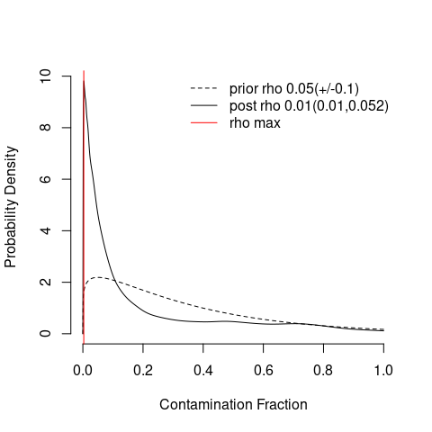<!-- -->

```
## 1318 genes passed tf-idf cut-off and 419 soup quantile filter.  Taking the top 100.
```

```
## Using 499 independent estimates of rho.
```

```
## Estimated global rho of 0.02
```

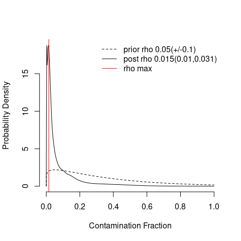<!-- -->

```
## 2176 genes passed tf-idf cut-off and 1075 soup quantile filter.  Taking the top 100.
```

```
## Using 829 independent estimates of rho.
```

```
## Estimated global rho of 0.02
```

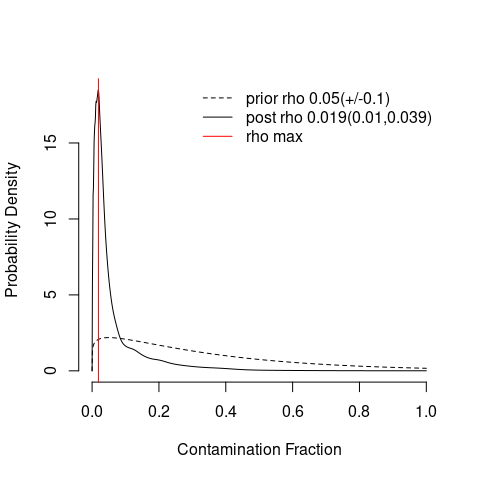<!-- -->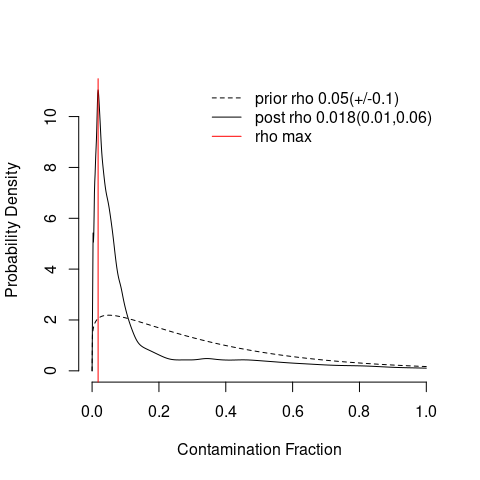<!-- -->
## Infer corrected expression matrix

```r
sample_list <- list()
for (i in seq_along(soup_list)){
  sample_list[[i]] <- adjustCounts(soup_list[[i]]) #Note, these outputs are stored as a separate sparse matrix.
}
```

```
## Expanding counts from 17 clusters to 8903 cells.
```

```
## Expanding counts from 20 clusters to 13481 cells.
```

```
## Expanding counts from 18 clusters to 14250 cells.
```

```
## Expanding counts from 23 clusters to 27159 cells.
```

The correction for specific genes can be visualized. For example, Igkc, an immunoglobulin coding gene, should be limited to mostly B cells. However, contaminated Igkc in the soup makes other cell types express Igck. SoupX adjusts for this.
Below, I've plotted Igkc contamination overlapped onto the tSNE projections calculated by CellRanger for the weight cycled sample.


```r
tSNE_data <- soup_list[["WC_soup"]]$metaData
tSNE_data$clusters <- factor(tSNE_data$clusters)
soup1 <- ggplot(tSNE_data, aes(tSNE1, tSNE2, color=clusters)) + geom_point(size = 0.2) + theme_bw()
soup2 <- plotChangeMap(soup_list[["WC_soup"]], sample_list[[4]], "Igkc") + theme_bw() + scale_color_viridis(option="viridis")
soup1 + soup2
```

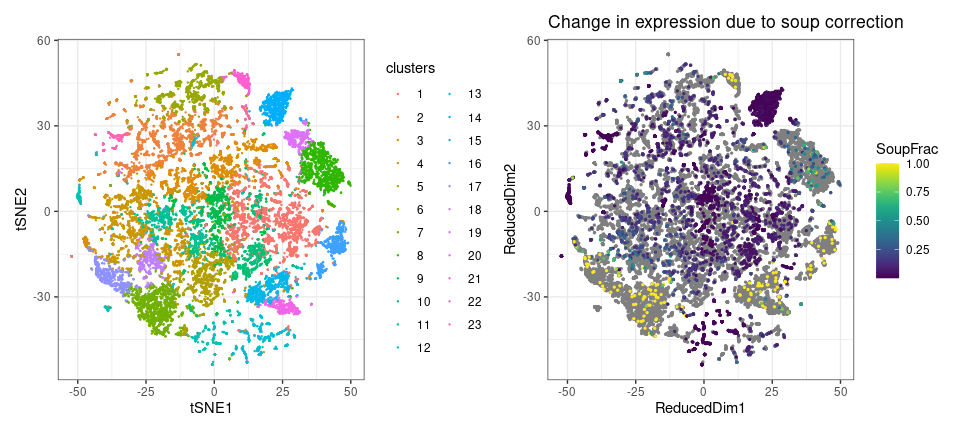<!-- -->

# Create the Seurat object
## Read in datafiles from 10X CellRanger outputs
This is a multimodal study. We will use the corrected counts from SoupX and the ADT/HTO data that remains in the original CellRanger outputs.


```r
# Read in datafiles from CellRanger
Lean.data <- Read10X("../10xCellRanger/Lean/filtered_feature_bc_matrix/")
```

```
## 10X data contains more than one type and is being returned as a list containing matrices of each type.
```

```r
Obese.data <- Read10X("../10xCellRanger/Obese/filtered_feature_bc_matrix/")
```

```
## 10X data contains more than one type and is being returned as a list containing matrices of each type.
```

```r
WL.data <- Read10X("../10xCellRanger/WL/filtered_feature_bc_matrix/")
```

```
## 10X data contains more than one type and is being returned as a list containing matrices of each type.
```

```r
WC.data <- Read10X("../10xCellRanger/WC/filtered_feature_bc_matrix/")
```

```
## 10X data contains more than one type and is being returned as a list containing matrices of each type.
```

## Using SoupX objects to create the Seurat object

```r
# Create a Seurat object list using the SoupX adjusted matrices
# The project name is stored in the `orig.ident` metadata column, which we use frequently later.
Seurat_list <- list(Lean = CreateSeuratObject(sample_list[[1]], project = "Lean"), Obese = CreateSeuratObject(sample_list[[2]], project = "Obese"), WL = CreateSeuratObject(sample_list[[3]], project = "WL"), WC = CreateSeuratObject(sample_list[[4]], project = "WC"))

# Take a look at the structure of this new list:
Seurat_list
```

```
## $Lean
## An object of class Seurat 
## 31053 features across 8903 samples within 1 assay 
## Active assay: RNA (31053 features, 0 variable features)
## 
## $Obese
## An object of class Seurat 
## 31053 features across 13481 samples within 1 assay 
## Active assay: RNA (31053 features, 0 variable features)
## 
## $WL
## An object of class Seurat 
## 31053 features across 14250 samples within 1 assay 
## Active assay: RNA (31053 features, 0 variable features)
## 
## $WC
## An object of class Seurat 
## 31053 features across 27159 samples within 1 assay 
## Active assay: RNA (31053 features, 0 variable features)
```

## Rename the CITE-seq antibodies.
CITE-seq antibodies had long names from our original 10X CellRanger run, which also indicate which TotalSeq-C antibody they originally were. We can adjust these names for downstream processing so that they are easier to read. These names are found in the `Antibody Capture` assay.

```r
#Explore which antibodies were included in the experiment.
rownames(Lean.data[["Antibody Capture"]])
```

```
##  [1] "0301_anti-mouse_Hashtag1" "0302_anti-mouse_Hashtag2"
##  [3] "0303_anti-mouse_Hashtag3" "0304_anti-mouse_Hashtag4"
##  [5] "0305_anti-mouse_Hashtag5" "0306_anti-mouse_Hashtag6"
##  [7] "0308_anti-mouse_Hashtag8" "0309_anti-mouse_Hashtag9"
##  [9] "0895_anti-mouse_Mac-2"    "0004_anti-mouse_CD279"   
## [11] "0202_anti-mouse_CD64"     "0001_anti-mouse_CD4"     
## [13] "0377_anti-mouse_CCR7"     "0849_anti-mouse_CD80"    
## [15] "0106_anti-mouse_CD11c"    "0073_anti-mouse_CD44"    
## [17] "0118_anti-mouse_NK1_1"    "0986_anti-mouse_TCRyd"   
## [19] "0834_anti-mouse_CD39"     "0093_anti-mouse_CD19"    
## [21] "0014_anti-mouse_CD11b"    "0182_anti-mouse_CD3"     
## [23] "0848_anti-mouse_TIGIT"    "0002_anti-mouse_CD8a"
```


```r
#Create a list with new antibody names
Antibody.list <- c("Hashtag1", "Hashtag2", "Hashtag3", "Hashtag4", 
                   "Hashtag5", "Hashtag6", "Hashtag8", "Hashtag9", 
                   "MAC2", "CD279", "CD64", "CD4", 
                   "CCR7", "CD80", "CD11c", "CD44", 
                   "NK1.1", "TCRyd", "CD39", "CD19", 
                   "CD11b", "CD3", "TIGIT", "CD8a")
```

Adjust antibody names for clarity and create separate matrices for Hashtag and CITE-seq antibodies

```r
#Apply the renamed antibody list
rownames(x = Lean.data[["Antibody Capture"]]) <- Antibody.list
rownames(x = Obese.data[["Antibody Capture"]]) <- Antibody.list
rownames(x = WL.data[["Antibody Capture"]]) <- Antibody.list
rownames(x = WC.data[["Antibody Capture"]]) <- Antibody.list
```


```r
#Create a matrix containing the ADT and HTO names. We only need to do this for one sample since they are the same for all lanes in this experiment
HTOs <- Lean.data$'Antibody Capture'@Dimnames[[1]][1:8]
HTO <- Lean.data$'Antibody Capture'[HTOs, ]
ADTs <- Lean.data$'Antibody Capture'@Dimnames[[1]][9:24]
ADT <- Lean.data$'Antibody Capture'[ADTs, ]
```


```r
#Antibody Capture Assay (Feature Barcoding; Hashtags)
Lean.ADT.counts <- Lean.data$'Antibody Capture'[ADTs, ]
Obese.ADT.counts <- Obese.data$'Antibody Capture'[ADTs, ]
WL.ADT.counts <- WL.data$'Antibody Capture'[ADTs, ]
WC.ADT.counts <- WC.data$'Antibody Capture'[ADTs, ]

Lean.HTO.counts <- Lean.data$'Antibody Capture'[HTOs, ]
Obese.HTO.counts <- Obese.data$'Antibody Capture'[HTOs, ]
WL.HTO.counts <- WL.data$'Antibody Capture'[HTOs, ]
WC.HTO.counts <- WC.data$'Antibody Capture'[HTOs, ]
```

In this experiment, Hashtags 5-6 and 8-9 were used in the Lean and WL lanes, while 1-4 were used in the Obese and WC lanes.


```r
#Remove HTOs that were not included in the lane
Lean.HTO.counts <- Lean.HTO.counts[setdiff(rownames(x = Lean.HTO.counts), c("Hashtag5", "Hashtag6", "Hashtag8", "Hashtag9")), ]
Obese.HTO.counts <- Obese.HTO.counts[setdiff(rownames(x = Obese.HTO.counts), c("Hashtag1", "Hashtag2", "Hashtag3", "Hashtag4")), ]
WL.HTO.counts <- WL.HTO.counts[setdiff(rownames(x = WL.HTO.counts), c("Hashtag5", "Hashtag6", "Hashtag8", "Hashtag9")), ]
WC.HTO.counts <- WC.HTO.counts[setdiff(rownames(x = WC.HTO.counts), c("Hashtag1", "Hashtag2", "Hashtag3", "Hashtag4")), ]
```

## Integrate the `Antibody Capture` assays into the SoupX-corrected Seurat object
We will store the CITE-seq antibodies in the `ADT` assay and the hashtags in the `HTO` assay.

```r
#Create the Antibody Capture assay object "ADT" and the Hashtag assay object "HTO".
Seurat_list[["Lean"]][['ADT']] <- CreateAssayObject(counts = Lean.ADT.counts)
Seurat_list[["Obese"]][['ADT']] <- CreateAssayObject(counts = Obese.ADT.counts)
Seurat_list[["WL"]][['ADT']]  <- CreateAssayObject(counts = WL.ADT.counts)
Seurat_list[["WC"]][['ADT']] <- CreateAssayObject(counts = WC.ADT.counts)

Seurat_list[["Lean"]][['HTO']]  <- CreateAssayObject(counts = Lean.HTO.counts)
Seurat_list[["Obese"]][['HTO']]  <- CreateAssayObject(counts = Obese.HTO.counts)
Seurat_list[["WL"]][['HTO']]  <- CreateAssayObject(counts = WL.HTO.counts)
Seurat_list[["WC"]][['HTO']]  <- CreateAssayObject(counts = WC.HTO.counts)

# Take a look at the structure of this updated list:
Seurat_list
```

```
## $Lean
## An object of class Seurat 
## 31073 features across 8903 samples within 3 assays 
## Active assay: RNA (31053 features, 0 variable features)
##  2 other assays present: ADT, HTO
## 
## $Obese
## An object of class Seurat 
## 31073 features across 13481 samples within 3 assays 
## Active assay: RNA (31053 features, 0 variable features)
##  2 other assays present: ADT, HTO
## 
## $WL
## An object of class Seurat 
## 31073 features across 14250 samples within 3 assays 
## Active assay: RNA (31053 features, 0 variable features)
##  2 other assays present: ADT, HTO
## 
## $WC
## An object of class Seurat 
## 31073 features across 27159 samples within 3 assays 
## Active assay: RNA (31053 features, 0 variable features)
##  2 other assays present: ADT, HTO
```

## Store original barcodes
The original cell identity is indicated by the cell barcode. As a precaution, I store the original cell barcodes as a metaData column. This protects these original names for later if we need to use them to match other tools after integrating our four lanes (which may have duplicate barcodes).


```r
#Store cell barcodes as a metadatacolumn in case we need them later:
for (i in seq_along(Seurat_list)){
  Seurat_list[[i]]$orig.barcodes <- rownames(Seurat_list[[i]][[]]) 
}
```

# Quality Control
Quality control of sample cells is a critical step in processing of scRNA-seq data. Our QC relies on four parameters for this dataset:
1. Less than 5% mitochondrial RNA content
2. Greater than 200 measured gene features
3. Greater than 500 total RNA fragments measured
4. Singlets as determined by hashtag demultiplexing

Mitochondrial RNA content can be used to predict which cells were likely undergoing mechanisms of cell death. The recommendation from the Satija lab (Seurat) and the Theis lab (SCANPY), among others, is to set the upper limit for mitochondrial RNA to 5% for murine cells (10% for human cells).

## Calculate the per-cell mitochondrial RNA content

```r
for (i in seq_along(Seurat_list)){
  Seurat_list[[i]]$percent.mt <- PercentageFeatureSet(Seurat_list[[i]], pattern = "^mt-") 
}
```

## Visualize QC features
It is helpful to visualize mitochondrial RNA content as a function of the number of UMIs measured per cell and of the number of features (genes) per cell. Here, we can observe that cells with more RNA fragments counted tend to have more features (genes) as expected. We can also observe that cells with few features (genes) and few counts frequently have higher mitochondrial content. 

To do this, we use one of the visualization functions built into Seurat V4: `FeatureScatter`.


```r
#Visualize QC Metrics using scatter plots
for (i in seq_along(Seurat_list)){
  qc1 <- FeatureScatter(Seurat_list[[i]], feature1 = "nFeature_RNA", feature2 = "nCount_RNA") 
  qc2 <- FeatureScatter(Seurat_list[[i]], feature1 = "nFeature_RNA", feature2 = "percent.mt")  
  qc3 <- FeatureScatter(Seurat_list[[i]], feature1 = "nCount_RNA", feature2 = "percent.mt")
  print(qc1 + qc2 + qc3)
} 
```

<!-- -->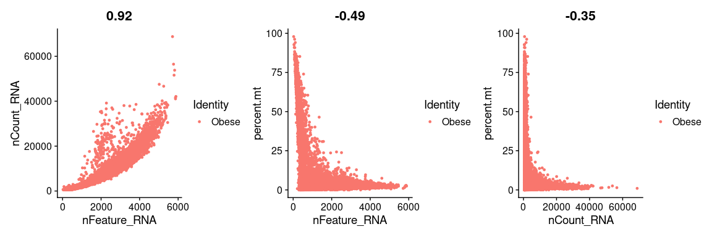<!-- -->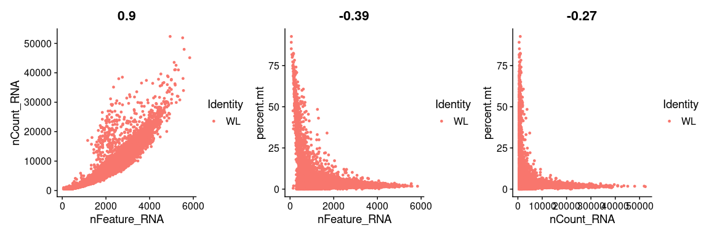<!-- -->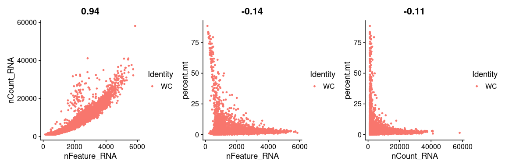<!-- -->

## Subset cells
The QC parameters will be used to subset the data so that we only retain cells which are considered to be of acceptable quality based on number of RNA features, total RNA fragments measured, and frequency of mitochondrial RNA.

```r
for (i in seq_along(Seurat_list)){
  Seurat_list[[i]] <- subset(Seurat_list[[i]], subset = nFeature_RNA > 200 & nCount_RNA > 500 & percent.mt<5)
}

#Check the updated sample list to see how many cells were retained.
Seurat_list
```

```
## $Lean
## An object of class Seurat 
## 31073 features across 7648 samples within 3 assays 
## Active assay: RNA (31053 features, 0 variable features)
##  2 other assays present: ADT, HTO
## 
## $Obese
## An object of class Seurat 
## 31073 features across 11126 samples within 3 assays 
## Active assay: RNA (31053 features, 0 variable features)
##  2 other assays present: ADT, HTO
## 
## $WL
## An object of class Seurat 
## 31073 features across 12406 samples within 3 assays 
## Active assay: RNA (31053 features, 0 variable features)
##  2 other assays present: ADT, HTO
## 
## $WC
## An object of class Seurat 
## 31073 features across 25547 samples within 3 assays 
## Active assay: RNA (31053 features, 0 variable features)
##  2 other assays present: ADT, HTO
```

# Demultiplexing Hashtags
In this study, hashtags were used to dilineate biological replicates. First, the hashtags will be normalized using Centered Log Ratio (CLR) normalization. After confirming proper enrichment for each hashtag, we will subset the data so that only cells which are described as singlets will be retained for downstream analysis.

## Normalize hashtag data
To use CLR normalization, simply pass the option `normalization.method = "CLR"`. Be sure to also indicate that the `HTO` assay should be normalized.

```r
for (i in seq_along(Seurat_list)){
  Seurat_list[[i]] <- NormalizeData(Seurat_list[[i]], assay="HTO", normalization.method="CLR", verbose=FALSE)
}
```

## Demultiplex
Use Seurat's `HTODemux` function to demultiplex the hashtags using the sample assay. This function also stores numerous metadata columns. The two used most frequency are: 
1) Global classification - Indicates whether cells are unlabeled, singlets, or doublets.
2) HTO max ID - Indicates the most likely ID based on hashtags.

We use the default 99% positive quantile, which should provide confidence that singlets are accurately identified.

```r
for (i in seq_along(Seurat_list)){
  Seurat_list[[i]] <- HTODemux(object = Seurat_list[[i]], assay = "HTO", positive.quantile=0.99)
}
```

```
## $start.arg
## $start.arg$size
## [1] 1.12304
## 
## $start.arg$mu
## [1] 14.36782
## 
## 
## $fix.arg
## NULL
```

```
## Cutoff for Hashtag1 : 54 reads
```

```
## $start.arg
## $start.arg$size
## [1] 1.104794
## 
## $start.arg$mu
## [1] 22.89808
## 
## 
## $fix.arg
## NULL
```

```
## Cutoff for Hashtag2 : 83 reads
```

```
## $start.arg
## $start.arg$size
## [1] 0.09325811
## 
## $start.arg$mu
## [1] 73.82107
## 
## 
## $fix.arg
## NULL
```

```
## Cutoff for Hashtag3 : 477 reads
```

```
## $start.arg
## $start.arg$size
## [1] 1.01604
## 
## $start.arg$mu
## [1] 19.47893
## 
## 
## $fix.arg
## NULL
```

```
## Cutoff for Hashtag4 : 63 reads
```

```
## $start.arg
## $start.arg$size
## [1] 0.4655455
## 
## $start.arg$mu
## [1] 45.18907
## 
## 
## $fix.arg
## NULL
```

```
## Cutoff for Hashtag5 : 288 reads
```

```
## $start.arg
## $start.arg$size
## [1] 0.3505507
## 
## $start.arg$mu
## [1] 14.09567
## 
## 
## $fix.arg
## NULL
```

```
## Cutoff for Hashtag6 : 101 reads
```

```
## $start.arg
## $start.arg$size
## [1] 0.28773
## 
## $start.arg$mu
## [1] 13.97267
## 
## 
## $fix.arg
## NULL
```

```
## Cutoff for Hashtag8 : 103 reads
```

```
## $start.arg
## $start.arg$size
## [1] 0.3225555
## 
## $start.arg$mu
## [1] 16.23462
## 
## 
## $fix.arg
## NULL
```

```
## Cutoff for Hashtag9 : 109 reads
```

```
## $start.arg
## $start.arg$size
## [1] 0.2975691
## 
## $start.arg$mu
## [1] 8.619801
## 
## 
## $fix.arg
## NULL
```

```
## Cutoff for Hashtag1 : 51 reads
```

```
## $start.arg
## $start.arg$size
## [1] 0.2493881
## 
## $start.arg$mu
## [1] 20.41828
## 
## 
## $fix.arg
## NULL
```

```
## Cutoff for Hashtag2 : 112 reads
```

```
## $start.arg
## $start.arg$size
## [1] 0.2513858
## 
## $start.arg$mu
## [1] 10.69361
## 
## 
## $fix.arg
## NULL
```

```
## Cutoff for Hashtag3 : 65 reads
```

```
## $start.arg
## $start.arg$size
## [1] 0.2689036
## 
## $start.arg$mu
## [1] 10.95841
## 
## 
## $fix.arg
## NULL
```

```
## Cutoff for Hashtag4 : 62 reads
```

```
## $start.arg
## $start.arg$size
## [1] 1.540745
## 
## $start.arg$mu
## [1] 46.61043
## 
## 
## $fix.arg
## NULL
```

```
## Cutoff for Hashtag5 : 183 reads
```

```
## $start.arg
## $start.arg$size
## [1] 0.8031547
## 
## $start.arg$mu
## [1] 29.71389
## 
## 
## $fix.arg
## NULL
```

```
## Cutoff for Hashtag6 : 143 reads
```

```
## $start.arg
## $start.arg$size
## [1] 0.1853581
## 
## $start.arg$mu
## [1] 24.85085
## 
## 
## $fix.arg
## NULL
```

```
## Cutoff for Hashtag8 : 159 reads
```

```
## $start.arg
## $start.arg$size
## [1] 0.1553004
## 
## $start.arg$mu
## [1] 26.23613
## 
## 
## $fix.arg
## NULL
```

```
## Cutoff for Hashtag9 : 160 reads
```

## Visualize hashtag demultiplexing
To visualize how well separated hashtags are, we use another one of Seurat V4s functions: `RidgePlot`

```r
for (i in seq_along(Seurat_list)){
  Idents(Seurat_list[[i]]) <- "HTO_maxID" #Change the ident so that we plot the most likely sample ID.
  print(RidgePlot(Seurat_list[[i]], assay = "HTO", features = rownames(Seurat_list[[i]][["HTO"]])[1:4], ncol = 2) & labs(y="", subtitle=names(Seurat_list[i])))
}
```

```
## Picking joint bandwidth of 0.0589
```

```
## Picking joint bandwidth of 0.0573
```

```
## Picking joint bandwidth of 0.0499
```

```
## Picking joint bandwidth of 0.0587
```

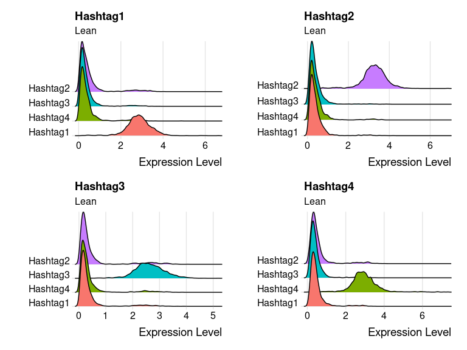<!-- -->

```
## Picking joint bandwidth of 0.0772
```

```
## Picking joint bandwidth of 0.0661
```

```
## Picking joint bandwidth of 0.0635
```

```
## Picking joint bandwidth of 0.0617
```

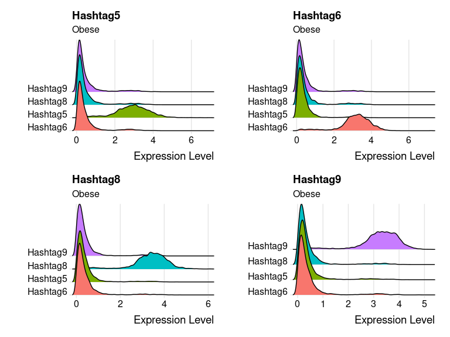<!-- -->

```
## Picking joint bandwidth of 0.0785
```

```
## Picking joint bandwidth of 0.0611
```

```
## Picking joint bandwidth of 0.0734
```

```
## Picking joint bandwidth of 0.0602
```

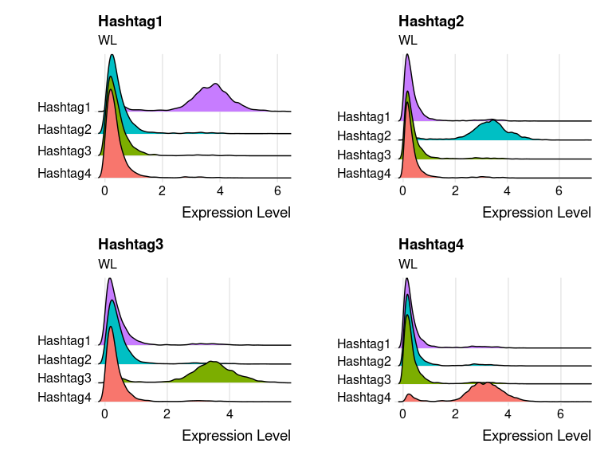<!-- -->

```
## Picking joint bandwidth of 0.0896
```

```
## Picking joint bandwidth of 0.0845
```

```
## Picking joint bandwidth of 0.088
```

```
## Picking joint bandwidth of 0.085
```

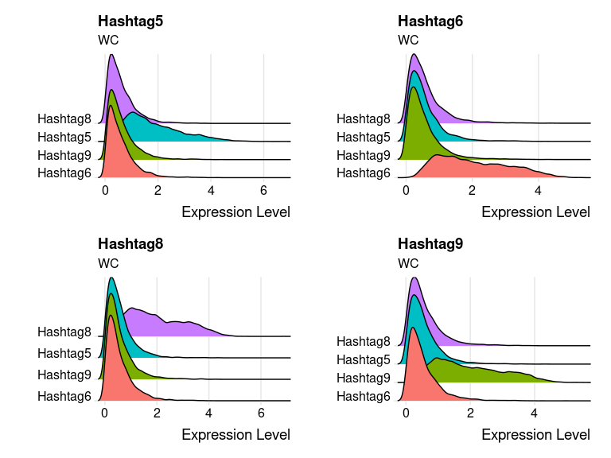<!-- -->

We can also calculate the frequency of singlets and report it in a table before subsetting. In this experiment, we observe that WL and WC samples had a higher frequency of "Negative" samples. These are cells in which surface Hashtag staining was too low for any specific antibody. This is likely due to insufficient antibody labeling. However, we retain enough cells even with a very strict cutoff for subsequent analysis.


```r
for (i in seq_along(Seurat_list)){
  print(names(Seurat_list)[i])
  print(prop.table(table(Seurat_list[[i]]$HTO_classification.global)))
}
```

```
## [1] "Lean"
## 
##    Doublet   Negative    Singlet 
## 0.20005230 0.02955021 0.77039749 
## [1] "Obese"
## 
##    Doublet   Negative    Singlet 
## 0.16016538 0.07486967 0.76496495 
## [1] "WL"
## 
##   Doublet  Negative   Singlet 
## 0.1670160 0.1199420 0.7130421 
## [1] "WC"
## 
##    Doublet   Negative    Singlet 
## 0.07488159 0.53082554 0.39429287
```
## Subset singlets
Finally, we will subset cells so that we only retain singlets for downstream processing

```r
for (i in seq_along(Seurat_list)){
  Idents(Seurat_list[[i]]) <- "HTO_classification.global" #Change the ident
  Seurat_list[[i]] <- subset(Seurat_list[[i]], idents = "Singlet")
}

#Take a look at how many cells are retained after final QC.
Seurat_list
```

```
## $Lean
## An object of class Seurat 
## 31073 features across 5892 samples within 3 assays 
## Active assay: RNA (31053 features, 0 variable features)
##  2 other assays present: ADT, HTO
## 
## $Obese
## An object of class Seurat 
## 31073 features across 8511 samples within 3 assays 
## Active assay: RNA (31053 features, 0 variable features)
##  2 other assays present: ADT, HTO
## 
## $WL
## An object of class Seurat 
## 31073 features across 8846 samples within 3 assays 
## Active assay: RNA (31053 features, 0 variable features)
##  2 other assays present: ADT, HTO
## 
## $WC
## An object of class Seurat 
## 31073 features across 10073 samples within 3 assays 
## Active assay: RNA (31053 features, 0 variable features)
##  2 other assays present: ADT, HTO
```

# Save Progress
The next vignette will show how we integrated our data and performed dimensional reduction. To save our current project, we will use the `saveRDS` function. This file is about 1.1gb and it seems unnecessary to move it around. Therefore, I've included all `.rds` files as part of the `git ignore` file. These will not be downloaded when the repository is cloned.


```r
saveRDS(Seurat_list, file="1_Preprocessing.rds")
```

# Session Info

```r
sessionInfo()
```

```
## R version 4.1.0 (2021-05-18)
## Platform: x86_64-pc-linux-gnu (64-bit)
## Running under: Ubuntu 20.04.2 LTS
## 
## Matrix products: default
## BLAS:   /usr/lib/x86_64-linux-gnu/blas/libblas.so.3.9.0
## LAPACK: /usr/lib/x86_64-linux-gnu/lapack/liblapack.so.3.9.0
## 
## locale:
##  [1] LC_CTYPE=en_US.UTF-8       LC_NUMERIC=C              
##  [3] LC_TIME=en_US.UTF-8        LC_COLLATE=en_US.UTF-8    
##  [5] LC_MONETARY=en_US.UTF-8    LC_MESSAGES=en_US.UTF-8   
##  [7] LC_PAPER=en_US.UTF-8       LC_NAME=C                 
##  [9] LC_ADDRESS=C               LC_TELEPHONE=C            
## [11] LC_MEASUREMENT=en_US.UTF-8 LC_IDENTIFICATION=C       
## 
## attached base packages:
## [1] parallel  stats4    stats     graphics  grDevices utils     datasets 
## [8] methods   base     
## 
## other attached packages:
##  [1] msigdbr_7.4.1               VAM_0.5.3                  
##  [3] MASS_7.3-54                 org.Mm.eg.db_3.13.0        
##  [5] AnnotationDbi_1.54.0        RColorBrewer_1.1-2         
##  [7] plotly_4.9.3                SeuratWrappers_0.3.0       
##  [9] velocyto.R_0.6              Matrix_1.3-4               
## [11] celldex_1.2.0               SummarizedExperiment_1.22.0
## [13] Biobase_2.52.0              GenomicRanges_1.44.0       
## [15] GenomeInfoDb_1.28.0         IRanges_2.26.0             
## [17] S4Vectors_0.30.0            BiocGenerics_0.38.0        
## [19] MatrixGenerics_1.4.0        matrixStats_0.59.0         
## [21] formattable_0.2.1           viridis_0.6.1              
## [23] viridisLite_0.4.0           cowplot_1.1.1              
## [25] SingleR_1.0.1               clustree_0.4.3             
## [27] ggraph_2.0.5                dplyr_1.0.6                
## [29] ggplot2_3.3.3               SeuratObject_4.0.1         
## [31] Seurat_4.0.2.9004           SoupX_1.5.2                
## 
## loaded via a namespace (and not attached):
##   [1] utf8_1.2.1                    reticulate_1.20              
##   [3] tidyselect_1.1.1              RSQLite_2.2.7                
##   [5] htmlwidgets_1.5.3             grid_4.1.0                   
##   [7] BiocParallel_1.26.0           Rtsne_0.15                   
##   [9] munsell_0.5.0                 ScaledMatrix_1.0.0           
##  [11] codetools_0.2-18              ica_1.0-2                    
##  [13] future_1.21.0                 miniUI_0.1.1.1               
##  [15] withr_2.4.2                   colorspace_2.0-1             
##  [17] filelock_1.0.2                highr_0.9                    
##  [19] knitr_1.33                    SingleCellExperiment_1.14.1  
##  [21] ROCR_1.0-11                   tensor_1.5                   
##  [23] pbmcapply_1.5.0               listenv_0.8.0                
##  [25] labeling_0.4.2                GenomeInfoDbData_1.2.6       
##  [27] polyclip_1.10-0               bit64_4.0.5                  
##  [29] farver_2.1.0                  pheatmap_1.0.12              
##  [31] rhdf5_2.36.0                  parallelly_1.25.0            
##  [33] vctrs_0.3.8                   generics_0.1.0               
##  [35] xfun_0.23                     BiocFileCache_2.0.0          
##  [37] doParallel_1.0.16             R6_2.5.0                     
##  [39] graphlayouts_0.7.1            rsvd_1.0.5                   
##  [41] locfit_1.5-9.4                bitops_1.0-7                 
##  [43] rhdf5filters_1.4.0            spatstat.utils_2.1-0         
##  [45] cachem_1.0.5                  DelayedArray_0.18.0          
##  [47] assertthat_0.2.1              promises_1.2.0.1             
##  [49] scales_1.1.1                  gtable_0.3.0                 
##  [51] beachmat_2.8.0                globals_0.14.0               
##  [53] goftest_1.2-2                 tidygraph_1.2.0              
##  [55] rlang_0.4.11                  splines_4.1.0                
##  [57] lazyeval_0.2.2                spatstat.geom_2.1-0          
##  [59] BiocManager_1.30.15           yaml_2.2.1                   
##  [61] reshape2_1.4.4                abind_1.4-5                  
##  [63] httpuv_1.6.1                  tools_4.1.0                  
##  [65] ellipsis_0.3.2                spatstat.core_2.1-2          
##  [67] jquerylib_0.1.4               ggridges_0.5.3               
##  [69] Rcpp_1.0.6                    plyr_1.8.6                   
##  [71] sparseMatrixStats_1.4.0       zlibbioc_1.38.0              
##  [73] purrr_0.3.4                   RCurl_1.98-1.3               
##  [75] rpart_4.1-15                  deldir_0.2-10                
##  [77] pbapply_1.4-3                 zoo_1.8-9                    
##  [79] ggrepel_0.9.1                 cluster_2.1.2                
##  [81] magrittr_2.0.1                data.table_1.14.0            
##  [83] scattermore_0.7               lmtest_0.9-37                
##  [85] RANN_2.6.1                    pcaMethods_1.84.0            
##  [87] fitdistrplus_1.1-5            patchwork_1.1.1              
##  [89] mime_0.10                     evaluate_0.14                
##  [91] GSVA_1.40.1                   xtable_1.8-4                 
##  [93] XML_3.99-0.6                  gridExtra_2.3                
##  [95] compiler_4.1.0                tibble_3.1.2                 
##  [97] KernSmooth_2.23-20            crayon_1.4.1                 
##  [99] htmltools_0.5.1.1             mgcv_1.8-36                  
## [101] later_1.2.0                   tidyr_1.1.3                  
## [103] DBI_1.1.1                     ExperimentHub_2.0.0          
## [105] tweenr_1.0.2                  dbplyr_2.1.1                 
## [107] rappdirs_0.3.3                babelgene_21.4               
## [109] igraph_1.2.6                  pkgconfig_2.0.3              
## [111] spatstat.sparse_2.0-0         foreach_1.5.1                
## [113] annotate_1.70.0               bslib_0.2.5.1                
## [115] XVector_0.32.0                doFuture_0.12.0              
## [117] stringr_1.4.0                 digest_0.6.27                
## [119] sctransform_0.3.2             RcppAnnoy_0.0.18             
## [121] graph_1.70.0                  spatstat.data_2.1-0          
## [123] Biostrings_2.60.0             rmarkdown_2.8                
## [125] leiden_0.3.8                  edgeR_3.34.0                 
## [127] uwot_0.1.10                   DelayedMatrixStats_1.14.0    
## [129] GSEABase_1.54.0               curl_4.3.1                   
## [131] shiny_1.6.0                   lifecycle_1.0.0              
## [133] nlme_3.1-152                  outliers_0.14                
## [135] jsonlite_1.7.2                Rhdf5lib_1.14.2              
## [137] limma_3.48.0                  fansi_0.5.0                  
## [139] pillar_1.6.1                  lattice_0.20-44              
## [141] KEGGREST_1.32.0               fastmap_1.1.0                
## [143] httr_1.4.2                    survival_3.2-11              
## [145] remotes_2.4.0                 interactiveDisplayBase_1.30.0
## [147] glue_1.4.2                    png_0.1-7                    
## [149] iterators_1.0.13              BiocVersion_3.13.1           
## [151] bit_4.0.4                     ggforce_0.3.3                
## [153] stringi_1.6.2                 sass_0.4.0                   
## [155] HDF5Array_1.20.0              blob_1.2.1                   
## [157] singscore_1.12.0              AnnotationHub_3.0.1          
## [159] BiocSingular_1.8.0            memoise_2.0.0                
## [161] irlba_2.3.3                   future.apply_1.7.0
```

