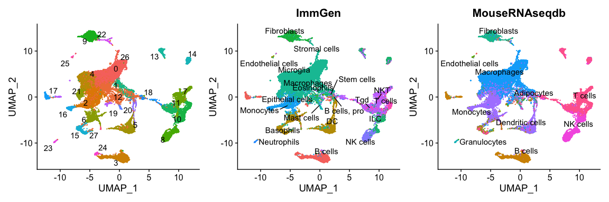
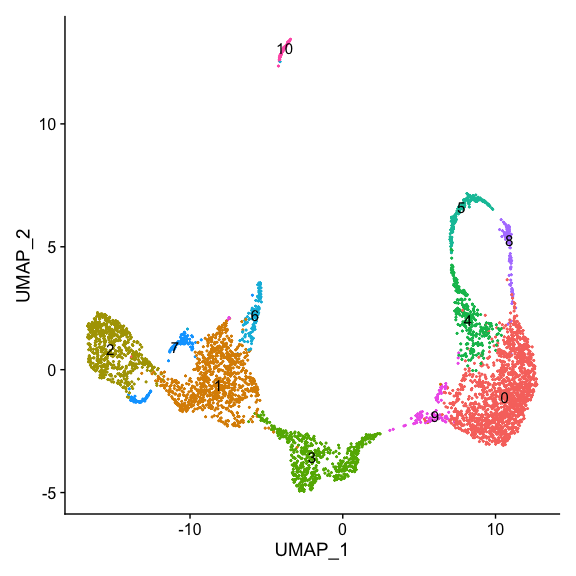
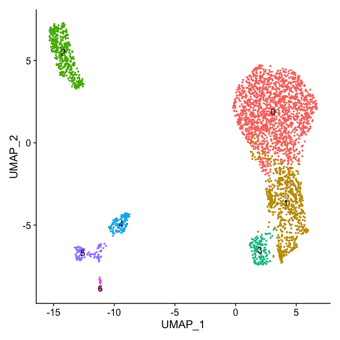
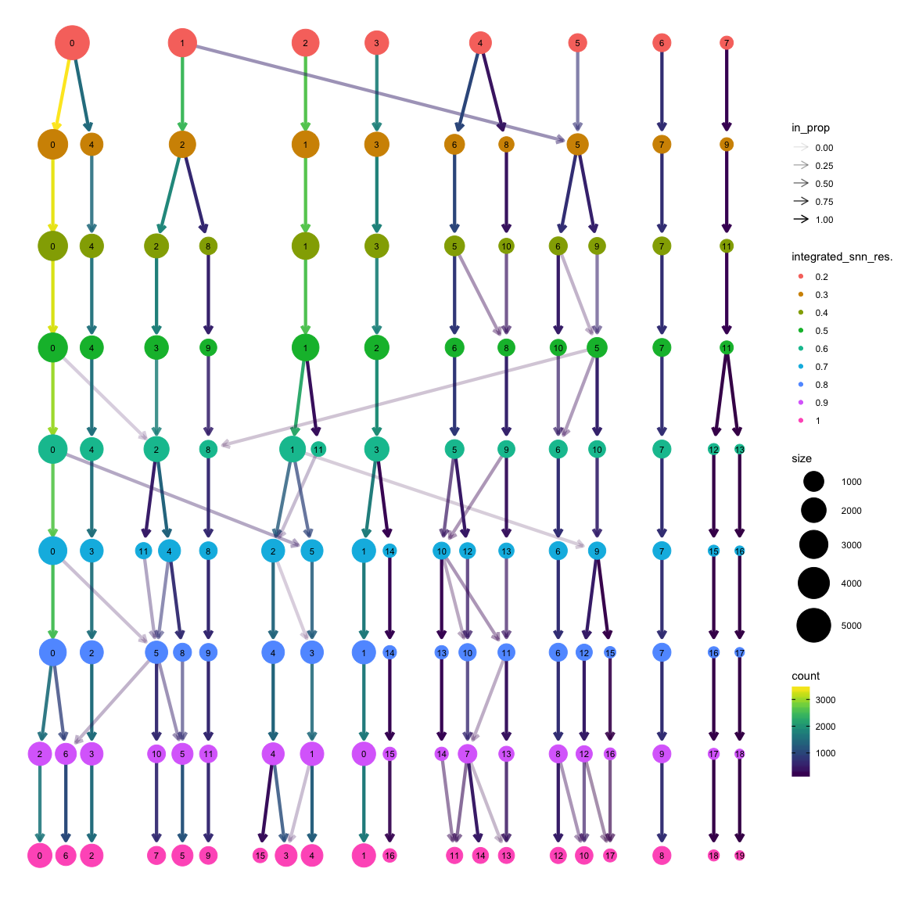

# In this vignette

In this cell annotation vignette, we will be taking the output from the Data Integration vignette and identifying cell types and subtypes by expression of key marker genes. Herein, we will do the following:

1. Perform low-resolution clustering
2. Identify cell types using differentially expressed genes.
3. Recluster each cell type at higher resolution.
4. Identify cell subtypes within broad cell type clusters using differentially expressed genes.
5. Run SingleR to help confirm annotations.

# Prepare the R environment

## Load in the necessary libraries


```r
library(Seurat)
library(ggplot2)
library(dplyr)
library(cowplot)
library(SeuratWrappers)
library(plotly)
library(RColorBrewer)
library(clustree)
library(SingleR)
library(formattable)
```

## Load in our Seurat object

This `.rds` file comes from Vignette #2 - Data Integration.


```r
data.integrated <- readRDS("../2_DataIntegration_Vignette/2_DataIntegration.rds")
```

# Clustering and visualization

Seurat uses K-nearest neighbor clustering based on PCA and then clusters the cells using the Louvain algorithm. Nearest neighbor clustering requires input of dimensions. Based on the `JackStrawPlot` and `ElbowPlot`, we will use all 50 PCs and could likely use even more. However, it is noted that there are diminishing returns on the number of PCs, so 50 will be sufficient.


```r
data.integrated <- FindNeighbors(data.integrated, dims=1:50) 
```

```
## Computing nearest neighbor graph
```

```
## Computing SNN
```

## Clustree

Resolution of the Louvain clustering algorithm greatly affects number of identified clusters. This can be visualized by iterating over multiple resolutions and then plotting using Clustree. The resulting clustering is stored in the metaData of our integrated Seurat object.


```r
#Calculate clusters for a number of resolutions ranging from 0.2-1.0
res <- c(0.2,0.3,0.4,0.5,0.6,0.7,0.8,0.9,1.0)
data.integrated <- FindClusters(data.integrated, resolution=res)
```

```
## Modularity Optimizer version 1.3.0 by Ludo Waltman and Nees Jan van Eck
## 
## Number of nodes: 33322
## Number of edges: 1402393
## 
## Running Louvain algorithm...
## Maximum modularity in 10 random starts: 0.9627
## Number of communities: 20
## Elapsed time: 6 seconds
## Modularity Optimizer version 1.3.0 by Ludo Waltman and Nees Jan van Eck
## 
## Number of nodes: 33322
## Number of edges: 1402393
## 
## Running Louvain algorithm...
## Maximum modularity in 10 random starts: 0.9541
## Number of communities: 25
## Elapsed time: 6 seconds
## Modularity Optimizer version 1.3.0 by Ludo Waltman and Nees Jan van Eck
## 
## Number of nodes: 33322
## Number of edges: 1402393
## 
## Running Louvain algorithm...
## Maximum modularity in 10 random starts: 0.9476
## Number of communities: 28
## Elapsed time: 6 seconds
## Modularity Optimizer version 1.3.0 by Ludo Waltman and Nees Jan van Eck
## 
## Number of nodes: 33322
## Number of edges: 1402393
## 
## Running Louvain algorithm...
## Maximum modularity in 10 random starts: 0.9418
## Number of communities: 31
## Elapsed time: 6 seconds
## Modularity Optimizer version 1.3.0 by Ludo Waltman and Nees Jan van Eck
## 
## Number of nodes: 33322
## Number of edges: 1402393
## 
## Running Louvain algorithm...
## Maximum modularity in 10 random starts: 0.9371
## Number of communities: 31
## Elapsed time: 6 seconds
## Modularity Optimizer version 1.3.0 by Ludo Waltman and Nees Jan van Eck
## 
## Number of nodes: 33322
## Number of edges: 1402393
## 
## Running Louvain algorithm...
## Maximum modularity in 10 random starts: 0.9326
## Number of communities: 33
## Elapsed time: 6 seconds
## Modularity Optimizer version 1.3.0 by Ludo Waltman and Nees Jan van Eck
## 
## Number of nodes: 33322
## Number of edges: 1402393
## 
## Running Louvain algorithm...
## Maximum modularity in 10 random starts: 0.9283
## Number of communities: 37
## Elapsed time: 6 seconds
## Modularity Optimizer version 1.3.0 by Ludo Waltman and Nees Jan van Eck
## 
## Number of nodes: 33322
## Number of edges: 1402393
## 
## Running Louvain algorithm...
## Maximum modularity in 10 random starts: 0.9241
## Number of communities: 39
## Elapsed time: 6 seconds
## Modularity Optimizer version 1.3.0 by Ludo Waltman and Nees Jan van Eck
## 
## Number of nodes: 33322
## Number of edges: 1402393
## 
## Running Louvain algorithm...
## Maximum modularity in 10 random starts: 0.9201
## Number of communities: 39
## Elapsed time: 6 seconds
```

```r
#Plot using Clustree
clustree(data.integrated, prefix="integrated_snn_res.")
```

```
## Warning: The `add` argument of `group_by()` is deprecated as of dplyr 1.0.0.
## Please use the `.add` argument instead.
```

<!-- -->


```r
#Recluster at the selected resolution of interest. This is not absolutely necessary, but is a nice redundancy and resets the `seurat_clusters` column in the metadata automatically.
data.integrated <- FindClusters(data.integrated, resolution=0.4)
```

```
## Modularity Optimizer version 1.3.0 by Ludo Waltman and Nees Jan van Eck
## 
## Number of nodes: 33322
## Number of edges: 1402393
## 
## Running Louvain algorithm...
## Maximum modularity in 10 random starts: 0.9476
## Number of communities: 28
## Elapsed time: 5 seconds
```

# SingleR
The R package `SingleR` uses microarray reference datasets to attempt to annotate each individual cell. We will use this package as a tool to support cluster identification. https://bioconductor.org/packages/release/bioc/html/SingleR.html References for `SingleR` are provided by the pokedex for cells `celldex.` In this case, we will run `SinglerR` with two different databases: 1) Immgen and 2) MouseRNAseq from the gene expression omnibus.


```r
#Warning, this takes a very long time to run and scales poorly with number of cells, but is not computationally expensive (can run with 8 gb of RAM.
#Load in the database information
ImmGen <- ImmGenData() 
```

```
## Warning: 'ImmGenData' is deprecated.
## Use 'celldex::ImmGenData' instead.
## See help("Deprecated")
```

```
## snapshotDate(): 2021-05-18
```

```
## see ?celldex and browseVignettes('celldex') for documentation
```

```
## loading from cache
```

```
## see ?celldex and browseVignettes('celldex') for documentation
```

```
## loading from cache
```

```r
MouseRNAseq <- MouseRNAseqData()
```

```
## snapshotDate(): 2021-05-18
```

```
## see ?celldex and browseVignettes('celldex') for documentation
```

```
## loading from cache
```

```
## see ?celldex and browseVignettes('celldex') for documentation
```

```
## loading from cache
```

```r
#SingleR requires conversion to a single cell experiment object
singleR <- as.SingleCellExperiment(data.integrated, assay= "integrated") 
#Create main labels using the Immgen database
singler.ImmGen <- SingleR(test = singleR, ref = ImmGen, labels = (ImmGen$label.main))
#Create main labels using the Immgen database
singler.MouseRNAseq <- SingleR(test = singleR, ref = MouseRNAseq, labels = (MouseRNAseq$label.main))
#Save the singleR labels into our Seurat object as a metaData column
data.integrated[["ImmGen"]] <- singler.ImmGen$labels 
data.integrated[["MouseRNAseqdb"]] <- singler.MouseRNAseq$labels
#Plot the main labels and compare them to the original Seurat clusters
SR1 <- DimPlot(data.integrated, label=T, repel=T) + NoLegend()
SR2 <- DimPlot(data.integrated, label=T, repel=T, group.by="ImmGen") + NoLegend()
SR3 <- DimPlot(data.integrated, label=T, repel=T, group.by="MouseRNAseqdb") + NoLegend()
SR1 + SR2 + SR3
```

```
## Warning: ggrepel: 8 unlabeled data points (too many overlaps). Consider
## increasing max.overlaps
```

<!-- -->

# Low-level Cluster Identification
Seurat has a built in function for differential expression across identities. In this case, our identities are currently numbered clusters and setting FindAllMarkers to report only genes expression in at least 50% of cells (for a given cluster) and with a positive fold change will give us markers that are highly expressed within each cluster. The max.cells.per.ident option limits the amount of cells included to reduce computational time.


```r
lowlevel.markers <- FindAllMarkers(data.integrated, only.pos = TRUE, min.pct = 0.50, logfc.threshold = 0.25, max.cells.per.ident=1000, verbose=FALSE)

#Store the top10 markers for each cluster and write it to a table
top10 <- lowlevel.markers %>% group_by(cluster) %>% top_n(n = 10, wt = avg_log2FC)

#Put the top10 markers for each cluster into a formatted table
top10 %>% formattable()
```


<table class="table table-condensed">
 <thead>
  <tr>
   <th style="text-align:right;"> p_val </th>
   <th style="text-align:right;"> avg_log2FC </th>
   <th style="text-align:right;"> pct.1 </th>
   <th style="text-align:right;"> pct.2 </th>
   <th style="text-align:right;"> p_val_adj </th>
   <th style="text-align:right;"> cluster </th>
   <th style="text-align:right;"> gene </th>
  </tr>
 </thead>
<tbody>
  <tr>
   <td style="text-align:right;"> 2.204445e-287 </td>
   <td style="text-align:right;"> 3.2733807 </td>
   <td style="text-align:right;"> 0.999 </td>
   <td style="text-align:right;"> 0.673 </td>
   <td style="text-align:right;"> 4.408890e-284 </td>
   <td style="text-align:right;"> 0 </td>
   <td style="text-align:right;"> Selenop </td>
  </tr>
  <tr>
   <td style="text-align:right;"> 3.765615e-278 </td>
   <td style="text-align:right;"> 2.7684359 </td>
   <td style="text-align:right;"> 0.999 </td>
   <td style="text-align:right;"> 0.557 </td>
   <td style="text-align:right;"> 7.531230e-275 </td>
   <td style="text-align:right;"> 0 </td>
   <td style="text-align:right;"> C1qc </td>
  </tr>
  <tr>
   <td style="text-align:right;"> 1.121794e-273 </td>
   <td style="text-align:right;"> 2.8516298 </td>
   <td style="text-align:right;"> 0.999 </td>
   <td style="text-align:right;"> 0.489 </td>
   <td style="text-align:right;"> 2.243588e-270 </td>
   <td style="text-align:right;"> 0 </td>
   <td style="text-align:right;"> C1qa </td>
  </tr>
  <tr>
   <td style="text-align:right;"> 2.390962e-265 </td>
   <td style="text-align:right;"> 2.5646835 </td>
   <td style="text-align:right;"> 0.999 </td>
   <td style="text-align:right;"> 0.554 </td>
   <td style="text-align:right;"> 4.781924e-262 </td>
   <td style="text-align:right;"> 0 </td>
   <td style="text-align:right;"> C1qb </td>
  </tr>
  <tr>
   <td style="text-align:right;"> 2.368984e-257 </td>
   <td style="text-align:right;"> 2.8163310 </td>
   <td style="text-align:right;"> 0.999 </td>
   <td style="text-align:right;"> 0.575 </td>
   <td style="text-align:right;"> 4.737969e-254 </td>
   <td style="text-align:right;"> 0 </td>
   <td style="text-align:right;"> Apoe </td>
  </tr>
  <tr>
   <td style="text-align:right;"> 2.370869e-255 </td>
   <td style="text-align:right;"> 2.9843800 </td>
   <td style="text-align:right;"> 0.996 </td>
   <td style="text-align:right;"> 0.450 </td>
   <td style="text-align:right;"> 4.741738e-252 </td>
   <td style="text-align:right;"> 0 </td>
   <td style="text-align:right;"> Pf4 </td>
  </tr>
  <tr>
   <td style="text-align:right;"> 5.702047e-240 </td>
   <td style="text-align:right;"> 2.4362855 </td>
   <td style="text-align:right;"> 0.998 </td>
   <td style="text-align:right;"> 0.593 </td>
   <td style="text-align:right;"> 1.140409e-236 </td>
   <td style="text-align:right;"> 0 </td>
   <td style="text-align:right;"> Pltp </td>
  </tr>
  <tr>
   <td style="text-align:right;"> 1.357335e-207 </td>
   <td style="text-align:right;"> 2.8264101 </td>
   <td style="text-align:right;"> 0.900 </td>
   <td style="text-align:right;"> 0.366 </td>
   <td style="text-align:right;"> 2.714670e-204 </td>
   <td style="text-align:right;"> 0 </td>
   <td style="text-align:right;"> Cbr2 </td>
  </tr>
  <tr>
   <td style="text-align:right;"> 3.900404e-180 </td>
   <td style="text-align:right;"> 2.3649790 </td>
   <td style="text-align:right;"> 0.893 </td>
   <td style="text-align:right;"> 0.344 </td>
   <td style="text-align:right;"> 7.800808e-177 </td>
   <td style="text-align:right;"> 0 </td>
   <td style="text-align:right;"> Folr2 </td>
  </tr>
  <tr>
   <td style="text-align:right;"> 1.925071e-111 </td>
   <td style="text-align:right;"> 2.6400285 </td>
   <td style="text-align:right;"> 0.815 </td>
   <td style="text-align:right;"> 0.456 </td>
   <td style="text-align:right;"> 3.850142e-108 </td>
   <td style="text-align:right;"> 0 </td>
   <td style="text-align:right;"> Ccl8 </td>
  </tr>
  <tr>
   <td style="text-align:right;"> 8.220399e-192 </td>
   <td style="text-align:right;"> 1.1934868 </td>
   <td style="text-align:right;"> 0.846 </td>
   <td style="text-align:right;"> 0.190 </td>
   <td style="text-align:right;"> 1.644080e-188 </td>
   <td style="text-align:right;"> 1 </td>
   <td style="text-align:right;"> Igkv8-30 </td>
  </tr>
  <tr>
   <td style="text-align:right;"> 5.682940e-43 </td>
   <td style="text-align:right;"> 0.7535382 </td>
   <td style="text-align:right;"> 0.344 </td>
   <td style="text-align:right;"> 0.551 </td>
   <td style="text-align:right;"> 1.136588e-39 </td>
   <td style="text-align:right;"> 1 </td>
   <td style="text-align:right;"> Gm26917 </td>
  </tr>
  <tr>
   <td style="text-align:right;"> 1.374123e-38 </td>
   <td style="text-align:right;"> 0.7733946 </td>
   <td style="text-align:right;"> 0.711 </td>
   <td style="text-align:right;"> 0.420 </td>
   <td style="text-align:right;"> 2.748246e-35 </td>
   <td style="text-align:right;"> 1 </td>
   <td style="text-align:right;"> Atp6v0d2 </td>
  </tr>
  <tr>
   <td style="text-align:right;"> 7.986853e-38 </td>
   <td style="text-align:right;"> 1.0257686 </td>
   <td style="text-align:right;"> 0.686 </td>
   <td style="text-align:right;"> 0.209 </td>
   <td style="text-align:right;"> 1.597371e-34 </td>
   <td style="text-align:right;"> 1 </td>
   <td style="text-align:right;"> Igkv3-2 </td>
  </tr>
  <tr>
   <td style="text-align:right;"> 2.984435e-29 </td>
   <td style="text-align:right;"> 1.5775792 </td>
   <td style="text-align:right;"> 0.615 </td>
   <td style="text-align:right;"> 0.147 </td>
   <td style="text-align:right;"> 5.968870e-26 </td>
   <td style="text-align:right;"> 1 </td>
   <td style="text-align:right;"> Igkv19-93 </td>
  </tr>
  <tr>
   <td style="text-align:right;"> 1.624575e-26 </td>
   <td style="text-align:right;"> 0.8348826 </td>
   <td style="text-align:right;"> 0.799 </td>
   <td style="text-align:right;"> 0.624 </td>
   <td style="text-align:right;"> 3.249150e-23 </td>
   <td style="text-align:right;"> 1 </td>
   <td style="text-align:right;"> Fabp5 </td>
  </tr>
  <tr>
   <td style="text-align:right;"> 2.629720e-20 </td>
   <td style="text-align:right;"> 0.7111138 </td>
   <td style="text-align:right;"> 0.935 </td>
   <td style="text-align:right;"> 0.911 </td>
   <td style="text-align:right;"> 5.259439e-17 </td>
   <td style="text-align:right;"> 1 </td>
   <td style="text-align:right;"> Prdx1 </td>
  </tr>
  <tr>
   <td style="text-align:right;"> 4.651868e-10 </td>
   <td style="text-align:right;"> 1.6805620 </td>
   <td style="text-align:right;"> 0.533 </td>
   <td style="text-align:right;"> 0.154 </td>
   <td style="text-align:right;"> 9.303735e-07 </td>
   <td style="text-align:right;"> 1 </td>
   <td style="text-align:right;"> Cma1 </td>
  </tr>
  <tr>
   <td style="text-align:right;"> 9.682367e-06 </td>
   <td style="text-align:right;"> 1.2939057 </td>
   <td style="text-align:right;"> 0.523 </td>
   <td style="text-align:right;"> 0.153 </td>
   <td style="text-align:right;"> 1.936473e-02 </td>
   <td style="text-align:right;"> 1 </td>
   <td style="text-align:right;"> Tpsb2 </td>
  </tr>
  <tr>
   <td style="text-align:right;"> 6.123045e-05 </td>
   <td style="text-align:right;"> 0.6727795 </td>
   <td style="text-align:right;"> 0.653 </td>
   <td style="text-align:right;"> 0.529 </td>
   <td style="text-align:right;"> 1.224609e-01 </td>
   <td style="text-align:right;"> 1 </td>
   <td style="text-align:right;"> Pla2g7 </td>
  </tr>
  <tr>
   <td style="text-align:right;"> 1.788606e-183 </td>
   <td style="text-align:right;"> 1.9390654 </td>
   <td style="text-align:right;"> 0.998 </td>
   <td style="text-align:right;"> 0.700 </td>
   <td style="text-align:right;"> 3.577212e-180 </td>
   <td style="text-align:right;"> 2 </td>
   <td style="text-align:right;"> Lyz2 </td>
  </tr>
  <tr>
   <td style="text-align:right;"> 1.124362e-176 </td>
   <td style="text-align:right;"> 1.7067890 </td>
   <td style="text-align:right;"> 0.944 </td>
   <td style="text-align:right;"> 0.546 </td>
   <td style="text-align:right;"> 2.248725e-173 </td>
   <td style="text-align:right;"> 2 </td>
   <td style="text-align:right;"> Lst1 </td>
  </tr>
  <tr>
   <td style="text-align:right;"> 1.593060e-167 </td>
   <td style="text-align:right;"> 1.7966249 </td>
   <td style="text-align:right;"> 0.963 </td>
   <td style="text-align:right;"> 0.592 </td>
   <td style="text-align:right;"> 3.186119e-164 </td>
   <td style="text-align:right;"> 2 </td>
   <td style="text-align:right;"> Ms4a6c </td>
  </tr>
  <tr>
   <td style="text-align:right;"> 9.448228e-155 </td>
   <td style="text-align:right;"> 2.0972228 </td>
   <td style="text-align:right;"> 0.989 </td>
   <td style="text-align:right;"> 0.685 </td>
   <td style="text-align:right;"> 1.889646e-151 </td>
   <td style="text-align:right;"> 2 </td>
   <td style="text-align:right;"> Ifitm3 </td>
  </tr>
  <tr>
   <td style="text-align:right;"> 5.375437e-148 </td>
   <td style="text-align:right;"> 1.7122860 </td>
   <td style="text-align:right;"> 0.982 </td>
   <td style="text-align:right;"> 0.823 </td>
   <td style="text-align:right;"> 1.075087e-144 </td>
   <td style="text-align:right;"> 2 </td>
   <td style="text-align:right;"> Prdx5 </td>
  </tr>
  <tr>
   <td style="text-align:right;"> 1.391176e-120 </td>
   <td style="text-align:right;"> 1.5645674 </td>
   <td style="text-align:right;"> 0.760 </td>
   <td style="text-align:right;"> 0.343 </td>
   <td style="text-align:right;"> 2.782352e-117 </td>
   <td style="text-align:right;"> 2 </td>
   <td style="text-align:right;"> Sirpb1c </td>
  </tr>
  <tr>
   <td style="text-align:right;"> 1.006656e-99 </td>
   <td style="text-align:right;"> 1.9192618 </td>
   <td style="text-align:right;"> 0.874 </td>
   <td style="text-align:right;"> 0.526 </td>
   <td style="text-align:right;"> 2.013311e-96 </td>
   <td style="text-align:right;"> 2 </td>
   <td style="text-align:right;"> Il1b </td>
  </tr>
  <tr>
   <td style="text-align:right;"> 6.440672e-66 </td>
   <td style="text-align:right;"> 2.0975351 </td>
   <td style="text-align:right;"> 0.770 </td>
   <td style="text-align:right;"> 0.517 </td>
   <td style="text-align:right;"> 1.288134e-62 </td>
   <td style="text-align:right;"> 2 </td>
   <td style="text-align:right;"> Plac8 </td>
  </tr>
  <tr>
   <td style="text-align:right;"> 7.910219e-32 </td>
   <td style="text-align:right;"> 1.8633784 </td>
   <td style="text-align:right;"> 0.704 </td>
   <td style="text-align:right;"> 0.510 </td>
   <td style="text-align:right;"> 1.582044e-28 </td>
   <td style="text-align:right;"> 2 </td>
   <td style="text-align:right;"> Cxcl9 </td>
  </tr>
  <tr>
   <td style="text-align:right;"> 2.885236e-07 </td>
   <td style="text-align:right;"> 1.6500587 </td>
   <td style="text-align:right;"> 0.601 </td>
   <td style="text-align:right;"> 0.527 </td>
   <td style="text-align:right;"> 5.770473e-04 </td>
   <td style="text-align:right;"> 2 </td>
   <td style="text-align:right;"> Cxcl10 </td>
  </tr>
  <tr>
   <td style="text-align:right;"> 0.000000e+00 </td>
   <td style="text-align:right;"> 4.7799811 </td>
   <td style="text-align:right;"> 0.998 </td>
   <td style="text-align:right;"> 0.414 </td>
   <td style="text-align:right;"> 0.000000e+00 </td>
   <td style="text-align:right;"> 3 </td>
   <td style="text-align:right;"> Cd79a </td>
  </tr>
  <tr>
   <td style="text-align:right;"> 1.093237e-301 </td>
   <td style="text-align:right;"> 3.7429075 </td>
   <td style="text-align:right;"> 0.983 </td>
   <td style="text-align:right;"> 0.415 </td>
   <td style="text-align:right;"> 2.186474e-298 </td>
   <td style="text-align:right;"> 3 </td>
   <td style="text-align:right;"> Cd79b </td>
  </tr>
  <tr>
   <td style="text-align:right;"> 2.767634e-297 </td>
   <td style="text-align:right;"> 4.3215389 </td>
   <td style="text-align:right;"> 0.984 </td>
   <td style="text-align:right;"> 0.380 </td>
   <td style="text-align:right;"> 5.535269e-294 </td>
   <td style="text-align:right;"> 3 </td>
   <td style="text-align:right;"> Ly6d </td>
  </tr>
  <tr>
   <td style="text-align:right;"> 2.717702e-281 </td>
   <td style="text-align:right;"> 3.3098711 </td>
   <td style="text-align:right;"> 0.945 </td>
   <td style="text-align:right;"> 0.257 </td>
   <td style="text-align:right;"> 5.435404e-278 </td>
   <td style="text-align:right;"> 3 </td>
   <td style="text-align:right;"> Ms4a1 </td>
  </tr>
  <tr>
   <td style="text-align:right;"> 3.888374e-254 </td>
   <td style="text-align:right;"> 2.9318569 </td>
   <td style="text-align:right;"> 0.944 </td>
   <td style="text-align:right;"> 0.454 </td>
   <td style="text-align:right;"> 7.776747e-251 </td>
   <td style="text-align:right;"> 3 </td>
   <td style="text-align:right;"> H2-DMb2 </td>
  </tr>
  <tr>
   <td style="text-align:right;"> 1.643444e-203 </td>
   <td style="text-align:right;"> 2.6502791 </td>
   <td style="text-align:right;"> 0.874 </td>
   <td style="text-align:right;"> 0.306 </td>
   <td style="text-align:right;"> 3.286888e-200 </td>
   <td style="text-align:right;"> 3 </td>
   <td style="text-align:right;"> Iglc3 </td>
  </tr>
  <tr>
   <td style="text-align:right;"> 7.823993e-198 </td>
   <td style="text-align:right;"> 2.4734851 </td>
   <td style="text-align:right;"> 0.896 </td>
   <td style="text-align:right;"> 0.318 </td>
   <td style="text-align:right;"> 1.564799e-194 </td>
   <td style="text-align:right;"> 3 </td>
   <td style="text-align:right;"> Iglc2 </td>
  </tr>
  <tr>
   <td style="text-align:right;"> 2.140715e-139 </td>
   <td style="text-align:right;"> 2.2579382 </td>
   <td style="text-align:right;"> 0.803 </td>
   <td style="text-align:right;"> 0.299 </td>
   <td style="text-align:right;"> 4.281431e-136 </td>
   <td style="text-align:right;"> 3 </td>
   <td style="text-align:right;"> Ebf1 </td>
  </tr>
  <tr>
   <td style="text-align:right;"> 9.989603e-134 </td>
   <td style="text-align:right;"> 2.4485614 </td>
   <td style="text-align:right;"> 0.763 </td>
   <td style="text-align:right;"> 0.239 </td>
   <td style="text-align:right;"> 1.997921e-130 </td>
   <td style="text-align:right;"> 3 </td>
   <td style="text-align:right;"> Fcmr </td>
  </tr>
  <tr>
   <td style="text-align:right;"> 7.000078e-127 </td>
   <td style="text-align:right;"> 2.3399668 </td>
   <td style="text-align:right;"> 0.745 </td>
   <td style="text-align:right;"> 0.286 </td>
   <td style="text-align:right;"> 1.400016e-123 </td>
   <td style="text-align:right;"> 3 </td>
   <td style="text-align:right;"> Ighd </td>
  </tr>
  <tr>
   <td style="text-align:right;"> 1.488688e-274 </td>
   <td style="text-align:right;"> 2.8740327 </td>
   <td style="text-align:right;"> 0.996 </td>
   <td style="text-align:right;"> 0.581 </td>
   <td style="text-align:right;"> 2.977376e-271 </td>
   <td style="text-align:right;"> 4 </td>
   <td style="text-align:right;"> Lpl </td>
  </tr>
  <tr>
   <td style="text-align:right;"> 8.837480e-273 </td>
   <td style="text-align:right;"> 2.7445951 </td>
   <td style="text-align:right;"> 1.000 </td>
   <td style="text-align:right;"> 0.806 </td>
   <td style="text-align:right;"> 1.767496e-269 </td>
   <td style="text-align:right;"> 4 </td>
   <td style="text-align:right;"> Lgals3 </td>
  </tr>
  <tr>
   <td style="text-align:right;"> 8.081045e-247 </td>
   <td style="text-align:right;"> 2.5382207 </td>
   <td style="text-align:right;"> 0.984 </td>
   <td style="text-align:right;"> 0.515 </td>
   <td style="text-align:right;"> 1.616209e-243 </td>
   <td style="text-align:right;"> 4 </td>
   <td style="text-align:right;"> Trem2 </td>
  </tr>
  <tr>
   <td style="text-align:right;"> 3.339546e-240 </td>
   <td style="text-align:right;"> 2.2143654 </td>
   <td style="text-align:right;"> 0.992 </td>
   <td style="text-align:right;"> 0.576 </td>
   <td style="text-align:right;"> 6.679092e-237 </td>
   <td style="text-align:right;"> 4 </td>
   <td style="text-align:right;"> Cd36 </td>
  </tr>
  <tr>
   <td style="text-align:right;"> 6.545996e-230 </td>
   <td style="text-align:right;"> 2.2898030 </td>
   <td style="text-align:right;"> 0.998 </td>
   <td style="text-align:right;"> 0.789 </td>
   <td style="text-align:right;"> 1.309199e-226 </td>
   <td style="text-align:right;"> 4 </td>
   <td style="text-align:right;"> Ctsd </td>
  </tr>
  <tr>
   <td style="text-align:right;"> 7.804839e-205 </td>
   <td style="text-align:right;"> 2.1610881 </td>
   <td style="text-align:right;"> 0.990 </td>
   <td style="text-align:right;"> 0.737 </td>
   <td style="text-align:right;"> 1.560968e-201 </td>
   <td style="text-align:right;"> 4 </td>
   <td style="text-align:right;"> Anxa1 </td>
  </tr>
  <tr>
   <td style="text-align:right;"> 2.704274e-159 </td>
   <td style="text-align:right;"> 2.2922252 </td>
   <td style="text-align:right;"> 0.828 </td>
   <td style="text-align:right;"> 0.441 </td>
   <td style="text-align:right;"> 5.408547e-156 </td>
   <td style="text-align:right;"> 4 </td>
   <td style="text-align:right;"> Gdf15 </td>
  </tr>
  <tr>
   <td style="text-align:right;"> 1.055975e-143 </td>
   <td style="text-align:right;"> 2.8297315 </td>
   <td style="text-align:right;"> 0.802 </td>
   <td style="text-align:right;"> 0.318 </td>
   <td style="text-align:right;"> 2.111949e-140 </td>
   <td style="text-align:right;"> 4 </td>
   <td style="text-align:right;"> Gpnmb </td>
  </tr>
  <tr>
   <td style="text-align:right;"> 2.605881e-74 </td>
   <td style="text-align:right;"> 2.7871300 </td>
   <td style="text-align:right;"> 0.672 </td>
   <td style="text-align:right;"> 0.255 </td>
   <td style="text-align:right;"> 5.211762e-71 </td>
   <td style="text-align:right;"> 4 </td>
   <td style="text-align:right;"> Mmp12 </td>
  </tr>
  <tr>
   <td style="text-align:right;"> 3.909452e-68 </td>
   <td style="text-align:right;"> 2.2310279 </td>
   <td style="text-align:right;"> 0.724 </td>
   <td style="text-align:right;"> 0.343 </td>
   <td style="text-align:right;"> 7.818904e-65 </td>
   <td style="text-align:right;"> 4 </td>
   <td style="text-align:right;"> Ctsk </td>
  </tr>
  <tr>
   <td style="text-align:right;"> 0.000000e+00 </td>
   <td style="text-align:right;"> 3.4526084 </td>
   <td style="text-align:right;"> 1.000 </td>
   <td style="text-align:right;"> 0.884 </td>
   <td style="text-align:right;"> 0.000000e+00 </td>
   <td style="text-align:right;"> 5 </td>
   <td style="text-align:right;"> Cst3 </td>
  </tr>
  <tr>
   <td style="text-align:right;"> 2.335810e-302 </td>
   <td style="text-align:right;"> 2.8325288 </td>
   <td style="text-align:right;"> 0.991 </td>
   <td style="text-align:right;"> 0.532 </td>
   <td style="text-align:right;"> 4.671620e-299 </td>
   <td style="text-align:right;"> 5 </td>
   <td style="text-align:right;"> Naaa </td>
  </tr>
  <tr>
   <td style="text-align:right;"> 3.564827e-300 </td>
   <td style="text-align:right;"> 2.2024370 </td>
   <td style="text-align:right;"> 0.978 </td>
   <td style="text-align:right;"> 0.342 </td>
   <td style="text-align:right;"> 7.129654e-297 </td>
   <td style="text-align:right;"> 5 </td>
   <td style="text-align:right;"> Clec9a </td>
  </tr>
  <tr>
   <td style="text-align:right;"> 1.906393e-289 </td>
   <td style="text-align:right;"> 2.6807061 </td>
   <td style="text-align:right;"> 0.994 </td>
   <td style="text-align:right;"> 0.668 </td>
   <td style="text-align:right;"> 3.812787e-286 </td>
   <td style="text-align:right;"> 5 </td>
   <td style="text-align:right;"> Irf8 </td>
  </tr>
  <tr>
   <td style="text-align:right;"> 1.722317e-276 </td>
   <td style="text-align:right;"> 2.5832926 </td>
   <td style="text-align:right;"> 0.993 </td>
   <td style="text-align:right;"> 0.595 </td>
   <td style="text-align:right;"> 3.444635e-273 </td>
   <td style="text-align:right;"> 5 </td>
   <td style="text-align:right;"> Plbd1 </td>
  </tr>
  <tr>
   <td style="text-align:right;"> 2.004989e-273 </td>
   <td style="text-align:right;"> 2.4032388 </td>
   <td style="text-align:right;"> 0.981 </td>
   <td style="text-align:right;"> 0.555 </td>
   <td style="text-align:right;"> 4.009979e-270 </td>
   <td style="text-align:right;"> 5 </td>
   <td style="text-align:right;"> Ppt1 </td>
  </tr>
  <tr>
   <td style="text-align:right;"> 7.912738e-266 </td>
   <td style="text-align:right;"> 2.0693468 </td>
   <td style="text-align:right;"> 0.986 </td>
   <td style="text-align:right;"> 0.459 </td>
   <td style="text-align:right;"> 1.582548e-262 </td>
   <td style="text-align:right;"> 5 </td>
   <td style="text-align:right;"> Wdfy4 </td>
  </tr>
  <tr>
   <td style="text-align:right;"> 2.021446e-264 </td>
   <td style="text-align:right;"> 2.1154419 </td>
   <td style="text-align:right;"> 0.990 </td>
   <td style="text-align:right;"> 0.644 </td>
   <td style="text-align:right;"> 4.042891e-261 </td>
   <td style="text-align:right;"> 5 </td>
   <td style="text-align:right;"> Gm2a </td>
  </tr>
  <tr>
   <td style="text-align:right;"> 2.608526e-244 </td>
   <td style="text-align:right;"> 2.1333803 </td>
   <td style="text-align:right;"> 0.976 </td>
   <td style="text-align:right;"> 0.428 </td>
   <td style="text-align:right;"> 5.217053e-241 </td>
   <td style="text-align:right;"> 5 </td>
   <td style="text-align:right;"> Cd24a </td>
  </tr>
  <tr>
   <td style="text-align:right;"> 1.311438e-231 </td>
   <td style="text-align:right;"> 2.1622829 </td>
   <td style="text-align:right;"> 0.932 </td>
   <td style="text-align:right;"> 0.414 </td>
   <td style="text-align:right;"> 2.622876e-228 </td>
   <td style="text-align:right;"> 5 </td>
   <td style="text-align:right;"> Rtl8c </td>
  </tr>
  <tr>
   <td style="text-align:right;"> 1.162098e-173 </td>
   <td style="text-align:right;"> 1.4567935 </td>
   <td style="text-align:right;"> 0.998 </td>
   <td style="text-align:right;"> 0.827 </td>
   <td style="text-align:right;"> 2.324195e-170 </td>
   <td style="text-align:right;"> 6 </td>
   <td style="text-align:right;"> H2-Ab1 </td>
  </tr>
  <tr>
   <td style="text-align:right;"> 1.176692e-156 </td>
   <td style="text-align:right;"> 1.4028706 </td>
   <td style="text-align:right;"> 0.991 </td>
   <td style="text-align:right;"> 0.801 </td>
   <td style="text-align:right;"> 2.353385e-153 </td>
   <td style="text-align:right;"> 6 </td>
   <td style="text-align:right;"> Lsp1 </td>
  </tr>
  <tr>
   <td style="text-align:right;"> 2.162521e-148 </td>
   <td style="text-align:right;"> 2.0932829 </td>
   <td style="text-align:right;"> 0.841 </td>
   <td style="text-align:right;"> 0.491 </td>
   <td style="text-align:right;"> 4.325041e-145 </td>
   <td style="text-align:right;"> 6 </td>
   <td style="text-align:right;"> Tnfsf9 </td>
  </tr>
  <tr>
   <td style="text-align:right;"> 4.545976e-128 </td>
   <td style="text-align:right;"> 1.3649905 </td>
   <td style="text-align:right;"> 0.953 </td>
   <td style="text-align:right;"> 0.611 </td>
   <td style="text-align:right;"> 9.091952e-125 </td>
   <td style="text-align:right;"> 6 </td>
   <td style="text-align:right;"> Napsa </td>
  </tr>
  <tr>
   <td style="text-align:right;"> 1.632052e-127 </td>
   <td style="text-align:right;"> 1.9768721 </td>
   <td style="text-align:right;"> 0.898 </td>
   <td style="text-align:right;"> 0.536 </td>
   <td style="text-align:right;"> 3.264103e-124 </td>
   <td style="text-align:right;"> 6 </td>
   <td style="text-align:right;"> Il1b </td>
  </tr>
  <tr>
   <td style="text-align:right;"> 3.037064e-119 </td>
   <td style="text-align:right;"> 1.5137601 </td>
   <td style="text-align:right;"> 0.832 </td>
   <td style="text-align:right;"> 0.478 </td>
   <td style="text-align:right;"> 6.074129e-116 </td>
   <td style="text-align:right;"> 6 </td>
   <td style="text-align:right;"> Tnip3 </td>
  </tr>
  <tr>
   <td style="text-align:right;"> 2.708316e-92 </td>
   <td style="text-align:right;"> 2.6750790 </td>
   <td style="text-align:right;"> 0.714 </td>
   <td style="text-align:right;"> 0.281 </td>
   <td style="text-align:right;"> 5.416632e-89 </td>
   <td style="text-align:right;"> 6 </td>
   <td style="text-align:right;"> Cd209a </td>
  </tr>
  <tr>
   <td style="text-align:right;"> 4.725833e-63 </td>
   <td style="text-align:right;"> 1.9469267 </td>
   <td style="text-align:right;"> 0.670 </td>
   <td style="text-align:right;"> 0.373 </td>
   <td style="text-align:right;"> 9.451666e-60 </td>
   <td style="text-align:right;"> 6 </td>
   <td style="text-align:right;"> Ear2 </td>
  </tr>
  <tr>
   <td style="text-align:right;"> 5.028765e-56 </td>
   <td style="text-align:right;"> 1.8900960 </td>
   <td style="text-align:right;"> 0.713 </td>
   <td style="text-align:right;"> 0.401 </td>
   <td style="text-align:right;"> 1.005753e-52 </td>
   <td style="text-align:right;"> 6 </td>
   <td style="text-align:right;"> Fn1 </td>
  </tr>
  <tr>
   <td style="text-align:right;"> 7.584320e-08 </td>
   <td style="text-align:right;"> 1.7143310 </td>
   <td style="text-align:right;"> 0.638 </td>
   <td style="text-align:right;"> 0.516 </td>
   <td style="text-align:right;"> 1.516864e-04 </td>
   <td style="text-align:right;"> 6 </td>
   <td style="text-align:right;"> Lyz1 </td>
  </tr>
  <tr>
   <td style="text-align:right;"> 1.720520e-247 </td>
   <td style="text-align:right;"> 2.5871026 </td>
   <td style="text-align:right;"> 0.979 </td>
   <td style="text-align:right;"> 0.496 </td>
   <td style="text-align:right;"> 3.441041e-244 </td>
   <td style="text-align:right;"> 7 </td>
   <td style="text-align:right;"> Cd3g </td>
  </tr>
  <tr>
   <td style="text-align:right;"> 2.782103e-234 </td>
   <td style="text-align:right;"> 2.4668968 </td>
   <td style="text-align:right;"> 0.971 </td>
   <td style="text-align:right;"> 0.491 </td>
   <td style="text-align:right;"> 5.564206e-231 </td>
   <td style="text-align:right;"> 7 </td>
   <td style="text-align:right;"> Cd3e </td>
  </tr>
  <tr>
   <td style="text-align:right;"> 3.610375e-230 </td>
   <td style="text-align:right;"> 2.3306726 </td>
   <td style="text-align:right;"> 0.964 </td>
   <td style="text-align:right;"> 0.536 </td>
   <td style="text-align:right;"> 7.220750e-227 </td>
   <td style="text-align:right;"> 7 </td>
   <td style="text-align:right;"> Cd3d </td>
  </tr>
  <tr>
   <td style="text-align:right;"> 1.725840e-200 </td>
   <td style="text-align:right;"> 3.2723736 </td>
   <td style="text-align:right;"> 0.853 </td>
   <td style="text-align:right;"> 0.376 </td>
   <td style="text-align:right;"> 3.451680e-197 </td>
   <td style="text-align:right;"> 7 </td>
   <td style="text-align:right;"> Tnfrsf4 </td>
  </tr>
  <tr>
   <td style="text-align:right;"> 7.987865e-172 </td>
   <td style="text-align:right;"> 2.7694239 </td>
   <td style="text-align:right;"> 0.869 </td>
   <td style="text-align:right;"> 0.509 </td>
   <td style="text-align:right;"> 1.597573e-168 </td>
   <td style="text-align:right;"> 7 </td>
   <td style="text-align:right;"> Ctla4 </td>
  </tr>
  <tr>
   <td style="text-align:right;"> 3.266643e-167 </td>
   <td style="text-align:right;"> 2.0673723 </td>
   <td style="text-align:right;"> 0.979 </td>
   <td style="text-align:right;"> 0.781 </td>
   <td style="text-align:right;"> 6.533287e-164 </td>
   <td style="text-align:right;"> 7 </td>
   <td style="text-align:right;"> AW112010 </td>
  </tr>
  <tr>
   <td style="text-align:right;"> 1.749500e-166 </td>
   <td style="text-align:right;"> 2.1100529 </td>
   <td style="text-align:right;"> 0.830 </td>
   <td style="text-align:right;"> 0.426 </td>
   <td style="text-align:right;"> 3.499000e-163 </td>
   <td style="text-align:right;"> 7 </td>
   <td style="text-align:right;"> Icos </td>
  </tr>
  <tr>
   <td style="text-align:right;"> 1.180868e-163 </td>
   <td style="text-align:right;"> 2.3089053 </td>
   <td style="text-align:right;"> 0.862 </td>
   <td style="text-align:right;"> 0.436 </td>
   <td style="text-align:right;"> 2.361736e-160 </td>
   <td style="text-align:right;"> 7 </td>
   <td style="text-align:right;"> Tnfrsf18 </td>
  </tr>
  <tr>
   <td style="text-align:right;"> 1.509837e-133 </td>
   <td style="text-align:right;"> 2.0975406 </td>
   <td style="text-align:right;"> 0.750 </td>
   <td style="text-align:right;"> 0.393 </td>
   <td style="text-align:right;"> 3.019673e-130 </td>
   <td style="text-align:right;"> 7 </td>
   <td style="text-align:right;"> Ikzf2 </td>
  </tr>
  <tr>
   <td style="text-align:right;"> 1.815537e-46 </td>
   <td style="text-align:right;"> 3.1063654 </td>
   <td style="text-align:right;"> 0.623 </td>
   <td style="text-align:right;"> 0.432 </td>
   <td style="text-align:right;"> 3.631075e-43 </td>
   <td style="text-align:right;"> 7 </td>
   <td style="text-align:right;"> Areg </td>
  </tr>
  <tr>
   <td style="text-align:right;"> 1.965096e-276 </td>
   <td style="text-align:right;"> 3.1430577 </td>
   <td style="text-align:right;"> 0.924 </td>
   <td style="text-align:right;"> 0.197 </td>
   <td style="text-align:right;"> 3.930193e-273 </td>
   <td style="text-align:right;"> 8 </td>
   <td style="text-align:right;"> Ncr1 </td>
  </tr>
  <tr>
   <td style="text-align:right;"> 2.967364e-274 </td>
   <td style="text-align:right;"> 3.1188238 </td>
   <td style="text-align:right;"> 0.999 </td>
   <td style="text-align:right;"> 0.562 </td>
   <td style="text-align:right;"> 5.934728e-271 </td>
   <td style="text-align:right;"> 8 </td>
   <td style="text-align:right;"> Nkg7 </td>
  </tr>
  <tr>
   <td style="text-align:right;"> 3.570166e-270 </td>
   <td style="text-align:right;"> 2.9675779 </td>
   <td style="text-align:right;"> 0.999 </td>
   <td style="text-align:right;"> 0.780 </td>
   <td style="text-align:right;"> 7.140332e-267 </td>
   <td style="text-align:right;"> 8 </td>
   <td style="text-align:right;"> AW112010 </td>
  </tr>
  <tr>
   <td style="text-align:right;"> 1.611834e-263 </td>
   <td style="text-align:right;"> 2.8419647 </td>
   <td style="text-align:right;"> 0.964 </td>
   <td style="text-align:right;"> 0.481 </td>
   <td style="text-align:right;"> 3.223669e-260 </td>
   <td style="text-align:right;"> 8 </td>
   <td style="text-align:right;"> Ctsw </td>
  </tr>
  <tr>
   <td style="text-align:right;"> 5.417348e-263 </td>
   <td style="text-align:right;"> 3.6783132 </td>
   <td style="text-align:right;"> 0.918 </td>
   <td style="text-align:right;"> 0.297 </td>
   <td style="text-align:right;"> 1.083470e-259 </td>
   <td style="text-align:right;"> 8 </td>
   <td style="text-align:right;"> Xcl1 </td>
  </tr>
  <tr>
   <td style="text-align:right;"> 7.797901e-263 </td>
   <td style="text-align:right;"> 2.8975007 </td>
   <td style="text-align:right;"> 0.969 </td>
   <td style="text-align:right;"> 0.508 </td>
   <td style="text-align:right;"> 1.559580e-259 </td>
   <td style="text-align:right;"> 8 </td>
   <td style="text-align:right;"> Il2rb </td>
  </tr>
  <tr>
   <td style="text-align:right;"> 2.245034e-232 </td>
   <td style="text-align:right;"> 2.9497521 </td>
   <td style="text-align:right;"> 0.890 </td>
   <td style="text-align:right;"> 0.361 </td>
   <td style="text-align:right;"> 4.490069e-229 </td>
   <td style="text-align:right;"> 8 </td>
   <td style="text-align:right;"> Klrb1c </td>
  </tr>
  <tr>
   <td style="text-align:right;"> 4.143432e-213 </td>
   <td style="text-align:right;"> 2.9107101 </td>
   <td style="text-align:right;"> 0.822 </td>
   <td style="text-align:right;"> 0.254 </td>
   <td style="text-align:right;"> 8.286865e-210 </td>
   <td style="text-align:right;"> 8 </td>
   <td style="text-align:right;"> Prf1 </td>
  </tr>
  <tr>
   <td style="text-align:right;"> 9.288241e-207 </td>
   <td style="text-align:right;"> 2.6199757 </td>
   <td style="text-align:right;"> 0.890 </td>
   <td style="text-align:right;"> 0.415 </td>
   <td style="text-align:right;"> 1.857648e-203 </td>
   <td style="text-align:right;"> 8 </td>
   <td style="text-align:right;"> Cd7 </td>
  </tr>
  <tr>
   <td style="text-align:right;"> 3.627012e-168 </td>
   <td style="text-align:right;"> 4.7894160 </td>
   <td style="text-align:right;"> 0.753 </td>
   <td style="text-align:right;"> 0.260 </td>
   <td style="text-align:right;"> 7.254025e-165 </td>
   <td style="text-align:right;"> 8 </td>
   <td style="text-align:right;"> Gzma </td>
  </tr>
  <tr>
   <td style="text-align:right;"> 0.000000e+00 </td>
   <td style="text-align:right;"> 5.8378008 </td>
   <td style="text-align:right;"> 0.992 </td>
   <td style="text-align:right;"> 0.178 </td>
   <td style="text-align:right;"> 0.000000e+00 </td>
   <td style="text-align:right;"> 9 </td>
   <td style="text-align:right;"> Dcn </td>
  </tr>
  <tr>
   <td style="text-align:right;"> 0.000000e+00 </td>
   <td style="text-align:right;"> 5.7040182 </td>
   <td style="text-align:right;"> 0.997 </td>
   <td style="text-align:right;"> 0.551 </td>
   <td style="text-align:right;"> 0.000000e+00 </td>
   <td style="text-align:right;"> 9 </td>
   <td style="text-align:right;"> Gsn </td>
  </tr>
  <tr>
   <td style="text-align:right;"> 0.000000e+00 </td>
   <td style="text-align:right;"> 4.2223587 </td>
   <td style="text-align:right;"> 0.982 </td>
   <td style="text-align:right;"> 0.226 </td>
   <td style="text-align:right;"> 0.000000e+00 </td>
   <td style="text-align:right;"> 9 </td>
   <td style="text-align:right;"> Serping1 </td>
  </tr>
  <tr>
   <td style="text-align:right;"> 1.666293e-303 </td>
   <td style="text-align:right;"> 3.7954575 </td>
   <td style="text-align:right;"> 0.990 </td>
   <td style="text-align:right;"> 0.392 </td>
   <td style="text-align:right;"> 3.332585e-300 </td>
   <td style="text-align:right;"> 9 </td>
   <td style="text-align:right;"> C3 </td>
  </tr>
  <tr>
   <td style="text-align:right;"> 5.875800e-292 </td>
   <td style="text-align:right;"> 3.5595392 </td>
   <td style="text-align:right;"> 0.967 </td>
   <td style="text-align:right;"> 0.309 </td>
   <td style="text-align:right;"> 1.175160e-288 </td>
   <td style="text-align:right;"> 9 </td>
   <td style="text-align:right;"> Gpx3 </td>
  </tr>
  <tr>
   <td style="text-align:right;"> 8.758582e-287 </td>
   <td style="text-align:right;"> 4.5248522 </td>
   <td style="text-align:right;"> 0.961 </td>
   <td style="text-align:right;"> 0.211 </td>
   <td style="text-align:right;"> 1.751716e-283 </td>
   <td style="text-align:right;"> 9 </td>
   <td style="text-align:right;"> Clec3b </td>
  </tr>
  <tr>
   <td style="text-align:right;"> 4.615889e-282 </td>
   <td style="text-align:right;"> 4.0279987 </td>
   <td style="text-align:right;"> 0.966 </td>
   <td style="text-align:right;"> 0.352 </td>
   <td style="text-align:right;"> 9.231778e-279 </td>
   <td style="text-align:right;"> 9 </td>
   <td style="text-align:right;"> Igfbp7 </td>
  </tr>
  <tr>
   <td style="text-align:right;"> 3.894426e-261 </td>
   <td style="text-align:right;"> 3.9531362 </td>
   <td style="text-align:right;"> 0.977 </td>
   <td style="text-align:right;"> 0.544 </td>
   <td style="text-align:right;"> 7.788852e-258 </td>
   <td style="text-align:right;"> 9 </td>
   <td style="text-align:right;"> Cebpd </td>
  </tr>
  <tr>
   <td style="text-align:right;"> 1.849781e-242 </td>
   <td style="text-align:right;"> 3.2862205 </td>
   <td style="text-align:right;"> 0.952 </td>
   <td style="text-align:right;"> 0.528 </td>
   <td style="text-align:right;"> 3.699563e-239 </td>
   <td style="text-align:right;"> 9 </td>
   <td style="text-align:right;"> Id3 </td>
  </tr>
  <tr>
   <td style="text-align:right;"> 1.164315e-216 </td>
   <td style="text-align:right;"> 3.8360513 </td>
   <td style="text-align:right;"> 0.906 </td>
   <td style="text-align:right;"> 0.253 </td>
   <td style="text-align:right;"> 2.328629e-213 </td>
   <td style="text-align:right;"> 9 </td>
   <td style="text-align:right;"> Sparc </td>
  </tr>
  <tr>
   <td style="text-align:right;"> 1.094560e-216 </td>
   <td style="text-align:right;"> 2.0657181 </td>
   <td style="text-align:right;"> 0.975 </td>
   <td style="text-align:right;"> 0.538 </td>
   <td style="text-align:right;"> 2.189120e-213 </td>
   <td style="text-align:right;"> 10 </td>
   <td style="text-align:right;"> Cd3d </td>
  </tr>
  <tr>
   <td style="text-align:right;"> 1.862478e-203 </td>
   <td style="text-align:right;"> 2.6896993 </td>
   <td style="text-align:right;"> 0.936 </td>
   <td style="text-align:right;"> 0.569 </td>
   <td style="text-align:right;"> 3.724956e-200 </td>
   <td style="text-align:right;"> 10 </td>
   <td style="text-align:right;"> Ly6c2 </td>
  </tr>
  <tr>
   <td style="text-align:right;"> 2.676799e-202 </td>
   <td style="text-align:right;"> 2.0825434 </td>
   <td style="text-align:right;"> 0.968 </td>
   <td style="text-align:right;"> 0.576 </td>
   <td style="text-align:right;"> 5.353597e-199 </td>
   <td style="text-align:right;"> 10 </td>
   <td style="text-align:right;"> Ms4a4b </td>
  </tr>
  <tr>
   <td style="text-align:right;"> 8.677553e-190 </td>
   <td style="text-align:right;"> 1.7184548 </td>
   <td style="text-align:right;"> 0.959 </td>
   <td style="text-align:right;"> 0.494 </td>
   <td style="text-align:right;"> 1.735511e-186 </td>
   <td style="text-align:right;"> 10 </td>
   <td style="text-align:right;"> Cd3e </td>
  </tr>
  <tr>
   <td style="text-align:right;"> 6.734735e-184 </td>
   <td style="text-align:right;"> 1.7006030 </td>
   <td style="text-align:right;"> 0.947 </td>
   <td style="text-align:right;"> 0.512 </td>
   <td style="text-align:right;"> 1.346947e-180 </td>
   <td style="text-align:right;"> 10 </td>
   <td style="text-align:right;"> Lck </td>
  </tr>
  <tr>
   <td style="text-align:right;"> 2.897437e-178 </td>
   <td style="text-align:right;"> 1.7971217 </td>
   <td style="text-align:right;"> 0.844 </td>
   <td style="text-align:right;"> 0.343 </td>
   <td style="text-align:right;"> 5.794874e-175 </td>
   <td style="text-align:right;"> 10 </td>
   <td style="text-align:right;"> Tcf7 </td>
  </tr>
  <tr>
   <td style="text-align:right;"> 1.365335e-174 </td>
   <td style="text-align:right;"> 1.7974966 </td>
   <td style="text-align:right;"> 0.947 </td>
   <td style="text-align:right;"> 0.504 </td>
   <td style="text-align:right;"> 2.730669e-171 </td>
   <td style="text-align:right;"> 10 </td>
   <td style="text-align:right;"> Thy1 </td>
  </tr>
  <tr>
   <td style="text-align:right;"> 1.713206e-173 </td>
   <td style="text-align:right;"> 1.7562783 </td>
   <td style="text-align:right;"> 0.956 </td>
   <td style="text-align:right;"> 0.597 </td>
   <td style="text-align:right;"> 3.426411e-170 </td>
   <td style="text-align:right;"> 10 </td>
   <td style="text-align:right;"> Ccl5 </td>
  </tr>
  <tr>
   <td style="text-align:right;"> 2.020857e-125 </td>
   <td style="text-align:right;"> 1.6632964 </td>
   <td style="text-align:right;"> 0.854 </td>
   <td style="text-align:right;"> 0.439 </td>
   <td style="text-align:right;"> 4.041715e-122 </td>
   <td style="text-align:right;"> 10 </td>
   <td style="text-align:right;"> Trbc2 </td>
  </tr>
  <tr>
   <td style="text-align:right;"> 4.271217e-67 </td>
   <td style="text-align:right;"> 1.7389740 </td>
   <td style="text-align:right;"> 0.719 </td>
   <td style="text-align:right;"> 0.424 </td>
   <td style="text-align:right;"> 8.542434e-64 </td>
   <td style="text-align:right;"> 10 </td>
   <td style="text-align:right;"> Cd7 </td>
  </tr>
  <tr>
   <td style="text-align:right;"> 1.366457e-298 </td>
   <td style="text-align:right;"> 4.3755646 </td>
   <td style="text-align:right;"> 0.998 </td>
   <td style="text-align:right;"> 0.597 </td>
   <td style="text-align:right;"> 2.732913e-295 </td>
   <td style="text-align:right;"> 11 </td>
   <td style="text-align:right;"> Ccl5 </td>
  </tr>
  <tr>
   <td style="text-align:right;"> 1.485543e-280 </td>
   <td style="text-align:right;"> 3.4411066 </td>
   <td style="text-align:right;"> 0.997 </td>
   <td style="text-align:right;"> 0.564 </td>
   <td style="text-align:right;"> 2.971087e-277 </td>
   <td style="text-align:right;"> 11 </td>
   <td style="text-align:right;"> Nkg7 </td>
  </tr>
  <tr>
   <td style="text-align:right;"> 5.418790e-266 </td>
   <td style="text-align:right;"> 2.9405115 </td>
   <td style="text-align:right;"> 0.990 </td>
   <td style="text-align:right;"> 0.577 </td>
   <td style="text-align:right;"> 1.083758e-262 </td>
   <td style="text-align:right;"> 11 </td>
   <td style="text-align:right;"> Ms4a4b </td>
  </tr>
  <tr>
   <td style="text-align:right;"> 1.178276e-264 </td>
   <td style="text-align:right;"> 3.7467698 </td>
   <td style="text-align:right;"> 0.926 </td>
   <td style="text-align:right;"> 0.349 </td>
   <td style="text-align:right;"> 2.356552e-261 </td>
   <td style="text-align:right;"> 11 </td>
   <td style="text-align:right;"> Cd8b1 </td>
  </tr>
  <tr>
   <td style="text-align:right;"> 6.478566e-248 </td>
   <td style="text-align:right;"> 2.6919827 </td>
   <td style="text-align:right;"> 0.974 </td>
   <td style="text-align:right;"> 0.496 </td>
   <td style="text-align:right;"> 1.295713e-244 </td>
   <td style="text-align:right;"> 11 </td>
   <td style="text-align:right;"> Cd3e </td>
  </tr>
  <tr>
   <td style="text-align:right;"> 7.310302e-241 </td>
   <td style="text-align:right;"> 3.3268773 </td>
   <td style="text-align:right;"> 0.894 </td>
   <td style="text-align:right;"> 0.365 </td>
   <td style="text-align:right;"> 1.462060e-237 </td>
   <td style="text-align:right;"> 11 </td>
   <td style="text-align:right;"> Gzmk </td>
  </tr>
  <tr>
   <td style="text-align:right;"> 9.187769e-241 </td>
   <td style="text-align:right;"> 2.6516882 </td>
   <td style="text-align:right;"> 0.973 </td>
   <td style="text-align:right;"> 0.540 </td>
   <td style="text-align:right;"> 1.837554e-237 </td>
   <td style="text-align:right;"> 11 </td>
   <td style="text-align:right;"> Cd3d </td>
  </tr>
  <tr>
   <td style="text-align:right;"> 4.061041e-240 </td>
   <td style="text-align:right;"> 2.6285212 </td>
   <td style="text-align:right;"> 0.974 </td>
   <td style="text-align:right;"> 0.500 </td>
   <td style="text-align:right;"> 8.122083e-237 </td>
   <td style="text-align:right;"> 11 </td>
   <td style="text-align:right;"> Cd3g </td>
  </tr>
  <tr>
   <td style="text-align:right;"> 3.707064e-232 </td>
   <td style="text-align:right;"> 2.4957990 </td>
   <td style="text-align:right;"> 0.939 </td>
   <td style="text-align:right;"> 0.506 </td>
   <td style="text-align:right;"> 7.414129e-229 </td>
   <td style="text-align:right;"> 11 </td>
   <td style="text-align:right;"> Lat </td>
  </tr>
  <tr>
   <td style="text-align:right;"> 9.254575e-210 </td>
   <td style="text-align:right;"> 2.8987733 </td>
   <td style="text-align:right;"> 0.858 </td>
   <td style="text-align:right;"> 0.369 </td>
   <td style="text-align:right;"> 1.850915e-206 </td>
   <td style="text-align:right;"> 11 </td>
   <td style="text-align:right;"> Cd8a </td>
  </tr>
  <tr>
   <td style="text-align:right;"> 5.644190e-259 </td>
   <td style="text-align:right;"> 2.5800321 </td>
   <td style="text-align:right;"> 0.981 </td>
   <td style="text-align:right;"> 0.484 </td>
   <td style="text-align:right;"> 1.128838e-255 </td>
   <td style="text-align:right;"> 12 </td>
   <td style="text-align:right;"> Stmn1 </td>
  </tr>
  <tr>
   <td style="text-align:right;"> 4.376341e-239 </td>
   <td style="text-align:right;"> 2.1614168 </td>
   <td style="text-align:right;"> 0.938 </td>
   <td style="text-align:right;"> 0.330 </td>
   <td style="text-align:right;"> 8.752681e-236 </td>
   <td style="text-align:right;"> 12 </td>
   <td style="text-align:right;"> Birc5 </td>
  </tr>
  <tr>
   <td style="text-align:right;"> 6.070325e-225 </td>
   <td style="text-align:right;"> 2.1119797 </td>
   <td style="text-align:right;"> 0.996 </td>
   <td style="text-align:right;"> 0.786 </td>
   <td style="text-align:right;"> 1.214065e-221 </td>
   <td style="text-align:right;"> 12 </td>
   <td style="text-align:right;"> Tuba1b </td>
  </tr>
  <tr>
   <td style="text-align:right;"> 9.326214e-218 </td>
   <td style="text-align:right;"> 1.6477712 </td>
   <td style="text-align:right;"> 0.918 </td>
   <td style="text-align:right;"> 0.370 </td>
   <td style="text-align:right;"> 1.865243e-214 </td>
   <td style="text-align:right;"> 12 </td>
   <td style="text-align:right;"> Tk1 </td>
  </tr>
  <tr>
   <td style="text-align:right;"> 8.873670e-214 </td>
   <td style="text-align:right;"> 2.0386987 </td>
   <td style="text-align:right;"> 0.995 </td>
   <td style="text-align:right;"> 0.802 </td>
   <td style="text-align:right;"> 1.774734e-210 </td>
   <td style="text-align:right;"> 12 </td>
   <td style="text-align:right;"> Tubb5 </td>
  </tr>
  <tr>
   <td style="text-align:right;"> 1.304747e-211 </td>
   <td style="text-align:right;"> 1.7381359 </td>
   <td style="text-align:right;"> 0.908 </td>
   <td style="text-align:right;"> 0.352 </td>
   <td style="text-align:right;"> 2.609494e-208 </td>
   <td style="text-align:right;"> 12 </td>
   <td style="text-align:right;"> Pclaf </td>
  </tr>
  <tr>
   <td style="text-align:right;"> 5.460677e-191 </td>
   <td style="text-align:right;"> 1.6506697 </td>
   <td style="text-align:right;"> 0.894 </td>
   <td style="text-align:right;"> 0.459 </td>
   <td style="text-align:right;"> 1.092135e-187 </td>
   <td style="text-align:right;"> 12 </td>
   <td style="text-align:right;"> Top2a </td>
  </tr>
  <tr>
   <td style="text-align:right;"> 2.283680e-133 </td>
   <td style="text-align:right;"> 2.2375279 </td>
   <td style="text-align:right;"> 0.810 </td>
   <td style="text-align:right;"> 0.359 </td>
   <td style="text-align:right;"> 4.567361e-130 </td>
   <td style="text-align:right;"> 12 </td>
   <td style="text-align:right;"> Ube2c </td>
  </tr>
  <tr>
   <td style="text-align:right;"> 4.725809e-127 </td>
   <td style="text-align:right;"> 1.6162227 </td>
   <td style="text-align:right;"> 0.972 </td>
   <td style="text-align:right;"> 0.709 </td>
   <td style="text-align:right;"> 9.451619e-124 </td>
   <td style="text-align:right;"> 12 </td>
   <td style="text-align:right;"> Hmgb2 </td>
  </tr>
  <tr>
   <td style="text-align:right;"> 2.958507e-74 </td>
   <td style="text-align:right;"> 2.3722323 </td>
   <td style="text-align:right;"> 0.775 </td>
   <td style="text-align:right;"> 0.439 </td>
   <td style="text-align:right;"> 5.917014e-71 </td>
   <td style="text-align:right;"> 12 </td>
   <td style="text-align:right;"> Hist1h2ap </td>
  </tr>
  <tr>
   <td style="text-align:right;"> 4.566835e-245 </td>
   <td style="text-align:right;"> 3.2578885 </td>
   <td style="text-align:right;"> 0.994 </td>
   <td style="text-align:right;"> 0.387 </td>
   <td style="text-align:right;"> 9.133670e-242 </td>
   <td style="text-align:right;"> 13 </td>
   <td style="text-align:right;"> Cxcr6 </td>
  </tr>
  <tr>
   <td style="text-align:right;"> 5.050357e-216 </td>
   <td style="text-align:right;"> 2.7551170 </td>
   <td style="text-align:right;"> 0.990 </td>
   <td style="text-align:right;"> 0.510 </td>
   <td style="text-align:right;"> 1.010071e-212 </td>
   <td style="text-align:right;"> 13 </td>
   <td style="text-align:right;"> Cd3g </td>
  </tr>
  <tr>
   <td style="text-align:right;"> 1.310833e-211 </td>
   <td style="text-align:right;"> 2.8460121 </td>
   <td style="text-align:right;"> 0.971 </td>
   <td style="text-align:right;"> 0.464 </td>
   <td style="text-align:right;"> 2.621666e-208 </td>
   <td style="text-align:right;"> 13 </td>
   <td style="text-align:right;"> Il7r </td>
  </tr>
  <tr>
   <td style="text-align:right;"> 3.360611e-203 </td>
   <td style="text-align:right;"> 2.7336304 </td>
   <td style="text-align:right;"> 0.904 </td>
   <td style="text-align:right;"> 0.358 </td>
   <td style="text-align:right;"> 6.721223e-200 </td>
   <td style="text-align:right;"> 13 </td>
   <td style="text-align:right;"> Actn2 </td>
  </tr>
  <tr>
   <td style="text-align:right;"> 4.060657e-198 </td>
   <td style="text-align:right;"> 2.5770626 </td>
   <td style="text-align:right;"> 0.956 </td>
   <td style="text-align:right;"> 0.385 </td>
   <td style="text-align:right;"> 8.121313e-195 </td>
   <td style="text-align:right;"> 13 </td>
   <td style="text-align:right;"> Ikzf3 </td>
  </tr>
  <tr>
   <td style="text-align:right;"> 4.355333e-196 </td>
   <td style="text-align:right;"> 3.1322533 </td>
   <td style="text-align:right;"> 0.847 </td>
   <td style="text-align:right;"> 0.160 </td>
   <td style="text-align:right;"> 8.710665e-193 </td>
   <td style="text-align:right;"> 13 </td>
   <td style="text-align:right;"> Tcrg-V6 </td>
  </tr>
  <tr>
   <td style="text-align:right;"> 2.450697e-195 </td>
   <td style="text-align:right;"> 3.7681954 </td>
   <td style="text-align:right;"> 0.854 </td>
   <td style="text-align:right;"> 0.186 </td>
   <td style="text-align:right;"> 4.901394e-192 </td>
   <td style="text-align:right;"> 13 </td>
   <td style="text-align:right;"> Cd163l1 </td>
  </tr>
  <tr>
   <td style="text-align:right;"> 1.562943e-193 </td>
   <td style="text-align:right;"> 4.6566444 </td>
   <td style="text-align:right;"> 0.872 </td>
   <td style="text-align:right;"> 0.278 </td>
   <td style="text-align:right;"> 3.125886e-190 </td>
   <td style="text-align:right;"> 13 </td>
   <td style="text-align:right;"> Trdv4 </td>
  </tr>
  <tr>
   <td style="text-align:right;"> 4.258710e-162 </td>
   <td style="text-align:right;"> 2.6505595 </td>
   <td style="text-align:right;"> 0.815 </td>
   <td style="text-align:right;"> 0.169 </td>
   <td style="text-align:right;"> 8.517419e-159 </td>
   <td style="text-align:right;"> 13 </td>
   <td style="text-align:right;"> Trdc </td>
  </tr>
  <tr>
   <td style="text-align:right;"> 8.095549e-129 </td>
   <td style="text-align:right;"> 2.5397097 </td>
   <td style="text-align:right;"> 0.850 </td>
   <td style="text-align:right;"> 0.565 </td>
   <td style="text-align:right;"> 1.619110e-125 </td>
   <td style="text-align:right;"> 13 </td>
   <td style="text-align:right;"> Rgcc </td>
  </tr>
  <tr>
   <td style="text-align:right;"> 2.234809e-199 </td>
   <td style="text-align:right;"> 4.2652511 </td>
   <td style="text-align:right;"> 0.939 </td>
   <td style="text-align:right;"> 0.432 </td>
   <td style="text-align:right;"> 4.469618e-196 </td>
   <td style="text-align:right;"> 14 </td>
   <td style="text-align:right;"> Areg </td>
  </tr>
  <tr>
   <td style="text-align:right;"> 2.211420e-198 </td>
   <td style="text-align:right;"> 4.1322656 </td>
   <td style="text-align:right;"> 0.970 </td>
   <td style="text-align:right;"> 0.565 </td>
   <td style="text-align:right;"> 4.422840e-195 </td>
   <td style="text-align:right;"> 14 </td>
   <td style="text-align:right;"> Hilpda </td>
  </tr>
  <tr>
   <td style="text-align:right;"> 1.028540e-186 </td>
   <td style="text-align:right;"> 2.7379575 </td>
   <td style="text-align:right;"> 0.901 </td>
   <td style="text-align:right;"> 0.266 </td>
   <td style="text-align:right;"> 2.057080e-183 </td>
   <td style="text-align:right;"> 14 </td>
   <td style="text-align:right;"> Klrg1 </td>
  </tr>
  <tr>
   <td style="text-align:right;"> 2.303502e-178 </td>
   <td style="text-align:right;"> 2.5981343 </td>
   <td style="text-align:right;"> 0.937 </td>
   <td style="text-align:right;"> 0.389 </td>
   <td style="text-align:right;"> 4.607004e-175 </td>
   <td style="text-align:right;"> 14 </td>
   <td style="text-align:right;"> Cxcr6 </td>
  </tr>
  <tr>
   <td style="text-align:right;"> 3.569811e-171 </td>
   <td style="text-align:right;"> 2.6896374 </td>
   <td style="text-align:right;"> 0.912 </td>
   <td style="text-align:right;"> 0.468 </td>
   <td style="text-align:right;"> 7.139621e-168 </td>
   <td style="text-align:right;"> 14 </td>
   <td style="text-align:right;"> Itk </td>
  </tr>
  <tr>
   <td style="text-align:right;"> 2.511854e-167 </td>
   <td style="text-align:right;"> 2.9545727 </td>
   <td style="text-align:right;"> 0.841 </td>
   <td style="text-align:right;"> 0.204 </td>
   <td style="text-align:right;"> 5.023707e-164 </td>
   <td style="text-align:right;"> 14 </td>
   <td style="text-align:right;"> Ccr8 </td>
  </tr>
  <tr>
   <td style="text-align:right;"> 2.680122e-116 </td>
   <td style="text-align:right;"> 2.6872598 </td>
   <td style="text-align:right;"> 0.752 </td>
   <td style="text-align:right;"> 0.232 </td>
   <td style="text-align:right;"> 5.360245e-113 </td>
   <td style="text-align:right;"> 14 </td>
   <td style="text-align:right;"> Arg1 </td>
  </tr>
  <tr>
   <td style="text-align:right;"> 5.370727e-105 </td>
   <td style="text-align:right;"> 2.4260294 </td>
   <td style="text-align:right;"> 0.805 </td>
   <td style="text-align:right;"> 0.447 </td>
   <td style="text-align:right;"> 1.074145e-101 </td>
   <td style="text-align:right;"> 14 </td>
   <td style="text-align:right;"> Gata3 </td>
  </tr>
  <tr>
   <td style="text-align:right;"> 1.291962e-75 </td>
   <td style="text-align:right;"> 2.4591385 </td>
   <td style="text-align:right;"> 0.778 </td>
   <td style="text-align:right;"> 0.517 </td>
   <td style="text-align:right;"> 2.583925e-72 </td>
   <td style="text-align:right;"> 14 </td>
   <td style="text-align:right;"> Lmo4 </td>
  </tr>
  <tr>
   <td style="text-align:right;"> 1.367314e-14 </td>
   <td style="text-align:right;"> 2.9534890 </td>
   <td style="text-align:right;"> 0.538 </td>
   <td style="text-align:right;"> 0.287 </td>
   <td style="text-align:right;"> 2.734628e-11 </td>
   <td style="text-align:right;"> 14 </td>
   <td style="text-align:right;"> Csf2 </td>
  </tr>
  <tr>
   <td style="text-align:right;"> 1.430433e-238 </td>
   <td style="text-align:right;"> 4.5889341 </td>
   <td style="text-align:right;"> 0.995 </td>
   <td style="text-align:right;"> 0.413 </td>
   <td style="text-align:right;"> 2.860865e-235 </td>
   <td style="text-align:right;"> 15 </td>
   <td style="text-align:right;"> Ccr7 </td>
  </tr>
  <tr>
   <td style="text-align:right;"> 2.511297e-209 </td>
   <td style="text-align:right;"> 3.4525616 </td>
   <td style="text-align:right;"> 0.973 </td>
   <td style="text-align:right;"> 0.599 </td>
   <td style="text-align:right;"> 5.022593e-206 </td>
   <td style="text-align:right;"> 15 </td>
   <td style="text-align:right;"> Tmem123 </td>
  </tr>
  <tr>
   <td style="text-align:right;"> 3.712795e-203 </td>
   <td style="text-align:right;"> 3.1701204 </td>
   <td style="text-align:right;"> 0.954 </td>
   <td style="text-align:right;"> 0.448 </td>
   <td style="text-align:right;"> 7.425589e-200 </td>
   <td style="text-align:right;"> 15 </td>
   <td style="text-align:right;"> Il4i1 </td>
  </tr>
  <tr>
   <td style="text-align:right;"> 2.773674e-199 </td>
   <td style="text-align:right;"> 4.7060784 </td>
   <td style="text-align:right;"> 0.921 </td>
   <td style="text-align:right;"> 0.323 </td>
   <td style="text-align:right;"> 5.547349e-196 </td>
   <td style="text-align:right;"> 15 </td>
   <td style="text-align:right;"> Fscn1 </td>
  </tr>
  <tr>
   <td style="text-align:right;"> 5.802395e-163 </td>
   <td style="text-align:right;"> 2.8170346 </td>
   <td style="text-align:right;"> 0.938 </td>
   <td style="text-align:right;"> 0.633 </td>
   <td style="text-align:right;"> 1.160479e-159 </td>
   <td style="text-align:right;"> 15 </td>
   <td style="text-align:right;"> Tspan3 </td>
  </tr>
  <tr>
   <td style="text-align:right;"> 1.106407e-133 </td>
   <td style="text-align:right;"> 3.1242161 </td>
   <td style="text-align:right;"> 0.818 </td>
   <td style="text-align:right;"> 0.376 </td>
   <td style="text-align:right;"> 2.212815e-130 </td>
   <td style="text-align:right;"> 15 </td>
   <td style="text-align:right;"> Ccl22 </td>
  </tr>
  <tr>
   <td style="text-align:right;"> 1.759331e-119 </td>
   <td style="text-align:right;"> 2.9074417 </td>
   <td style="text-align:right;"> 0.728 </td>
   <td style="text-align:right;"> 0.148 </td>
   <td style="text-align:right;"> 3.518662e-116 </td>
   <td style="text-align:right;"> 15 </td>
   <td style="text-align:right;"> Apol7c </td>
  </tr>
  <tr>
   <td style="text-align:right;"> 1.344000e-105 </td>
   <td style="text-align:right;"> 3.1061386 </td>
   <td style="text-align:right;"> 0.875 </td>
   <td style="text-align:right;"> 0.635 </td>
   <td style="text-align:right;"> 2.688000e-102 </td>
   <td style="text-align:right;"> 15 </td>
   <td style="text-align:right;"> Fabp5 </td>
  </tr>
  <tr>
   <td style="text-align:right;"> 1.479372e-102 </td>
   <td style="text-align:right;"> 3.0081776 </td>
   <td style="text-align:right;"> 0.695 </td>
   <td style="text-align:right;"> 0.201 </td>
   <td style="text-align:right;"> 2.958744e-99 </td>
   <td style="text-align:right;"> 15 </td>
   <td style="text-align:right;"> Il12b </td>
  </tr>
  <tr>
   <td style="text-align:right;"> 3.720049e-99 </td>
   <td style="text-align:right;"> 3.0570300 </td>
   <td style="text-align:right;"> 0.909 </td>
   <td style="text-align:right;"> 0.663 </td>
   <td style="text-align:right;"> 7.440098e-96 </td>
   <td style="text-align:right;"> 15 </td>
   <td style="text-align:right;"> Epsti1 </td>
  </tr>
  <tr>
   <td style="text-align:right;"> 4.419900e-202 </td>
   <td style="text-align:right;"> 3.8196518 </td>
   <td style="text-align:right;"> 0.996 </td>
   <td style="text-align:right;"> 0.557 </td>
   <td style="text-align:right;"> 8.839799e-199 </td>
   <td style="text-align:right;"> 16 </td>
   <td style="text-align:right;"> Gngt2 </td>
  </tr>
  <tr>
   <td style="text-align:right;"> 3.951499e-178 </td>
   <td style="text-align:right;"> 3.0711655 </td>
   <td style="text-align:right;"> 0.998 </td>
   <td style="text-align:right;"> 0.599 </td>
   <td style="text-align:right;"> 7.902998e-175 </td>
   <td style="text-align:right;"> 16 </td>
   <td style="text-align:right;"> Msrb1 </td>
  </tr>
  <tr>
   <td style="text-align:right;"> 4.814620e-178 </td>
   <td style="text-align:right;"> 2.8580055 </td>
   <td style="text-align:right;"> 0.987 </td>
   <td style="text-align:right;"> 0.575 </td>
   <td style="text-align:right;"> 9.629240e-175 </td>
   <td style="text-align:right;"> 16 </td>
   <td style="text-align:right;"> Lst1 </td>
  </tr>
  <tr>
   <td style="text-align:right;"> 9.129207e-156 </td>
   <td style="text-align:right;"> 3.1681137 </td>
   <td style="text-align:right;"> 0.953 </td>
   <td style="text-align:right;"> 0.382 </td>
   <td style="text-align:right;"> 1.825841e-152 </td>
   <td style="text-align:right;"> 16 </td>
   <td style="text-align:right;"> Ear2 </td>
  </tr>
  <tr>
   <td style="text-align:right;"> 2.517856e-150 </td>
   <td style="text-align:right;"> 3.0161141 </td>
   <td style="text-align:right;"> 0.919 </td>
   <td style="text-align:right;"> 0.354 </td>
   <td style="text-align:right;"> 5.035713e-147 </td>
   <td style="text-align:right;"> 16 </td>
   <td style="text-align:right;"> Ace </td>
  </tr>
  <tr>
   <td style="text-align:right;"> 4.473623e-139 </td>
   <td style="text-align:right;"> 2.6125079 </td>
   <td style="text-align:right;"> 0.927 </td>
   <td style="text-align:right;"> 0.385 </td>
   <td style="text-align:right;"> 8.947246e-136 </td>
   <td style="text-align:right;"> 16 </td>
   <td style="text-align:right;"> Ifitm6 </td>
  </tr>
  <tr>
   <td style="text-align:right;"> 4.375031e-137 </td>
   <td style="text-align:right;"> 2.8106390 </td>
   <td style="text-align:right;"> 0.942 </td>
   <td style="text-align:right;"> 0.516 </td>
   <td style="text-align:right;"> 8.750062e-134 </td>
   <td style="text-align:right;"> 16 </td>
   <td style="text-align:right;"> Pglyrp1 </td>
  </tr>
  <tr>
   <td style="text-align:right;"> 7.072014e-133 </td>
   <td style="text-align:right;"> 2.6903165 </td>
   <td style="text-align:right;"> 0.955 </td>
   <td style="text-align:right;"> 0.533 </td>
   <td style="text-align:right;"> 1.414403e-129 </td>
   <td style="text-align:right;"> 16 </td>
   <td style="text-align:right;"> Plac8 </td>
  </tr>
  <tr>
   <td style="text-align:right;"> 5.226081e-125 </td>
   <td style="text-align:right;"> 2.6562942 </td>
   <td style="text-align:right;"> 0.870 </td>
   <td style="text-align:right;"> 0.255 </td>
   <td style="text-align:right;"> 1.045216e-121 </td>
   <td style="text-align:right;"> 16 </td>
   <td style="text-align:right;"> Treml4 </td>
  </tr>
  <tr>
   <td style="text-align:right;"> 1.674944e-96 </td>
   <td style="text-align:right;"> 2.5439001 </td>
   <td style="text-align:right;"> 0.831 </td>
   <td style="text-align:right;"> 0.396 </td>
   <td style="text-align:right;"> 3.349887e-93 </td>
   <td style="text-align:right;"> 16 </td>
   <td style="text-align:right;"> Eno3 </td>
  </tr>
  <tr>
   <td style="text-align:right;"> 1.940061e-195 </td>
   <td style="text-align:right;"> 6.8935106 </td>
   <td style="text-align:right;"> 0.995 </td>
   <td style="text-align:right;"> 0.290 </td>
   <td style="text-align:right;"> 3.880122e-192 </td>
   <td style="text-align:right;"> 17 </td>
   <td style="text-align:right;"> Jchain </td>
  </tr>
  <tr>
   <td style="text-align:right;"> 8.589551e-175 </td>
   <td style="text-align:right;"> 5.9145585 </td>
   <td style="text-align:right;"> 0.980 </td>
   <td style="text-align:right;"> 0.501 </td>
   <td style="text-align:right;"> 1.717910e-171 </td>
   <td style="text-align:right;"> 17 </td>
   <td style="text-align:right;"> Igkc </td>
  </tr>
  <tr>
   <td style="text-align:right;"> 3.761565e-165 </td>
   <td style="text-align:right;"> 7.0090309 </td>
   <td style="text-align:right;"> 0.933 </td>
   <td style="text-align:right;"> 0.227 </td>
   <td style="text-align:right;"> 7.523129e-162 </td>
   <td style="text-align:right;"> 17 </td>
   <td style="text-align:right;"> Iglv1 </td>
  </tr>
  <tr>
   <td style="text-align:right;"> 1.012652e-160 </td>
   <td style="text-align:right;"> 6.2678339 </td>
   <td style="text-align:right;"> 0.968 </td>
   <td style="text-align:right;"> 0.653 </td>
   <td style="text-align:right;"> 2.025305e-157 </td>
   <td style="text-align:right;"> 17 </td>
   <td style="text-align:right;"> Ighm </td>
  </tr>
  <tr>
   <td style="text-align:right;"> 5.530097e-123 </td>
   <td style="text-align:right;"> 6.4162187 </td>
   <td style="text-align:right;"> 0.714 </td>
   <td style="text-align:right;"> 0.149 </td>
   <td style="text-align:right;"> 1.106019e-119 </td>
   <td style="text-align:right;"> 17 </td>
   <td style="text-align:right;"> Igkv3-5 </td>
  </tr>
  <tr>
   <td style="text-align:right;"> 1.655636e-92 </td>
   <td style="text-align:right;"> 7.4179285 </td>
   <td style="text-align:right;"> 0.724 </td>
   <td style="text-align:right;"> 0.246 </td>
   <td style="text-align:right;"> 3.311271e-89 </td>
   <td style="text-align:right;"> 17 </td>
   <td style="text-align:right;"> Igkv3-2 </td>
  </tr>
  <tr>
   <td style="text-align:right;"> 1.146709e-73 </td>
   <td style="text-align:right;"> 6.3638962 </td>
   <td style="text-align:right;"> 0.635 </td>
   <td style="text-align:right;"> 0.267 </td>
   <td style="text-align:right;"> 2.293419e-70 </td>
   <td style="text-align:right;"> 17 </td>
   <td style="text-align:right;"> Igkv3-10 </td>
  </tr>
  <tr>
   <td style="text-align:right;"> 4.103861e-57 </td>
   <td style="text-align:right;"> 5.5773850 </td>
   <td style="text-align:right;"> 0.510 </td>
   <td style="text-align:right;"> 0.049 </td>
   <td style="text-align:right;"> 8.207721e-54 </td>
   <td style="text-align:right;"> 17 </td>
   <td style="text-align:right;"> Igkv1-117 </td>
  </tr>
  <tr>
   <td style="text-align:right;"> 1.492014e-44 </td>
   <td style="text-align:right;"> 6.3462965 </td>
   <td style="text-align:right;"> 0.562 </td>
   <td style="text-align:right;"> 0.238 </td>
   <td style="text-align:right;"> 2.984028e-41 </td>
   <td style="text-align:right;"> 17 </td>
   <td style="text-align:right;"> Igkv17-121 </td>
  </tr>
  <tr>
   <td style="text-align:right;"> 4.037721e-34 </td>
   <td style="text-align:right;"> 5.5177794 </td>
   <td style="text-align:right;"> 0.502 </td>
   <td style="text-align:right;"> 0.190 </td>
   <td style="text-align:right;"> 8.075442e-31 </td>
   <td style="text-align:right;"> 17 </td>
   <td style="text-align:right;"> Igkv2-109 </td>
  </tr>
  <tr>
   <td style="text-align:right;"> 4.245031e-153 </td>
   <td style="text-align:right;"> 3.3423899 </td>
   <td style="text-align:right;"> 1.000 </td>
   <td style="text-align:right;"> 0.713 </td>
   <td style="text-align:right;"> 8.490063e-150 </td>
   <td style="text-align:right;"> 18 </td>
   <td style="text-align:right;"> Hmgb2 </td>
  </tr>
  <tr>
   <td style="text-align:right;"> 2.038511e-137 </td>
   <td style="text-align:right;"> 2.5708947 </td>
   <td style="text-align:right;"> 0.976 </td>
   <td style="text-align:right;"> 0.493 </td>
   <td style="text-align:right;"> 4.077021e-134 </td>
   <td style="text-align:right;"> 18 </td>
   <td style="text-align:right;"> Stmn1 </td>
  </tr>
  <tr>
   <td style="text-align:right;"> 1.453815e-136 </td>
   <td style="text-align:right;"> 2.2388824 </td>
   <td style="text-align:right;"> 0.958 </td>
   <td style="text-align:right;"> 0.453 </td>
   <td style="text-align:right;"> 2.907630e-133 </td>
   <td style="text-align:right;"> 18 </td>
   <td style="text-align:right;"> Mki67 </td>
  </tr>
  <tr>
   <td style="text-align:right;"> 3.322470e-132 </td>
   <td style="text-align:right;"> 2.8725476 </td>
   <td style="text-align:right;"> 0.929 </td>
   <td style="text-align:right;"> 0.361 </td>
   <td style="text-align:right;"> 6.644939e-129 </td>
   <td style="text-align:right;"> 18 </td>
   <td style="text-align:right;"> Pclaf </td>
  </tr>
  <tr>
   <td style="text-align:right;"> 5.921607e-129 </td>
   <td style="text-align:right;"> 2.2405000 </td>
   <td style="text-align:right;"> 0.961 </td>
   <td style="text-align:right;"> 0.528 </td>
   <td style="text-align:right;"> 1.184321e-125 </td>
   <td style="text-align:right;"> 18 </td>
   <td style="text-align:right;"> Dut </td>
  </tr>
  <tr>
   <td style="text-align:right;"> 2.564572e-118 </td>
   <td style="text-align:right;"> 2.3557514 </td>
   <td style="text-align:right;"> 0.908 </td>
   <td style="text-align:right;"> 0.341 </td>
   <td style="text-align:right;"> 5.129145e-115 </td>
   <td style="text-align:right;"> 18 </td>
   <td style="text-align:right;"> Birc5 </td>
  </tr>
  <tr>
   <td style="text-align:right;"> 1.353960e-116 </td>
   <td style="text-align:right;"> 2.4305848 </td>
   <td style="text-align:right;"> 0.911 </td>
   <td style="text-align:right;"> 0.467 </td>
   <td style="text-align:right;"> 2.707921e-113 </td>
   <td style="text-align:right;"> 18 </td>
   <td style="text-align:right;"> Top2a </td>
  </tr>
  <tr>
   <td style="text-align:right;"> 1.368116e-114 </td>
   <td style="text-align:right;"> 2.7088852 </td>
   <td style="text-align:right;"> 0.887 </td>
   <td style="text-align:right;"> 0.366 </td>
   <td style="text-align:right;"> 2.736231e-111 </td>
   <td style="text-align:right;"> 18 </td>
   <td style="text-align:right;"> Ube2c </td>
  </tr>
  <tr>
   <td style="text-align:right;"> 1.602869e-91 </td>
   <td style="text-align:right;"> 2.3583983 </td>
   <td style="text-align:right;"> 0.887 </td>
   <td style="text-align:right;"> 0.505 </td>
   <td style="text-align:right;"> 3.205738e-88 </td>
   <td style="text-align:right;"> 18 </td>
   <td style="text-align:right;"> H2afx </td>
  </tr>
  <tr>
   <td style="text-align:right;"> 3.627306e-79 </td>
   <td style="text-align:right;"> 3.5725562 </td>
   <td style="text-align:right;"> 0.813 </td>
   <td style="text-align:right;"> 0.444 </td>
   <td style="text-align:right;"> 7.254612e-76 </td>
   <td style="text-align:right;"> 18 </td>
   <td style="text-align:right;"> Hist1h2ap </td>
  </tr>
  <tr>
   <td style="text-align:right;"> 5.428585e-172 </td>
   <td style="text-align:right;"> 7.3256614 </td>
   <td style="text-align:right;"> 1.000 </td>
   <td style="text-align:right;"> 0.103 </td>
   <td style="text-align:right;"> 1.085717e-168 </td>
   <td style="text-align:right;"> 19 </td>
   <td style="text-align:right;"> Mcpt4 </td>
  </tr>
  <tr>
   <td style="text-align:right;"> 2.611234e-164 </td>
   <td style="text-align:right;"> 7.2632147 </td>
   <td style="text-align:right;"> 1.000 </td>
   <td style="text-align:right;"> 0.179 </td>
   <td style="text-align:right;"> 5.222468e-161 </td>
   <td style="text-align:right;"> 19 </td>
   <td style="text-align:right;"> Tpsb2 </td>
  </tr>
  <tr>
   <td style="text-align:right;"> 1.559864e-159 </td>
   <td style="text-align:right;"> 7.2422849 </td>
   <td style="text-align:right;"> 1.000 </td>
   <td style="text-align:right;"> 0.181 </td>
   <td style="text-align:right;"> 3.119727e-156 </td>
   <td style="text-align:right;"> 19 </td>
   <td style="text-align:right;"> Cma1 </td>
  </tr>
  <tr>
   <td style="text-align:right;"> 5.528504e-158 </td>
   <td style="text-align:right;"> 6.1625705 </td>
   <td style="text-align:right;"> 0.996 </td>
   <td style="text-align:right;"> 0.140 </td>
   <td style="text-align:right;"> 1.105701e-154 </td>
   <td style="text-align:right;"> 19 </td>
   <td style="text-align:right;"> Cpa3 </td>
  </tr>
  <tr>
   <td style="text-align:right;"> 1.008235e-136 </td>
   <td style="text-align:right;"> 4.0619822 </td>
   <td style="text-align:right;"> 0.923 </td>
   <td style="text-align:right;"> 0.104 </td>
   <td style="text-align:right;"> 2.016471e-133 </td>
   <td style="text-align:right;"> 19 </td>
   <td style="text-align:right;"> Fcer1a </td>
  </tr>
  <tr>
   <td style="text-align:right;"> 3.213310e-127 </td>
   <td style="text-align:right;"> 5.0901896 </td>
   <td style="text-align:right;"> 0.944 </td>
   <td style="text-align:right;"> 0.290 </td>
   <td style="text-align:right;"> 6.426620e-124 </td>
   <td style="text-align:right;"> 19 </td>
   <td style="text-align:right;"> Hdc </td>
  </tr>
  <tr>
   <td style="text-align:right;"> 1.151088e-124 </td>
   <td style="text-align:right;"> 3.9888072 </td>
   <td style="text-align:right;"> 0.986 </td>
   <td style="text-align:right;"> 0.713 </td>
   <td style="text-align:right;"> 2.302177e-121 </td>
   <td style="text-align:right;"> 19 </td>
   <td style="text-align:right;"> Jun </td>
  </tr>
  <tr>
   <td style="text-align:right;"> 6.336756e-120 </td>
   <td style="text-align:right;"> 4.0545302 </td>
   <td style="text-align:right;"> 0.961 </td>
   <td style="text-align:right;"> 0.502 </td>
   <td style="text-align:right;"> 1.267351e-116 </td>
   <td style="text-align:right;"> 19 </td>
   <td style="text-align:right;"> Ccl2 </td>
  </tr>
  <tr>
   <td style="text-align:right;"> 3.642700e-119 </td>
   <td style="text-align:right;"> 4.7164455 </td>
   <td style="text-align:right;"> 0.937 </td>
   <td style="text-align:right;"> 0.456 </td>
   <td style="text-align:right;"> 7.285399e-116 </td>
   <td style="text-align:right;"> 19 </td>
   <td style="text-align:right;"> Serpinb1a </td>
  </tr>
  <tr>
   <td style="text-align:right;"> 1.354505e-35 </td>
   <td style="text-align:right;"> 4.1755179 </td>
   <td style="text-align:right;"> 0.697 </td>
   <td style="text-align:right;"> 0.408 </td>
   <td style="text-align:right;"> 2.709009e-32 </td>
   <td style="text-align:right;"> 19 </td>
   <td style="text-align:right;"> Ccl7 </td>
  </tr>
  <tr>
   <td style="text-align:right;"> 1.087603e-130 </td>
   <td style="text-align:right;"> 2.8502137 </td>
   <td style="text-align:right;"> 1.000 </td>
   <td style="text-align:right;"> 0.714 </td>
   <td style="text-align:right;"> 2.175205e-127 </td>
   <td style="text-align:right;"> 20 </td>
   <td style="text-align:right;"> Hmgb2 </td>
  </tr>
  <tr>
   <td style="text-align:right;"> 4.217440e-121 </td>
   <td style="text-align:right;"> 2.7397130 </td>
   <td style="text-align:right;"> 0.996 </td>
   <td style="text-align:right;"> 0.505 </td>
   <td style="text-align:right;"> 8.434880e-118 </td>
   <td style="text-align:right;"> 20 </td>
   <td style="text-align:right;"> H2afx </td>
  </tr>
  <tr>
   <td style="text-align:right;"> 2.511728e-119 </td>
   <td style="text-align:right;"> 2.3140089 </td>
   <td style="text-align:right;"> 0.996 </td>
   <td style="text-align:right;"> 0.554 </td>
   <td style="text-align:right;"> 5.023457e-116 </td>
   <td style="text-align:right;"> 20 </td>
   <td style="text-align:right;"> Naaa </td>
  </tr>
  <tr>
   <td style="text-align:right;"> 1.193647e-117 </td>
   <td style="text-align:right;"> 2.3892104 </td>
   <td style="text-align:right;"> 1.000 </td>
   <td style="text-align:right;"> 0.890 </td>
   <td style="text-align:right;"> 2.387295e-114 </td>
   <td style="text-align:right;"> 20 </td>
   <td style="text-align:right;"> Cst3 </td>
  </tr>
  <tr>
   <td style="text-align:right;"> 6.273036e-114 </td>
   <td style="text-align:right;"> 2.2351330 </td>
   <td style="text-align:right;"> 0.993 </td>
   <td style="text-align:right;"> 0.684 </td>
   <td style="text-align:right;"> 1.254607e-110 </td>
   <td style="text-align:right;"> 20 </td>
   <td style="text-align:right;"> Irf8 </td>
  </tr>
  <tr>
   <td style="text-align:right;"> 2.419714e-104 </td>
   <td style="text-align:right;"> 2.3087095 </td>
   <td style="text-align:right;"> 0.937 </td>
   <td style="text-align:right;"> 0.362 </td>
   <td style="text-align:right;"> 4.839428e-101 </td>
   <td style="text-align:right;"> 20 </td>
   <td style="text-align:right;"> Pclaf </td>
  </tr>
  <tr>
   <td style="text-align:right;"> 6.290424e-103 </td>
   <td style="text-align:right;"> 2.2119185 </td>
   <td style="text-align:right;"> 0.996 </td>
   <td style="text-align:right;"> 0.806 </td>
   <td style="text-align:right;"> 1.258085e-99 </td>
   <td style="text-align:right;"> 20 </td>
   <td style="text-align:right;"> Tubb5 </td>
  </tr>
  <tr>
   <td style="text-align:right;"> 1.345089e-102 </td>
   <td style="text-align:right;"> 2.3637218 </td>
   <td style="text-align:right;"> 0.937 </td>
   <td style="text-align:right;"> 0.367 </td>
   <td style="text-align:right;"> 2.690178e-99 </td>
   <td style="text-align:right;"> 20 </td>
   <td style="text-align:right;"> Ube2c </td>
  </tr>
  <tr>
   <td style="text-align:right;"> 6.894258e-95 </td>
   <td style="text-align:right;"> 2.1613241 </td>
   <td style="text-align:right;"> 0.993 </td>
   <td style="text-align:right;"> 0.790 </td>
   <td style="text-align:right;"> 1.378852e-91 </td>
   <td style="text-align:right;"> 20 </td>
   <td style="text-align:right;"> Tuba1b </td>
  </tr>
  <tr>
   <td style="text-align:right;"> 1.737667e-88 </td>
   <td style="text-align:right;"> 2.7846271 </td>
   <td style="text-align:right;"> 0.914 </td>
   <td style="text-align:right;"> 0.444 </td>
   <td style="text-align:right;"> 3.475333e-85 </td>
   <td style="text-align:right;"> 20 </td>
   <td style="text-align:right;"> Hist1h2ap </td>
  </tr>
  <tr>
   <td style="text-align:right;"> 4.559889e-163 </td>
   <td style="text-align:right;"> 8.1814325 </td>
   <td style="text-align:right;"> 0.996 </td>
   <td style="text-align:right;"> 0.202 </td>
   <td style="text-align:right;"> 9.119779e-160 </td>
   <td style="text-align:right;"> 21 </td>
   <td style="text-align:right;"> Ighv11-2 </td>
  </tr>
  <tr>
   <td style="text-align:right;"> 1.100138e-156 </td>
   <td style="text-align:right;"> 9.1700803 </td>
   <td style="text-align:right;"> 1.000 </td>
   <td style="text-align:right;"> 0.291 </td>
   <td style="text-align:right;"> 2.200276e-153 </td>
   <td style="text-align:right;"> 21 </td>
   <td style="text-align:right;"> Igkv14-126 </td>
  </tr>
  <tr>
   <td style="text-align:right;"> 8.035587e-141 </td>
   <td style="text-align:right;"> 4.7798094 </td>
   <td style="text-align:right;"> 1.000 </td>
   <td style="text-align:right;"> 0.293 </td>
   <td style="text-align:right;"> 1.607117e-137 </td>
   <td style="text-align:right;"> 21 </td>
   <td style="text-align:right;"> Jchain </td>
  </tr>
  <tr>
   <td style="text-align:right;"> 1.119871e-124 </td>
   <td style="text-align:right;"> 4.7006576 </td>
   <td style="text-align:right;"> 0.988 </td>
   <td style="text-align:right;"> 0.503 </td>
   <td style="text-align:right;"> 2.239742e-121 </td>
   <td style="text-align:right;"> 21 </td>
   <td style="text-align:right;"> Igkc </td>
  </tr>
  <tr>
   <td style="text-align:right;"> 2.448200e-124 </td>
   <td style="text-align:right;"> 4.5171688 </td>
   <td style="text-align:right;"> 0.996 </td>
   <td style="text-align:right;"> 0.654 </td>
   <td style="text-align:right;"> 4.896399e-121 </td>
   <td style="text-align:right;"> 21 </td>
   <td style="text-align:right;"> Ighm </td>
  </tr>
  <tr>
   <td style="text-align:right;"> 6.013557e-113 </td>
   <td style="text-align:right;"> 2.6552746 </td>
   <td style="text-align:right;"> 0.965 </td>
   <td style="text-align:right;"> 0.221 </td>
   <td style="text-align:right;"> 1.202711e-109 </td>
   <td style="text-align:right;"> 21 </td>
   <td style="text-align:right;"> Iglc1 </td>
  </tr>
  <tr>
   <td style="text-align:right;"> 1.753400e-101 </td>
   <td style="text-align:right;"> 3.2516509 </td>
   <td style="text-align:right;"> 0.950 </td>
   <td style="text-align:right;"> 0.338 </td>
   <td style="text-align:right;"> 3.506800e-98 </td>
   <td style="text-align:right;"> 21 </td>
   <td style="text-align:right;"> Mzb1 </td>
  </tr>
  <tr>
   <td style="text-align:right;"> 1.043355e-94 </td>
   <td style="text-align:right;"> 3.0621636 </td>
   <td style="text-align:right;"> 0.946 </td>
   <td style="text-align:right;"> 0.355 </td>
   <td style="text-align:right;"> 2.086711e-91 </td>
   <td style="text-align:right;"> 21 </td>
   <td style="text-align:right;"> Iglc2 </td>
  </tr>
  <tr>
   <td style="text-align:right;"> 1.194685e-89 </td>
   <td style="text-align:right;"> 3.3653450 </td>
   <td style="text-align:right;"> 0.730 </td>
   <td style="text-align:right;"> 0.112 </td>
   <td style="text-align:right;"> 2.389370e-86 </td>
   <td style="text-align:right;"> 21 </td>
   <td style="text-align:right;"> Ighv1-39 </td>
  </tr>
  <tr>
   <td style="text-align:right;"> 1.288364e-75 </td>
   <td style="text-align:right;"> 2.7556636 </td>
   <td style="text-align:right;"> 0.876 </td>
   <td style="text-align:right;"> 0.517 </td>
   <td style="text-align:right;"> 2.576728e-72 </td>
   <td style="text-align:right;"> 21 </td>
   <td style="text-align:right;"> Txndc5 </td>
  </tr>
  <tr>
   <td style="text-align:right;"> 8.159333e-121 </td>
   <td style="text-align:right;"> 4.2235024 </td>
   <td style="text-align:right;"> 0.985 </td>
   <td style="text-align:right;"> 0.094 </td>
   <td style="text-align:right;"> 1.631867e-117 </td>
   <td style="text-align:right;"> 22 </td>
   <td style="text-align:right;"> Clu </td>
  </tr>
  <tr>
   <td style="text-align:right;"> 3.261344e-117 </td>
   <td style="text-align:right;"> 4.3829823 </td>
   <td style="text-align:right;"> 0.995 </td>
   <td style="text-align:right;"> 0.254 </td>
   <td style="text-align:right;"> 6.522687e-114 </td>
   <td style="text-align:right;"> 22 </td>
   <td style="text-align:right;"> Efemp1 </td>
  </tr>
  <tr>
   <td style="text-align:right;"> 6.310086e-110 </td>
   <td style="text-align:right;"> 3.3219906 </td>
   <td style="text-align:right;"> 0.995 </td>
   <td style="text-align:right;"> 0.392 </td>
   <td style="text-align:right;"> 1.262017e-106 </td>
   <td style="text-align:right;"> 22 </td>
   <td style="text-align:right;"> Aebp1 </td>
  </tr>
  <tr>
   <td style="text-align:right;"> 6.029672e-109 </td>
   <td style="text-align:right;"> 3.9765111 </td>
   <td style="text-align:right;"> 0.995 </td>
   <td style="text-align:right;"> 0.211 </td>
   <td style="text-align:right;"> 1.205934e-105 </td>
   <td style="text-align:right;"> 22 </td>
   <td style="text-align:right;"> Dcn </td>
  </tr>
  <tr>
   <td style="text-align:right;"> 1.248169e-105 </td>
   <td style="text-align:right;"> 3.4955474 </td>
   <td style="text-align:right;"> 0.985 </td>
   <td style="text-align:right;"> 0.256 </td>
   <td style="text-align:right;"> 2.496337e-102 </td>
   <td style="text-align:right;"> 22 </td>
   <td style="text-align:right;"> Serping1 </td>
  </tr>
  <tr>
   <td style="text-align:right;"> 6.870331e-105 </td>
   <td style="text-align:right;"> 3.5278683 </td>
   <td style="text-align:right;"> 0.990 </td>
   <td style="text-align:right;"> 0.392 </td>
   <td style="text-align:right;"> 1.374066e-101 </td>
   <td style="text-align:right;"> 22 </td>
   <td style="text-align:right;"> Rarres2 </td>
  </tr>
  <tr>
   <td style="text-align:right;"> 1.234470e-101 </td>
   <td style="text-align:right;"> 3.8778375 </td>
   <td style="text-align:right;"> 0.995 </td>
   <td style="text-align:right;"> 0.416 </td>
   <td style="text-align:right;"> 2.468940e-98 </td>
   <td style="text-align:right;"> 22 </td>
   <td style="text-align:right;"> C3 </td>
  </tr>
  <tr>
   <td style="text-align:right;"> 2.942678e-70 </td>
   <td style="text-align:right;"> 3.6690370 </td>
   <td style="text-align:right;"> 0.901 </td>
   <td style="text-align:right;"> 0.312 </td>
   <td style="text-align:right;"> 5.885355e-67 </td>
   <td style="text-align:right;"> 22 </td>
   <td style="text-align:right;"> Igfbp6 </td>
  </tr>
  <tr>
   <td style="text-align:right;"> 2.685445e-40 </td>
   <td style="text-align:right;"> 3.0280798 </td>
   <td style="text-align:right;"> 0.803 </td>
   <td style="text-align:right;"> 0.447 </td>
   <td style="text-align:right;"> 5.370890e-37 </td>
   <td style="text-align:right;"> 22 </td>
   <td style="text-align:right;"> Hspb1 </td>
  </tr>
  <tr>
   <td style="text-align:right;"> 1.373034e-31 </td>
   <td style="text-align:right;"> 3.2171966 </td>
   <td style="text-align:right;"> 0.759 </td>
   <td style="text-align:right;"> 0.350 </td>
   <td style="text-align:right;"> 2.746067e-28 </td>
   <td style="text-align:right;"> 22 </td>
   <td style="text-align:right;"> Slpi </td>
  </tr>
  <tr>
   <td style="text-align:right;"> 2.079035e-163 </td>
   <td style="text-align:right;"> 9.1231462 </td>
   <td style="text-align:right;"> 0.980 </td>
   <td style="text-align:right;"> 0.030 </td>
   <td style="text-align:right;"> 4.158069e-160 </td>
   <td style="text-align:right;"> 23 </td>
   <td style="text-align:right;"> S100a9 </td>
  </tr>
  <tr>
   <td style="text-align:right;"> 7.988334e-130 </td>
   <td style="text-align:right;"> 6.0250691 </td>
   <td style="text-align:right;"> 0.851 </td>
   <td style="text-align:right;"> 0.054 </td>
   <td style="text-align:right;"> 1.597667e-126 </td>
   <td style="text-align:right;"> 23 </td>
   <td style="text-align:right;"> Retnlg </td>
  </tr>
  <tr>
   <td style="text-align:right;"> 1.387399e-119 </td>
   <td style="text-align:right;"> 8.8399015 </td>
   <td style="text-align:right;"> 0.990 </td>
   <td style="text-align:right;"> 0.277 </td>
   <td style="text-align:right;"> 2.774799e-116 </td>
   <td style="text-align:right;"> 23 </td>
   <td style="text-align:right;"> S100a8 </td>
  </tr>
  <tr>
   <td style="text-align:right;"> 5.537872e-106 </td>
   <td style="text-align:right;"> 4.5774104 </td>
   <td style="text-align:right;"> 0.990 </td>
   <td style="text-align:right;"> 0.603 </td>
   <td style="text-align:right;"> 1.107574e-102 </td>
   <td style="text-align:right;"> 23 </td>
   <td style="text-align:right;"> Msrb1 </td>
  </tr>
  <tr>
   <td style="text-align:right;"> 1.377552e-99 </td>
   <td style="text-align:right;"> 4.4032719 </td>
   <td style="text-align:right;"> 0.975 </td>
   <td style="text-align:right;"> 0.554 </td>
   <td style="text-align:right;"> 2.755104e-96 </td>
   <td style="text-align:right;"> 23 </td>
   <td style="text-align:right;"> Il1b </td>
  </tr>
  <tr>
   <td style="text-align:right;"> 1.387203e-97 </td>
   <td style="text-align:right;"> 4.2545411 </td>
   <td style="text-align:right;"> 0.945 </td>
   <td style="text-align:right;"> 0.402 </td>
   <td style="text-align:right;"> 2.774406e-94 </td>
   <td style="text-align:right;"> 23 </td>
   <td style="text-align:right;"> Csf3r </td>
  </tr>
  <tr>
   <td style="text-align:right;"> 5.856747e-97 </td>
   <td style="text-align:right;"> 4.9925113 </td>
   <td style="text-align:right;"> 0.955 </td>
   <td style="text-align:right;"> 0.349 </td>
   <td style="text-align:right;"> 1.171349e-93 </td>
   <td style="text-align:right;"> 23 </td>
   <td style="text-align:right;"> Slpi </td>
  </tr>
  <tr>
   <td style="text-align:right;"> 1.031866e-88 </td>
   <td style="text-align:right;"> 6.0578696 </td>
   <td style="text-align:right;"> 0.900 </td>
   <td style="text-align:right;"> 0.410 </td>
   <td style="text-align:right;"> 2.063732e-85 </td>
   <td style="text-align:right;"> 23 </td>
   <td style="text-align:right;"> G0s2 </td>
  </tr>
  <tr>
   <td style="text-align:right;"> 9.645739e-79 </td>
   <td style="text-align:right;"> 4.0191416 </td>
   <td style="text-align:right;"> 0.846 </td>
   <td style="text-align:right;"> 0.292 </td>
   <td style="text-align:right;"> 1.929148e-75 </td>
   <td style="text-align:right;"> 23 </td>
   <td style="text-align:right;"> Hcar2 </td>
  </tr>
  <tr>
   <td style="text-align:right;"> 1.785933e-44 </td>
   <td style="text-align:right;"> 4.1705390 </td>
   <td style="text-align:right;"> 0.756 </td>
   <td style="text-align:right;"> 0.419 </td>
   <td style="text-align:right;"> 3.571866e-41 </td>
   <td style="text-align:right;"> 23 </td>
   <td style="text-align:right;"> Ifitm1 </td>
  </tr>
  <tr>
   <td style="text-align:right;"> 1.248688e-108 </td>
   <td style="text-align:right;"> 2.5516898 </td>
   <td style="text-align:right;"> 1.000 </td>
   <td style="text-align:right;"> 0.205 </td>
   <td style="text-align:right;"> 2.497376e-105 </td>
   <td style="text-align:right;"> 24 </td>
   <td style="text-align:right;"> Ighv11-2 </td>
  </tr>
  <tr>
   <td style="text-align:right;"> 9.006299e-102 </td>
   <td style="text-align:right;"> 2.3238014 </td>
   <td style="text-align:right;"> 1.000 </td>
   <td style="text-align:right;"> 0.293 </td>
   <td style="text-align:right;"> 1.801260e-98 </td>
   <td style="text-align:right;"> 24 </td>
   <td style="text-align:right;"> Igkv14-126 </td>
  </tr>
  <tr>
   <td style="text-align:right;"> 2.336318e-83 </td>
   <td style="text-align:right;"> 2.9943866 </td>
   <td style="text-align:right;"> 1.000 </td>
   <td style="text-align:right;"> 0.303 </td>
   <td style="text-align:right;"> 4.672637e-80 </td>
   <td style="text-align:right;"> 24 </td>
   <td style="text-align:right;"> Ms4a1 </td>
  </tr>
  <tr>
   <td style="text-align:right;"> 8.714840e-78 </td>
   <td style="text-align:right;"> 2.7526211 </td>
   <td style="text-align:right;"> 1.000 </td>
   <td style="text-align:right;"> 0.357 </td>
   <td style="text-align:right;"> 1.742968e-74 </td>
   <td style="text-align:right;"> 24 </td>
   <td style="text-align:right;"> Iglc2 </td>
  </tr>
  <tr>
   <td style="text-align:right;"> 2.600791e-76 </td>
   <td style="text-align:right;"> 3.2119901 </td>
   <td style="text-align:right;"> 1.000 </td>
   <td style="text-align:right;"> 0.454 </td>
   <td style="text-align:right;"> 5.201582e-73 </td>
   <td style="text-align:right;"> 24 </td>
   <td style="text-align:right;"> Cd79a </td>
  </tr>
  <tr>
   <td style="text-align:right;"> 6.140559e-75 </td>
   <td style="text-align:right;"> 2.2582757 </td>
   <td style="text-align:right;"> 0.986 </td>
   <td style="text-align:right;"> 0.340 </td>
   <td style="text-align:right;"> 1.228112e-71 </td>
   <td style="text-align:right;"> 24 </td>
   <td style="text-align:right;"> Mzb1 </td>
  </tr>
  <tr>
   <td style="text-align:right;"> 2.086910e-74 </td>
   <td style="text-align:right;"> 2.9536397 </td>
   <td style="text-align:right;"> 0.993 </td>
   <td style="text-align:right;"> 0.454 </td>
   <td style="text-align:right;"> 4.173819e-71 </td>
   <td style="text-align:right;"> 24 </td>
   <td style="text-align:right;"> Cd79b </td>
  </tr>
  <tr>
   <td style="text-align:right;"> 1.402111e-70 </td>
   <td style="text-align:right;"> 2.1604940 </td>
   <td style="text-align:right;"> 0.939 </td>
   <td style="text-align:right;"> 0.274 </td>
   <td style="text-align:right;"> 2.804222e-67 </td>
   <td style="text-align:right;"> 24 </td>
   <td style="text-align:right;"> Fcmr </td>
  </tr>
  <tr>
   <td style="text-align:right;"> 1.735769e-70 </td>
   <td style="text-align:right;"> 2.4212141 </td>
   <td style="text-align:right;"> 0.980 </td>
   <td style="text-align:right;"> 0.344 </td>
   <td style="text-align:right;"> 3.471537e-67 </td>
   <td style="text-align:right;"> 24 </td>
   <td style="text-align:right;"> Iglc3 </td>
  </tr>
  <tr>
   <td style="text-align:right;"> 7.664837e-66 </td>
   <td style="text-align:right;"> 2.4033807 </td>
   <td style="text-align:right;"> 0.993 </td>
   <td style="text-align:right;"> 0.537 </td>
   <td style="text-align:right;"> 1.532967e-62 </td>
   <td style="text-align:right;"> 24 </td>
   <td style="text-align:right;"> Plac8 </td>
  </tr>
  <tr>
   <td style="text-align:right;"> 1.419026e-68 </td>
   <td style="text-align:right;"> 4.6113177 </td>
   <td style="text-align:right;"> 0.972 </td>
   <td style="text-align:right;"> 0.294 </td>
   <td style="text-align:right;"> 2.838052e-65 </td>
   <td style="text-align:right;"> 25 </td>
   <td style="text-align:right;"> Cldn5 </td>
  </tr>
  <tr>
   <td style="text-align:right;"> 5.750502e-66 </td>
   <td style="text-align:right;"> 7.1624312 </td>
   <td style="text-align:right;"> 1.000 </td>
   <td style="text-align:right;"> 0.590 </td>
   <td style="text-align:right;"> 1.150100e-62 </td>
   <td style="text-align:right;"> 25 </td>
   <td style="text-align:right;"> Fabp4 </td>
  </tr>
  <tr>
   <td style="text-align:right;"> 3.722888e-64 </td>
   <td style="text-align:right;"> 3.6131564 </td>
   <td style="text-align:right;"> 0.889 </td>
   <td style="text-align:right;"> 0.203 </td>
   <td style="text-align:right;"> 7.445775e-61 </td>
   <td style="text-align:right;"> 25 </td>
   <td style="text-align:right;"> Car4 </td>
  </tr>
  <tr>
   <td style="text-align:right;"> 4.557783e-64 </td>
   <td style="text-align:right;"> 4.5197296 </td>
   <td style="text-align:right;"> 0.963 </td>
   <td style="text-align:right;"> 0.267 </td>
   <td style="text-align:right;"> 9.115566e-61 </td>
   <td style="text-align:right;"> 25 </td>
   <td style="text-align:right;"> Cav1 </td>
  </tr>
  <tr>
   <td style="text-align:right;"> 4.305298e-63 </td>
   <td style="text-align:right;"> 5.0160194 </td>
   <td style="text-align:right;"> 0.991 </td>
   <td style="text-align:right;"> 0.454 </td>
   <td style="text-align:right;"> 8.610597e-60 </td>
   <td style="text-align:right;"> 25 </td>
   <td style="text-align:right;"> Ly6c1 </td>
  </tr>
  <tr>
   <td style="text-align:right;"> 4.383829e-63 </td>
   <td style="text-align:right;"> 4.4785232 </td>
   <td style="text-align:right;"> 0.972 </td>
   <td style="text-align:right;"> 0.475 </td>
   <td style="text-align:right;"> 8.767658e-60 </td>
   <td style="text-align:right;"> 25 </td>
   <td style="text-align:right;"> Mgll </td>
  </tr>
  <tr>
   <td style="text-align:right;"> 1.646428e-59 </td>
   <td style="text-align:right;"> 3.9209942 </td>
   <td style="text-align:right;"> 0.972 </td>
   <td style="text-align:right;"> 0.281 </td>
   <td style="text-align:right;"> 3.292856e-56 </td>
   <td style="text-align:right;"> 25 </td>
   <td style="text-align:right;"> Sparc </td>
  </tr>
  <tr>
   <td style="text-align:right;"> 5.743588e-53 </td>
   <td style="text-align:right;"> 4.4041692 </td>
   <td style="text-align:right;"> 0.935 </td>
   <td style="text-align:right;"> 0.448 </td>
   <td style="text-align:right;"> 1.148718e-49 </td>
   <td style="text-align:right;"> 25 </td>
   <td style="text-align:right;"> Hspb1 </td>
  </tr>
  <tr>
   <td style="text-align:right;"> 4.038108e-48 </td>
   <td style="text-align:right;"> 5.1026001 </td>
   <td style="text-align:right;"> 0.907 </td>
   <td style="text-align:right;"> 0.325 </td>
   <td style="text-align:right;"> 8.076216e-45 </td>
   <td style="text-align:right;"> 25 </td>
   <td style="text-align:right;"> Gpihbp1 </td>
  </tr>
  <tr>
   <td style="text-align:right;"> 2.002827e-12 </td>
   <td style="text-align:right;"> 4.0668830 </td>
   <td style="text-align:right;"> 0.213 </td>
   <td style="text-align:right;"> 0.509 </td>
   <td style="text-align:right;"> 4.005654e-09 </td>
   <td style="text-align:right;"> 25 </td>
   <td style="text-align:right;"> Car3 </td>
  </tr>
  <tr>
   <td style="text-align:right;"> 8.376765e-123 </td>
   <td style="text-align:right;"> 4.5393693 </td>
   <td style="text-align:right;"> 1.000 </td>
   <td style="text-align:right;"> 0.031 </td>
   <td style="text-align:right;"> 1.675353e-119 </td>
   <td style="text-align:right;"> 26 </td>
   <td style="text-align:right;"> Alox15 </td>
  </tr>
  <tr>
   <td style="text-align:right;"> 1.038854e-70 </td>
   <td style="text-align:right;"> 3.7094278 </td>
   <td style="text-align:right;"> 1.000 </td>
   <td style="text-align:right;"> 0.196 </td>
   <td style="text-align:right;"> 2.077709e-67 </td>
   <td style="text-align:right;"> 26 </td>
   <td style="text-align:right;"> Serpinb2 </td>
  </tr>
  <tr>
   <td style="text-align:right;"> 3.203417e-70 </td>
   <td style="text-align:right;"> 4.8314007 </td>
   <td style="text-align:right;"> 1.000 </td>
   <td style="text-align:right;"> 0.206 </td>
   <td style="text-align:right;"> 6.406835e-67 </td>
   <td style="text-align:right;"> 26 </td>
   <td style="text-align:right;"> Prg4 </td>
  </tr>
  <tr>
   <td style="text-align:right;"> 1.413965e-65 </td>
   <td style="text-align:right;"> 6.8955031 </td>
   <td style="text-align:right;"> 0.979 </td>
   <td style="text-align:right;"> 0.196 </td>
   <td style="text-align:right;"> 2.827930e-62 </td>
   <td style="text-align:right;"> 26 </td>
   <td style="text-align:right;"> Saa3 </td>
  </tr>
  <tr>
   <td style="text-align:right;"> 5.197820e-60 </td>
   <td style="text-align:right;"> 5.0189462 </td>
   <td style="text-align:right;"> 1.000 </td>
   <td style="text-align:right;"> 0.417 </td>
   <td style="text-align:right;"> 1.039564e-56 </td>
   <td style="text-align:right;"> 26 </td>
   <td style="text-align:right;"> Fn1 </td>
  </tr>
  <tr>
   <td style="text-align:right;"> 8.619503e-58 </td>
   <td style="text-align:right;"> 6.6989202 </td>
   <td style="text-align:right;"> 0.989 </td>
   <td style="text-align:right;"> 0.350 </td>
   <td style="text-align:right;"> 1.723901e-54 </td>
   <td style="text-align:right;"> 26 </td>
   <td style="text-align:right;"> Slpi </td>
  </tr>
  <tr>
   <td style="text-align:right;"> 4.260168e-55 </td>
   <td style="text-align:right;"> 3.3729247 </td>
   <td style="text-align:right;"> 1.000 </td>
   <td style="text-align:right;"> 0.513 </td>
   <td style="text-align:right;"> 8.520335e-52 </td>
   <td style="text-align:right;"> 26 </td>
   <td style="text-align:right;"> Ecm1 </td>
  </tr>
  <tr>
   <td style="text-align:right;"> 5.470622e-54 </td>
   <td style="text-align:right;"> 3.7158681 </td>
   <td style="text-align:right;"> 0.989 </td>
   <td style="text-align:right;"> 0.521 </td>
   <td style="text-align:right;"> 1.094124e-50 </td>
   <td style="text-align:right;"> 26 </td>
   <td style="text-align:right;"> Lyz1 </td>
  </tr>
  <tr>
   <td style="text-align:right;"> 3.358556e-51 </td>
   <td style="text-align:right;"> 3.3181598 </td>
   <td style="text-align:right;"> 1.000 </td>
   <td style="text-align:right;"> 0.646 </td>
   <td style="text-align:right;"> 6.717113e-48 </td>
   <td style="text-align:right;"> 26 </td>
   <td style="text-align:right;"> Wfdc17 </td>
  </tr>
  <tr>
   <td style="text-align:right;"> 2.748532e-11 </td>
   <td style="text-align:right;"> 3.5282562 </td>
   <td style="text-align:right;"> 0.638 </td>
   <td style="text-align:right;"> 0.257 </td>
   <td style="text-align:right;"> 5.497064e-08 </td>
   <td style="text-align:right;"> 26 </td>
   <td style="text-align:right;"> Cxcl13 </td>
  </tr>
  <tr>
   <td style="text-align:right;"> 5.672058e-102 </td>
   <td style="text-align:right;"> 3.9803227 </td>
   <td style="text-align:right;"> 0.886 </td>
   <td style="text-align:right;"> 0.059 </td>
   <td style="text-align:right;"> 1.134412e-98 </td>
   <td style="text-align:right;"> 27 </td>
   <td style="text-align:right;"> Klk1 </td>
  </tr>
  <tr>
   <td style="text-align:right;"> 2.631656e-53 </td>
   <td style="text-align:right;"> 4.9593429 </td>
   <td style="text-align:right;"> 1.000 </td>
   <td style="text-align:right;"> 0.197 </td>
   <td style="text-align:right;"> 5.263312e-50 </td>
   <td style="text-align:right;"> 27 </td>
   <td style="text-align:right;"> Siglech </td>
  </tr>
  <tr>
   <td style="text-align:right;"> 1.347054e-44 </td>
   <td style="text-align:right;"> 4.3966876 </td>
   <td style="text-align:right;"> 1.000 </td>
   <td style="text-align:right;"> 0.763 </td>
   <td style="text-align:right;"> 2.694107e-41 </td>
   <td style="text-align:right;"> 27 </td>
   <td style="text-align:right;"> Bst2 </td>
  </tr>
  <tr>
   <td style="text-align:right;"> 6.758234e-44 </td>
   <td style="text-align:right;"> 4.4148955 </td>
   <td style="text-align:right;"> 0.929 </td>
   <td style="text-align:right;"> 0.183 </td>
   <td style="text-align:right;"> 1.351647e-40 </td>
   <td style="text-align:right;"> 27 </td>
   <td style="text-align:right;"> Cox6a2 </td>
  </tr>
  <tr>
   <td style="text-align:right;"> 3.554736e-43 </td>
   <td style="text-align:right;"> 3.3774794 </td>
   <td style="text-align:right;"> 1.000 </td>
   <td style="text-align:right;"> 0.686 </td>
   <td style="text-align:right;"> 7.109472e-40 </td>
   <td style="text-align:right;"> 27 </td>
   <td style="text-align:right;"> Irf8 </td>
  </tr>
  <tr>
   <td style="text-align:right;"> 1.409637e-41 </td>
   <td style="text-align:right;"> 3.0580651 </td>
   <td style="text-align:right;"> 0.986 </td>
   <td style="text-align:right;"> 0.467 </td>
   <td style="text-align:right;"> 2.819275e-38 </td>
   <td style="text-align:right;"> 27 </td>
   <td style="text-align:right;"> Atp1b1 </td>
  </tr>
  <tr>
   <td style="text-align:right;"> 3.788852e-41 </td>
   <td style="text-align:right;"> 3.2985962 </td>
   <td style="text-align:right;"> 1.000 </td>
   <td style="text-align:right;"> 0.538 </td>
   <td style="text-align:right;"> 7.577704e-38 </td>
   <td style="text-align:right;"> 27 </td>
   <td style="text-align:right;"> Plac8 </td>
  </tr>
  <tr>
   <td style="text-align:right;"> 4.363986e-41 </td>
   <td style="text-align:right;"> 3.0043321 </td>
   <td style="text-align:right;"> 0.986 </td>
   <td style="text-align:right;"> 0.549 </td>
   <td style="text-align:right;"> 8.727972e-38 </td>
   <td style="text-align:right;"> 27 </td>
   <td style="text-align:right;"> Rnase6 </td>
  </tr>
  <tr>
   <td style="text-align:right;"> 5.228466e-36 </td>
   <td style="text-align:right;"> 3.0711277 </td>
   <td style="text-align:right;"> 0.986 </td>
   <td style="text-align:right;"> 0.423 </td>
   <td style="text-align:right;"> 1.045693e-32 </td>
   <td style="text-align:right;"> 27 </td>
   <td style="text-align:right;"> Ly6d </td>
  </tr>
  <tr>
   <td style="text-align:right;"> 3.949152e-35 </td>
   <td style="text-align:right;"> 3.1100210 </td>
   <td style="text-align:right;"> 0.886 </td>
   <td style="text-align:right;"> 0.312 </td>
   <td style="text-align:right;"> 7.898303e-32 </td>
   <td style="text-align:right;"> 27 </td>
   <td style="text-align:right;"> Cd209d </td>
  </tr>
</tbody>
</table>

## Rename low-level identities
Using the annotations from SingleR and the differentially expressed genes, we can assign annotations to each cell type cluster. For this, we heavily reference literature and seek to identify known cell type marker genes. We will further refine and adjust these results when we have more granular cell type annotations after subclustering.


```r
#Rename clusters based on their deduced identities
data.integrated <- RenameIdents(data.integrated,
                                '0' = "Macrophages",
                                '1' = "Macrophages",
                                '2' = "Monocytes",
                                '3' = "B Cells",
                                '4' = "Macrophages",
                                '5' = "Dendritic Cells",
                                '6' = "Dendritic Cells",
                                '7' = "T Cells",
                                '8' = "NK Cells",
                                '9' = "Stromal Cells",
                                '10' = "T Cells",
                                '11' = "T Cells",
                                '12' = "Macrophages",
                                '13' = "T Cells",
                                '14' = "ILCs",
                                '15' = "Dendritic Cells",
                                '16' = "Monocytes",
                                '17' = "Plasma Cells",
                                '18' = "T Cells",
                                '19' = "Mast Cells",
                                '20' = "Dendritic Cells",
                                '21' = "Plasma Cells",
                                '22' = "Stromal Cells",
                                '23' = "Neutrophils",
                                '24' = "B Cells",
                                '25' = "Endothelial Cells",
                                '26' = "Macrophages",
                                '27' = "Dendritic Cells")
```

# Plot lowlevel clusters


```r
#Save and plot the low level identification
data.integrated$lowlevel <- Idents(data.integrated)
DimPlot(data.integrated, label=T) + NoLegend()
```

<!-- -->

# High-level Cluster Identification

For each of the 12 cell type clusters, we will subset the cells and repeat clustering to define subclusters. In this vignette, we refer to these subclusters as high-resolution or high-level clusters.

## T and NK Cells

### PCA and clustering

Run PCA and determine dimensions for clustering.


```r
NKT <- subset(data.integrated, idents = c("T Cells", "NK Cells"))
NKT <- RunPCA(NKT, features=VariableFeatures(NKT),dims=1:30, verbose=FALSE)
ElbowPlot(NKT, ndims=30, reduction="pca")
```

<!-- -->

Generate a clustering tree and determine clustering resolution for subclusters.


```r
NKT <- FindNeighbors(NKT, dims=1:15, verbose=FALSE) 
NKT <- FindClusters(NKT, resolution=res, verbose=FALSE) 

# Clustering Tree
clustree(NKT, prefix="integrated_snn_res.") 
```

<!-- -->

```r
# Choose resolution
NKT <- FindClusters(NKT, resolution=0.31, verbose=FALSE) 
```

### Dimensional Reduction

Plot the dimensional reduction for the new cell subclusters.


```r
# Run UMAP
NKT <- RunUMAP(NKT, dims=1:15, verbose=FALSE) 
```

```
## Warning: The default method for RunUMAP has changed from calling Python UMAP via reticulate to the R-native UWOT using the cosine metric
## To use Python UMAP via reticulate, set umap.method to 'umap-learn' and metric to 'correlation'
## This message will be shown once per session
```

```r
# Plot UMAP
DimPlot(NKT, reduction="umap", label=TRUE) + NoLegend() 
```

<!-- -->

### Find Subcluster Markers

Find differentially expressed markers between the subclusters.


```r
# Find Markers
NKT.markers <- FindAllMarkers(NKT, only.pos = TRUE, min.pct = 0.50, logfc.threshold = 0.25, max.cells.per.ident=500, verbose=FALSE) 

# List top 10 genes for each subcluster in a table
NKT.markers.top10 <- NKT.markers %>% group_by(cluster) %>% top_n(n = 10, wt = avg_log2FC)
NKT.markers.top10 %>% formattable()
```


<table class="table table-condensed">
 <thead>
  <tr>
   <th style="text-align:right;"> p_val </th>
   <th style="text-align:right;"> avg_log2FC </th>
   <th style="text-align:right;"> pct.1 </th>
   <th style="text-align:right;"> pct.2 </th>
   <th style="text-align:right;"> p_val_adj </th>
   <th style="text-align:right;"> cluster </th>
   <th style="text-align:right;"> gene </th>
  </tr>
 </thead>
<tbody>
  <tr>
   <td style="text-align:right;"> 2.748997e-125 </td>
   <td style="text-align:right;"> 2.9709229 </td>
   <td style="text-align:right;"> 0.923 </td>
   <td style="text-align:right;"> 0.353 </td>
   <td style="text-align:right;"> 5.497994e-122 </td>
   <td style="text-align:right;"> 0 </td>
   <td style="text-align:right;"> Ncr1 </td>
  </tr>
  <tr>
   <td style="text-align:right;"> 1.077215e-105 </td>
   <td style="text-align:right;"> 2.4938874 </td>
   <td style="text-align:right;"> 0.888 </td>
   <td style="text-align:right;"> 0.487 </td>
   <td style="text-align:right;"> 2.154429e-102 </td>
   <td style="text-align:right;"> 0 </td>
   <td style="text-align:right;"> Klrb1c </td>
  </tr>
  <tr>
   <td style="text-align:right;"> 1.454266e-90 </td>
   <td style="text-align:right;"> 2.6700916 </td>
   <td style="text-align:right;"> 0.917 </td>
   <td style="text-align:right;"> 0.582 </td>
   <td style="text-align:right;"> 2.908531e-87 </td>
   <td style="text-align:right;"> 0 </td>
   <td style="text-align:right;"> Xcl1 </td>
  </tr>
  <tr>
   <td style="text-align:right;"> 6.652505e-86 </td>
   <td style="text-align:right;"> 1.9931426 </td>
   <td style="text-align:right;"> 0.861 </td>
   <td style="text-align:right;"> 0.490 </td>
   <td style="text-align:right;"> 1.330501e-82 </td>
   <td style="text-align:right;"> 0 </td>
   <td style="text-align:right;"> Klre1 </td>
  </tr>
  <tr>
   <td style="text-align:right;"> 1.794730e-81 </td>
   <td style="text-align:right;"> 2.5017321 </td>
   <td style="text-align:right;"> 0.821 </td>
   <td style="text-align:right;"> 0.458 </td>
   <td style="text-align:right;"> 3.589461e-78 </td>
   <td style="text-align:right;"> 0 </td>
   <td style="text-align:right;"> Prf1 </td>
  </tr>
  <tr>
   <td style="text-align:right;"> 1.316373e-79 </td>
   <td style="text-align:right;"> 2.6402843 </td>
   <td style="text-align:right;"> 0.818 </td>
   <td style="text-align:right;"> 0.491 </td>
   <td style="text-align:right;"> 2.632746e-76 </td>
   <td style="text-align:right;"> 0 </td>
   <td style="text-align:right;"> Irf8 </td>
  </tr>
  <tr>
   <td style="text-align:right;"> 9.487306e-65 </td>
   <td style="text-align:right;"> 4.0725925 </td>
   <td style="text-align:right;"> 0.753 </td>
   <td style="text-align:right;"> 0.443 </td>
   <td style="text-align:right;"> 1.897461e-61 </td>
   <td style="text-align:right;"> 0 </td>
   <td style="text-align:right;"> Gzma </td>
  </tr>
  <tr>
   <td style="text-align:right;"> 2.479872e-60 </td>
   <td style="text-align:right;"> 1.8601378 </td>
   <td style="text-align:right;"> 0.827 </td>
   <td style="text-align:right;"> 0.597 </td>
   <td style="text-align:right;"> 4.959744e-57 </td>
   <td style="text-align:right;"> 0 </td>
   <td style="text-align:right;"> Serpinb9 </td>
  </tr>
  <tr>
   <td style="text-align:right;"> 5.876576e-48 </td>
   <td style="text-align:right;"> 2.0259246 </td>
   <td style="text-align:right;"> 0.586 </td>
   <td style="text-align:right;"> 0.111 </td>
   <td style="text-align:right;"> 1.175315e-44 </td>
   <td style="text-align:right;"> 0 </td>
   <td style="text-align:right;"> Klra4 </td>
  </tr>
  <tr>
   <td style="text-align:right;"> 1.331234e-33 </td>
   <td style="text-align:right;"> 2.3267827 </td>
   <td style="text-align:right;"> 0.596 </td>
   <td style="text-align:right;"> 0.209 </td>
   <td style="text-align:right;"> 2.662469e-30 </td>
   <td style="text-align:right;"> 0 </td>
   <td style="text-align:right;"> Klra8 </td>
  </tr>
  <tr>
   <td style="text-align:right;"> 4.525918e-115 </td>
   <td style="text-align:right;"> 2.3637819 </td>
   <td style="text-align:right;"> 0.999 </td>
   <td style="text-align:right;"> 0.851 </td>
   <td style="text-align:right;"> 9.051836e-112 </td>
   <td style="text-align:right;"> 1 </td>
   <td style="text-align:right;"> Ccl5 </td>
  </tr>
  <tr>
   <td style="text-align:right;"> 6.534789e-115 </td>
   <td style="text-align:right;"> 2.9545144 </td>
   <td style="text-align:right;"> 0.930 </td>
   <td style="text-align:right;"> 0.434 </td>
   <td style="text-align:right;"> 1.306958e-111 </td>
   <td style="text-align:right;"> 1 </td>
   <td style="text-align:right;"> Cd8b1 </td>
  </tr>
  <tr>
   <td style="text-align:right;"> 1.155064e-110 </td>
   <td style="text-align:right;"> 2.9525152 </td>
   <td style="text-align:right;"> 0.898 </td>
   <td style="text-align:right;"> 0.488 </td>
   <td style="text-align:right;"> 2.310128e-107 </td>
   <td style="text-align:right;"> 1 </td>
   <td style="text-align:right;"> Gzmk </td>
  </tr>
  <tr>
   <td style="text-align:right;"> 7.389535e-90 </td>
   <td style="text-align:right;"> 2.4111543 </td>
   <td style="text-align:right;"> 0.859 </td>
   <td style="text-align:right;"> 0.395 </td>
   <td style="text-align:right;"> 1.477907e-86 </td>
   <td style="text-align:right;"> 1 </td>
   <td style="text-align:right;"> Cd8a </td>
  </tr>
  <tr>
   <td style="text-align:right;"> 3.696870e-73 </td>
   <td style="text-align:right;"> 1.3234135 </td>
   <td style="text-align:right;"> 0.997 </td>
   <td style="text-align:right;"> 0.877 </td>
   <td style="text-align:right;"> 7.393741e-70 </td>
   <td style="text-align:right;"> 1 </td>
   <td style="text-align:right;"> Nkg7 </td>
  </tr>
  <tr>
   <td style="text-align:right;"> 6.451329e-47 </td>
   <td style="text-align:right;"> 0.9639693 </td>
   <td style="text-align:right;"> 0.990 </td>
   <td style="text-align:right;"> 0.892 </td>
   <td style="text-align:right;"> 1.290266e-43 </td>
   <td style="text-align:right;"> 1 </td>
   <td style="text-align:right;"> Ms4a4b </td>
  </tr>
  <tr>
   <td style="text-align:right;"> 2.430238e-28 </td>
   <td style="text-align:right;"> 0.9617370 </td>
   <td style="text-align:right;"> 0.713 </td>
   <td style="text-align:right;"> 0.565 </td>
   <td style="text-align:right;"> 4.860475e-25 </td>
   <td style="text-align:right;"> 1 </td>
   <td style="text-align:right;"> Tox </td>
  </tr>
  <tr>
   <td style="text-align:right;"> 1.172646e-25 </td>
   <td style="text-align:right;"> 0.9214126 </td>
   <td style="text-align:right;"> 0.940 </td>
   <td style="text-align:right;"> 0.808 </td>
   <td style="text-align:right;"> 2.345293e-22 </td>
   <td style="text-align:right;"> 1 </td>
   <td style="text-align:right;"> Lat </td>
  </tr>
  <tr>
   <td style="text-align:right;"> 5.685223e-20 </td>
   <td style="text-align:right;"> 1.5205153 </td>
   <td style="text-align:right;"> 0.516 </td>
   <td style="text-align:right;"> 0.364 </td>
   <td style="text-align:right;"> 1.137045e-16 </td>
   <td style="text-align:right;"> 1 </td>
   <td style="text-align:right;"> Trbv3 </td>
  </tr>
  <tr>
   <td style="text-align:right;"> 7.604307e-20 </td>
   <td style="text-align:right;"> 1.1628097 </td>
   <td style="text-align:right;"> 0.733 </td>
   <td style="text-align:right;"> 0.635 </td>
   <td style="text-align:right;"> 1.520861e-16 </td>
   <td style="text-align:right;"> 1 </td>
   <td style="text-align:right;"> Ccl4 </td>
  </tr>
  <tr>
   <td style="text-align:right;"> 3.161560e-59 </td>
   <td style="text-align:right;"> 1.3359866 </td>
   <td style="text-align:right;"> 0.798 </td>
   <td style="text-align:right;"> 0.417 </td>
   <td style="text-align:right;"> 6.323120e-56 </td>
   <td style="text-align:right;"> 2 </td>
   <td style="text-align:right;"> Tnfrsf4 </td>
  </tr>
  <tr>
   <td style="text-align:right;"> 2.374827e-53 </td>
   <td style="text-align:right;"> 1.7842772 </td>
   <td style="text-align:right;"> 0.911 </td>
   <td style="text-align:right;"> 0.710 </td>
   <td style="text-align:right;"> 4.749654e-50 </td>
   <td style="text-align:right;"> 2 </td>
   <td style="text-align:right;"> Ly6a </td>
  </tr>
  <tr>
   <td style="text-align:right;"> 9.234563e-39 </td>
   <td style="text-align:right;"> 1.7020911 </td>
   <td style="text-align:right;"> 0.690 </td>
   <td style="text-align:right;"> 0.358 </td>
   <td style="text-align:right;"> 1.846913e-35 </td>
   <td style="text-align:right;"> 2 </td>
   <td style="text-align:right;"> Cd4 </td>
  </tr>
  <tr>
   <td style="text-align:right;"> 6.175100e-33 </td>
   <td style="text-align:right;"> 1.1042290 </td>
   <td style="text-align:right;"> 0.854 </td>
   <td style="text-align:right;"> 0.701 </td>
   <td style="text-align:right;"> 1.235020e-29 </td>
   <td style="text-align:right;"> 2 </td>
   <td style="text-align:right;"> Cd28 </td>
  </tr>
  <tr>
   <td style="text-align:right;"> 2.265966e-31 </td>
   <td style="text-align:right;"> 1.2232373 </td>
   <td style="text-align:right;"> 0.636 </td>
   <td style="text-align:right;"> 0.401 </td>
   <td style="text-align:right;"> 4.531933e-28 </td>
   <td style="text-align:right;"> 2 </td>
   <td style="text-align:right;"> Trbv13-1 </td>
  </tr>
  <tr>
   <td style="text-align:right;"> 1.181441e-26 </td>
   <td style="text-align:right;"> 1.1589386 </td>
   <td style="text-align:right;"> 0.754 </td>
   <td style="text-align:right;"> 0.577 </td>
   <td style="text-align:right;"> 2.362881e-23 </td>
   <td style="text-align:right;"> 2 </td>
   <td style="text-align:right;"> Cd5 </td>
  </tr>
  <tr>
   <td style="text-align:right;"> 1.123120e-25 </td>
   <td style="text-align:right;"> 1.2470746 </td>
   <td style="text-align:right;"> 0.756 </td>
   <td style="text-align:right;"> 0.489 </td>
   <td style="text-align:right;"> 2.246240e-22 </td>
   <td style="text-align:right;"> 2 </td>
   <td style="text-align:right;"> Ifi27l2a </td>
  </tr>
  <tr>
   <td style="text-align:right;"> 4.244419e-22 </td>
   <td style="text-align:right;"> 1.6950581 </td>
   <td style="text-align:right;"> 0.641 </td>
   <td style="text-align:right;"> 0.456 </td>
   <td style="text-align:right;"> 8.488837e-19 </td>
   <td style="text-align:right;"> 2 </td>
   <td style="text-align:right;"> Cd40lg </td>
  </tr>
  <tr>
   <td style="text-align:right;"> 1.382343e-07 </td>
   <td style="text-align:right;"> 1.2505646 </td>
   <td style="text-align:right;"> 0.573 </td>
   <td style="text-align:right;"> 0.442 </td>
   <td style="text-align:right;"> 2.764686e-04 </td>
   <td style="text-align:right;"> 2 </td>
   <td style="text-align:right;"> Izumo1r </td>
  </tr>
  <tr>
   <td style="text-align:right;"> 3.358300e-06 </td>
   <td style="text-align:right;"> 1.6311205 </td>
   <td style="text-align:right;"> 0.604 </td>
   <td style="text-align:right;"> 0.540 </td>
   <td style="text-align:right;"> 6.716600e-03 </td>
   <td style="text-align:right;"> 2 </td>
   <td style="text-align:right;"> Ifng </td>
  </tr>
  <tr>
   <td style="text-align:right;"> 1.395754e-95 </td>
   <td style="text-align:right;"> 1.9608124 </td>
   <td style="text-align:right;"> 0.976 </td>
   <td style="text-align:right;"> 0.554 </td>
   <td style="text-align:right;"> 2.791508e-92 </td>
   <td style="text-align:right;"> 3 </td>
   <td style="text-align:right;"> Ly6c2 </td>
  </tr>
  <tr>
   <td style="text-align:right;"> 9.780738e-51 </td>
   <td style="text-align:right;"> 1.0215430 </td>
   <td style="text-align:right;"> 0.820 </td>
   <td style="text-align:right;"> 0.469 </td>
   <td style="text-align:right;"> 1.956148e-47 </td>
   <td style="text-align:right;"> 3 </td>
   <td style="text-align:right;"> Cd160 </td>
  </tr>
  <tr>
   <td style="text-align:right;"> 2.554998e-41 </td>
   <td style="text-align:right;"> 1.0928256 </td>
   <td style="text-align:right;"> 0.784 </td>
   <td style="text-align:right;"> 0.508 </td>
   <td style="text-align:right;"> 5.109997e-38 </td>
   <td style="text-align:right;"> 3 </td>
   <td style="text-align:right;"> Ms4a4c </td>
  </tr>
  <tr>
   <td style="text-align:right;"> 1.367099e-33 </td>
   <td style="text-align:right;"> 1.0213058 </td>
   <td style="text-align:right;"> 0.910 </td>
   <td style="text-align:right;"> 0.685 </td>
   <td style="text-align:right;"> 2.734198e-30 </td>
   <td style="text-align:right;"> 3 </td>
   <td style="text-align:right;"> Cd7 </td>
  </tr>
  <tr>
   <td style="text-align:right;"> 3.034127e-33 </td>
   <td style="text-align:right;"> 0.9331457 </td>
   <td style="text-align:right;"> 0.890 </td>
   <td style="text-align:right;"> 0.624 </td>
   <td style="text-align:right;"> 6.068254e-30 </td>
   <td style="text-align:right;"> 3 </td>
   <td style="text-align:right;"> Klrk1 </td>
  </tr>
  <tr>
   <td style="text-align:right;"> 1.563870e-30 </td>
   <td style="text-align:right;"> 1.1672667 </td>
   <td style="text-align:right;"> 0.694 </td>
   <td style="text-align:right;"> 0.403 </td>
   <td style="text-align:right;"> 3.127740e-27 </td>
   <td style="text-align:right;"> 3 </td>
   <td style="text-align:right;"> Klra7 </td>
  </tr>
  <tr>
   <td style="text-align:right;"> 2.850647e-30 </td>
   <td style="text-align:right;"> 1.1078243 </td>
   <td style="text-align:right;"> 0.620 </td>
   <td style="text-align:right;"> 0.373 </td>
   <td style="text-align:right;"> 5.701294e-27 </td>
   <td style="text-align:right;"> 3 </td>
   <td style="text-align:right;"> Trbv12-2 </td>
  </tr>
  <tr>
   <td style="text-align:right;"> 3.858589e-23 </td>
   <td style="text-align:right;"> 0.8376468 </td>
   <td style="text-align:right;"> 0.792 </td>
   <td style="text-align:right;"> 0.505 </td>
   <td style="text-align:right;"> 7.717179e-20 </td>
   <td style="text-align:right;"> 3 </td>
   <td style="text-align:right;"> Sell </td>
  </tr>
  <tr>
   <td style="text-align:right;"> 3.192907e-21 </td>
   <td style="text-align:right;"> 0.8167955 </td>
   <td style="text-align:right;"> 0.747 </td>
   <td style="text-align:right;"> 0.525 </td>
   <td style="text-align:right;"> 6.385814e-18 </td>
   <td style="text-align:right;"> 3 </td>
   <td style="text-align:right;"> Klrc1 </td>
  </tr>
  <tr>
   <td style="text-align:right;"> 1.239413e-03 </td>
   <td style="text-align:right;"> 1.2384853 </td>
   <td style="text-align:right;"> 0.511 </td>
   <td style="text-align:right;"> 0.424 </td>
   <td style="text-align:right;"> 1.000000e+00 </td>
   <td style="text-align:right;"> 3 </td>
   <td style="text-align:right;"> Klra1 </td>
  </tr>
  <tr>
   <td style="text-align:right;"> 3.020077e-142 </td>
   <td style="text-align:right;"> 3.3248297 </td>
   <td style="text-align:right;"> 0.962 </td>
   <td style="text-align:right;"> 0.367 </td>
   <td style="text-align:right;"> 6.040154e-139 </td>
   <td style="text-align:right;"> 4 </td>
   <td style="text-align:right;"> Ckb </td>
  </tr>
  <tr>
   <td style="text-align:right;"> 1.069686e-126 </td>
   <td style="text-align:right;"> 2.6724631 </td>
   <td style="text-align:right;"> 0.904 </td>
   <td style="text-align:right;"> 0.305 </td>
   <td style="text-align:right;"> 2.139372e-123 </td>
   <td style="text-align:right;"> 4 </td>
   <td style="text-align:right;"> Actn2 </td>
  </tr>
  <tr>
   <td style="text-align:right;"> 1.306498e-116 </td>
   <td style="text-align:right;"> 3.7645344 </td>
   <td style="text-align:right;"> 0.853 </td>
   <td style="text-align:right;"> 0.258 </td>
   <td style="text-align:right;"> 2.612995e-113 </td>
   <td style="text-align:right;"> 4 </td>
   <td style="text-align:right;"> Cd163l1 </td>
  </tr>
  <tr>
   <td style="text-align:right;"> 2.760289e-113 </td>
   <td style="text-align:right;"> 2.3212202 </td>
   <td style="text-align:right;"> 0.964 </td>
   <td style="text-align:right;"> 0.614 </td>
   <td style="text-align:right;"> 5.520578e-110 </td>
   <td style="text-align:right;"> 4 </td>
   <td style="text-align:right;"> Capg </td>
  </tr>
  <tr>
   <td style="text-align:right;"> 5.406230e-111 </td>
   <td style="text-align:right;"> 2.4175701 </td>
   <td style="text-align:right;"> 0.897 </td>
   <td style="text-align:right;"> 0.289 </td>
   <td style="text-align:right;"> 1.081246e-107 </td>
   <td style="text-align:right;"> 4 </td>
   <td style="text-align:right;"> Ltb4r1 </td>
  </tr>
  <tr>
   <td style="text-align:right;"> 4.786671e-108 </td>
   <td style="text-align:right;"> 3.1258657 </td>
   <td style="text-align:right;"> 0.845 </td>
   <td style="text-align:right;"> 0.229 </td>
   <td style="text-align:right;"> 9.573342e-105 </td>
   <td style="text-align:right;"> 4 </td>
   <td style="text-align:right;"> Tcrg-V6 </td>
  </tr>
  <tr>
   <td style="text-align:right;"> 3.999478e-103 </td>
   <td style="text-align:right;"> 4.3816012 </td>
   <td style="text-align:right;"> 0.870 </td>
   <td style="text-align:right;"> 0.429 </td>
   <td style="text-align:right;"> 7.998956e-100 </td>
   <td style="text-align:right;"> 4 </td>
   <td style="text-align:right;"> Trdv4 </td>
  </tr>
  <tr>
   <td style="text-align:right;"> 1.252668e-92 </td>
   <td style="text-align:right;"> 2.4527070 </td>
   <td style="text-align:right;"> 0.787 </td>
   <td style="text-align:right;"> 0.045 </td>
   <td style="text-align:right;"> 2.505337e-89 </td>
   <td style="text-align:right;"> 4 </td>
   <td style="text-align:right;"> Blk </td>
  </tr>
  <tr>
   <td style="text-align:right;"> 1.678410e-89 </td>
   <td style="text-align:right;"> 2.4626528 </td>
   <td style="text-align:right;"> 0.848 </td>
   <td style="text-align:right;"> 0.451 </td>
   <td style="text-align:right;"> 3.356819e-86 </td>
   <td style="text-align:right;"> 4 </td>
   <td style="text-align:right;"> Serpinb1a </td>
  </tr>
  <tr>
   <td style="text-align:right;"> 6.080007e-75 </td>
   <td style="text-align:right;"> 2.4147457 </td>
   <td style="text-align:right;"> 0.813 </td>
   <td style="text-align:right;"> 0.417 </td>
   <td style="text-align:right;"> 1.216001e-71 </td>
   <td style="text-align:right;"> 4 </td>
   <td style="text-align:right;"> Trdc </td>
  </tr>
  <tr>
   <td style="text-align:right;"> 2.028297e-78 </td>
   <td style="text-align:right;"> 2.7335179 </td>
   <td style="text-align:right;"> 0.829 </td>
   <td style="text-align:right;"> 0.357 </td>
   <td style="text-align:right;"> 4.056595e-75 </td>
   <td style="text-align:right;"> 5 </td>
   <td style="text-align:right;"> Ccr7 </td>
  </tr>
  <tr>
   <td style="text-align:right;"> 3.094447e-33 </td>
   <td style="text-align:right;"> 1.1718242 </td>
   <td style="text-align:right;"> 0.885 </td>
   <td style="text-align:right;"> 0.570 </td>
   <td style="text-align:right;"> 6.188893e-30 </td>
   <td style="text-align:right;"> 5 </td>
   <td style="text-align:right;"> Tcf7 </td>
  </tr>
  <tr>
   <td style="text-align:right;"> 3.070180e-26 </td>
   <td style="text-align:right;"> 0.7224290 </td>
   <td style="text-align:right;"> 0.885 </td>
   <td style="text-align:right;"> 0.617 </td>
   <td style="text-align:right;"> 6.140361e-23 </td>
   <td style="text-align:right;"> 5 </td>
   <td style="text-align:right;"> Acp5 </td>
  </tr>
  <tr>
   <td style="text-align:right;"> 3.716769e-26 </td>
   <td style="text-align:right;"> 1.2282576 </td>
   <td style="text-align:right;"> 0.659 </td>
   <td style="text-align:right;"> 0.376 </td>
   <td style="text-align:right;"> 7.433539e-23 </td>
   <td style="text-align:right;"> 5 </td>
   <td style="text-align:right;"> Rflnb </td>
  </tr>
  <tr>
   <td style="text-align:right;"> 5.119457e-17 </td>
   <td style="text-align:right;"> 0.8239742 </td>
   <td style="text-align:right;"> 0.741 </td>
   <td style="text-align:right;"> 0.519 </td>
   <td style="text-align:right;"> 1.023891e-13 </td>
   <td style="text-align:right;"> 5 </td>
   <td style="text-align:right;"> Smc4 </td>
  </tr>
  <tr>
   <td style="text-align:right;"> 2.997028e-15 </td>
   <td style="text-align:right;"> 1.1835954 </td>
   <td style="text-align:right;"> 0.563 </td>
   <td style="text-align:right;"> 0.313 </td>
   <td style="text-align:right;"> 5.994055e-12 </td>
   <td style="text-align:right;"> 5 </td>
   <td style="text-align:right;"> Ly6c1 </td>
  </tr>
  <tr>
   <td style="text-align:right;"> 3.203272e-13 </td>
   <td style="text-align:right;"> 1.6520094 </td>
   <td style="text-align:right;"> 0.571 </td>
   <td style="text-align:right;"> 0.276 </td>
   <td style="text-align:right;"> 6.406544e-10 </td>
   <td style="text-align:right;"> 5 </td>
   <td style="text-align:right;"> Dapl1 </td>
  </tr>
  <tr>
   <td style="text-align:right;"> 1.900742e-12 </td>
   <td style="text-align:right;"> 0.9117834 </td>
   <td style="text-align:right;"> 0.695 </td>
   <td style="text-align:right;"> 0.511 </td>
   <td style="text-align:right;"> 3.801483e-09 </td>
   <td style="text-align:right;"> 5 </td>
   <td style="text-align:right;"> Gm8369 </td>
  </tr>
  <tr>
   <td style="text-align:right;"> 1.761643e-05 </td>
   <td style="text-align:right;"> 0.6753112 </td>
   <td style="text-align:right;"> 0.522 </td>
   <td style="text-align:right;"> 0.328 </td>
   <td style="text-align:right;"> 3.523287e-02 </td>
   <td style="text-align:right;"> 5 </td>
   <td style="text-align:right;"> Trbv19 </td>
  </tr>
  <tr>
   <td style="text-align:right;"> 4.668663e-05 </td>
   <td style="text-align:right;"> 1.0448251 </td>
   <td style="text-align:right;"> 0.517 </td>
   <td style="text-align:right;"> 0.344 </td>
   <td style="text-align:right;"> 9.337325e-02 </td>
   <td style="text-align:right;"> 5 </td>
   <td style="text-align:right;"> Actn1 </td>
  </tr>
  <tr>
   <td style="text-align:right;"> 1.852783e-123 </td>
   <td style="text-align:right;"> 3.2098672 </td>
   <td style="text-align:right;"> 0.976 </td>
   <td style="text-align:right;"> 0.442 </td>
   <td style="text-align:right;"> 3.705566e-120 </td>
   <td style="text-align:right;"> 6 </td>
   <td style="text-align:right;"> Tnfrsf4 </td>
  </tr>
  <tr>
   <td style="text-align:right;"> 6.663103e-122 </td>
   <td style="text-align:right;"> 2.5449899 </td>
   <td style="text-align:right;"> 0.892 </td>
   <td style="text-align:right;"> 0.192 </td>
   <td style="text-align:right;"> 1.332621e-118 </td>
   <td style="text-align:right;"> 6 </td>
   <td style="text-align:right;"> Foxp3 </td>
  </tr>
  <tr>
   <td style="text-align:right;"> 2.087155e-100 </td>
   <td style="text-align:right;"> 4.7943474 </td>
   <td style="text-align:right;"> 0.876 </td>
   <td style="text-align:right;"> 0.340 </td>
   <td style="text-align:right;"> 4.174310e-97 </td>
   <td style="text-align:right;"> 6 </td>
   <td style="text-align:right;"> Areg </td>
  </tr>
  <tr>
   <td style="text-align:right;"> 3.871402e-100 </td>
   <td style="text-align:right;"> 2.4728109 </td>
   <td style="text-align:right;"> 0.946 </td>
   <td style="text-align:right;"> 0.544 </td>
   <td style="text-align:right;"> 7.742804e-97 </td>
   <td style="text-align:right;"> 6 </td>
   <td style="text-align:right;"> Ikzf2 </td>
  </tr>
  <tr>
   <td style="text-align:right;"> 4.372832e-93 </td>
   <td style="text-align:right;"> 2.5359951 </td>
   <td style="text-align:right;"> 0.967 </td>
   <td style="text-align:right;"> 0.678 </td>
   <td style="text-align:right;"> 8.745665e-90 </td>
   <td style="text-align:right;"> 6 </td>
   <td style="text-align:right;"> Ctla4 </td>
  </tr>
  <tr>
   <td style="text-align:right;"> 1.036886e-67 </td>
   <td style="text-align:right;"> 1.8526294 </td>
   <td style="text-align:right;"> 0.965 </td>
   <td style="text-align:right;"> 0.730 </td>
   <td style="text-align:right;"> 2.073771e-64 </td>
   <td style="text-align:right;"> 6 </td>
   <td style="text-align:right;"> Tnfrsf18 </td>
  </tr>
  <tr>
   <td style="text-align:right;"> 3.742644e-50 </td>
   <td style="text-align:right;"> 1.8410683 </td>
   <td style="text-align:right;"> 0.896 </td>
   <td style="text-align:right;"> 0.640 </td>
   <td style="text-align:right;"> 7.485287e-47 </td>
   <td style="text-align:right;"> 6 </td>
   <td style="text-align:right;"> Traf1 </td>
  </tr>
  <tr>
   <td style="text-align:right;"> 9.172411e-49 </td>
   <td style="text-align:right;"> 2.4313730 </td>
   <td style="text-align:right;"> 0.742 </td>
   <td style="text-align:right;"> 0.391 </td>
   <td style="text-align:right;"> 1.834482e-45 </td>
   <td style="text-align:right;"> 6 </td>
   <td style="text-align:right;"> Klrg1 </td>
  </tr>
  <tr>
   <td style="text-align:right;"> 1.375337e-44 </td>
   <td style="text-align:right;"> 1.9062082 </td>
   <td style="text-align:right;"> 0.928 </td>
   <td style="text-align:right;"> 0.759 </td>
   <td style="text-align:right;"> 2.750674e-41 </td>
   <td style="text-align:right;"> 6 </td>
   <td style="text-align:right;"> Odc1 </td>
  </tr>
  <tr>
   <td style="text-align:right;"> 1.702011e-05 </td>
   <td style="text-align:right;"> 3.2557103 </td>
   <td style="text-align:right;"> 0.508 </td>
   <td style="text-align:right;"> 0.422 </td>
   <td style="text-align:right;"> 3.404022e-02 </td>
   <td style="text-align:right;"> 6 </td>
   <td style="text-align:right;"> Cxcl2 </td>
  </tr>
  <tr>
   <td style="text-align:right;"> 3.358685e-120 </td>
   <td style="text-align:right;"> 3.0970145 </td>
   <td style="text-align:right;"> 0.979 </td>
   <td style="text-align:right;"> 0.330 </td>
   <td style="text-align:right;"> 6.717369e-117 </td>
   <td style="text-align:right;"> 7 </td>
   <td style="text-align:right;"> Stmn1 </td>
  </tr>
  <tr>
   <td style="text-align:right;"> 3.394283e-113 </td>
   <td style="text-align:right;"> 3.2093548 </td>
   <td style="text-align:right;"> 0.937 </td>
   <td style="text-align:right;"> 0.268 </td>
   <td style="text-align:right;"> 6.788566e-110 </td>
   <td style="text-align:right;"> 7 </td>
   <td style="text-align:right;"> Pclaf </td>
  </tr>
  <tr>
   <td style="text-align:right;"> 1.024165e-112 </td>
   <td style="text-align:right;"> 2.8773806 </td>
   <td style="text-align:right;"> 1.000 </td>
   <td style="text-align:right;"> 0.797 </td>
   <td style="text-align:right;"> 2.048331e-109 </td>
   <td style="text-align:right;"> 7 </td>
   <td style="text-align:right;"> Hmgb2 </td>
  </tr>
  <tr>
   <td style="text-align:right;"> 2.037985e-107 </td>
   <td style="text-align:right;"> 2.8747000 </td>
   <td style="text-align:right;"> 0.985 </td>
   <td style="text-align:right;"> 0.546 </td>
   <td style="text-align:right;"> 4.075970e-104 </td>
   <td style="text-align:right;"> 7 </td>
   <td style="text-align:right;"> Tuba1b </td>
  </tr>
  <tr>
   <td style="text-align:right;"> 2.258869e-105 </td>
   <td style="text-align:right;"> 2.6833454 </td>
   <td style="text-align:right;"> 0.912 </td>
   <td style="text-align:right;"> 0.212 </td>
   <td style="text-align:right;"> 4.517738e-102 </td>
   <td style="text-align:right;"> 7 </td>
   <td style="text-align:right;"> Birc5 </td>
  </tr>
  <tr>
   <td style="text-align:right;"> 9.059349e-105 </td>
   <td style="text-align:right;"> 3.0666432 </td>
   <td style="text-align:right;"> 0.888 </td>
   <td style="text-align:right;"> 0.182 </td>
   <td style="text-align:right;"> 1.811870e-101 </td>
   <td style="text-align:right;"> 7 </td>
   <td style="text-align:right;"> Ube2c </td>
  </tr>
  <tr>
   <td style="text-align:right;"> 9.868234e-70 </td>
   <td style="text-align:right;"> 4.0285541 </td>
   <td style="text-align:right;"> 0.825 </td>
   <td style="text-align:right;"> 0.398 </td>
   <td style="text-align:right;"> 1.973647e-66 </td>
   <td style="text-align:right;"> 7 </td>
   <td style="text-align:right;"> Hist1h2ap </td>
  </tr>
  <tr>
   <td style="text-align:right;"> 9.549303e-38 </td>
   <td style="text-align:right;"> 2.9162960 </td>
   <td style="text-align:right;"> 0.692 </td>
   <td style="text-align:right;"> 0.404 </td>
   <td style="text-align:right;"> 1.909861e-34 </td>
   <td style="text-align:right;"> 7 </td>
   <td style="text-align:right;"> Cd74 </td>
  </tr>
  <tr>
   <td style="text-align:right;"> 1.012726e-15 </td>
   <td style="text-align:right;"> 3.4203059 </td>
   <td style="text-align:right;"> 0.653 </td>
   <td style="text-align:right;"> 0.484 </td>
   <td style="text-align:right;"> 2.025452e-12 </td>
   <td style="text-align:right;"> 7 </td>
   <td style="text-align:right;"> Igkc </td>
  </tr>
  <tr>
   <td style="text-align:right;"> 5.106003e-03 </td>
   <td style="text-align:right;"> 3.8423618 </td>
   <td style="text-align:right;"> 0.571 </td>
   <td style="text-align:right;"> 0.512 </td>
   <td style="text-align:right;"> 1.000000e+00 </td>
   <td style="text-align:right;"> 7 </td>
   <td style="text-align:right;"> Ighm </td>
  </tr>
  <tr>
   <td style="text-align:right;"> 3.586761e-30 </td>
   <td style="text-align:right;"> 3.3238092 </td>
   <td style="text-align:right;"> 0.984 </td>
   <td style="text-align:right;"> 0.610 </td>
   <td style="text-align:right;"> 7.173521e-27 </td>
   <td style="text-align:right;"> 8 </td>
   <td style="text-align:right;"> Hilpda </td>
  </tr>
  <tr>
   <td style="text-align:right;"> 4.585762e-28 </td>
   <td style="text-align:right;"> 3.3670334 </td>
   <td style="text-align:right;"> 0.921 </td>
   <td style="text-align:right;"> 0.370 </td>
   <td style="text-align:right;"> 9.171523e-25 </td>
   <td style="text-align:right;"> 8 </td>
   <td style="text-align:right;"> Areg </td>
  </tr>
  <tr>
   <td style="text-align:right;"> 9.451679e-28 </td>
   <td style="text-align:right;"> 2.2881447 </td>
   <td style="text-align:right;"> 0.952 </td>
   <td style="text-align:right;"> 0.481 </td>
   <td style="text-align:right;"> 1.890336e-24 </td>
   <td style="text-align:right;"> 8 </td>
   <td style="text-align:right;"> Cd40lg </td>
  </tr>
  <tr>
   <td style="text-align:right;"> 1.366428e-21 </td>
   <td style="text-align:right;"> 1.9706842 </td>
   <td style="text-align:right;"> 0.968 </td>
   <td style="text-align:right;"> 0.721 </td>
   <td style="text-align:right;"> 2.732856e-18 </td>
   <td style="text-align:right;"> 8 </td>
   <td style="text-align:right;"> Bcl2a1d </td>
  </tr>
  <tr>
   <td style="text-align:right;"> 7.912297e-17 </td>
   <td style="text-align:right;"> 1.9157922 </td>
   <td style="text-align:right;"> 0.730 </td>
   <td style="text-align:right;"> 0.327 </td>
   <td style="text-align:right;"> 1.582459e-13 </td>
   <td style="text-align:right;"> 8 </td>
   <td style="text-align:right;"> Csf2 </td>
  </tr>
  <tr>
   <td style="text-align:right;"> 7.135952e-15 </td>
   <td style="text-align:right;"> 1.8927814 </td>
   <td style="text-align:right;"> 0.794 </td>
   <td style="text-align:right;"> 0.387 </td>
   <td style="text-align:right;"> 1.427190e-11 </td>
   <td style="text-align:right;"> 8 </td>
   <td style="text-align:right;"> Gata3 </td>
  </tr>
  <tr>
   <td style="text-align:right;"> 6.626730e-14 </td>
   <td style="text-align:right;"> 2.1323989 </td>
   <td style="text-align:right;"> 0.810 </td>
   <td style="text-align:right;"> 0.524 </td>
   <td style="text-align:right;"> 1.325346e-10 </td>
   <td style="text-align:right;"> 8 </td>
   <td style="text-align:right;"> Phlda1 </td>
  </tr>
  <tr>
   <td style="text-align:right;"> 2.079250e-13 </td>
   <td style="text-align:right;"> 1.8180661 </td>
   <td style="text-align:right;"> 0.746 </td>
   <td style="text-align:right;"> 0.380 </td>
   <td style="text-align:right;"> 4.158501e-10 </td>
   <td style="text-align:right;"> 8 </td>
   <td style="text-align:right;"> Ramp3 </td>
  </tr>
  <tr>
   <td style="text-align:right;"> 4.587388e-13 </td>
   <td style="text-align:right;"> 2.1635938 </td>
   <td style="text-align:right;"> 0.778 </td>
   <td style="text-align:right;"> 0.373 </td>
   <td style="text-align:right;"> 9.174776e-10 </td>
   <td style="text-align:right;"> 8 </td>
   <td style="text-align:right;"> Tnfsf11 </td>
  </tr>
  <tr>
   <td style="text-align:right;"> 9.906248e-10 </td>
   <td style="text-align:right;"> 1.8546223 </td>
   <td style="text-align:right;"> 0.683 </td>
   <td style="text-align:right;"> 0.463 </td>
   <td style="text-align:right;"> 1.981250e-06 </td>
   <td style="text-align:right;"> 8 </td>
   <td style="text-align:right;"> Atf3 </td>
  </tr>
</tbody>
</table>

### Rename subcluster identities

Using the information from SingleR and differential expression, assign annotations to the subclusters.


```r
NKT <- RenameIdents(NKT,
                               '0' = "NK Cells",
                               '1' = "Effector CD8+ T Cells",
                               '2' = "Th1 CD4+ T Cells",
                               '3' = "NKT Cells",
                               '4' = "gd T cells",
                               '5' = "Memory CD8+ T Cells",
                               '6' = "Tregs",
                               '7' = "Proliferating CD8+ T Cells",
                               '8' = "Th2 CD4+ T Cells")
NKT$highlevel <- Idents(NKT)
```

### Final Dim Plot

As a final check, take a look at the Dim Plot for the subclusters and confirm that it makes sense.


```r
DimPlot(NKT, reduction="umap", group.by="highlevel", label=TRUE, repel=TRUE) + NoLegend() + labs(title="NK and T Cells")
```

<!-- -->


## Dendritic Cells

### PCA and clustering

Run PCA and determine dimensions for clustering.


```r
DCs <- subset(data.integrated, idents = c("Dendritic Cells"))
DCs <- RunPCA(DCs, features=VariableFeatures(DCs),dims=1:30, verbose=FALSE)
ElbowPlot(DCs, ndims=30, reduction="pca")
```

<!-- -->

Generate a clustering tree and determine clustering resolution for subclusters.


```r
DCs <- FindNeighbors(DCs, dims=1:15, verbose=FALSE) 
DCs <- FindClusters(DCs, resolution=res, verbose=FALSE) 

# Clustering Tree
clustree(DCs, prefix="integrated_snn_res.") 
```

<!-- -->

```r
# Choose resolution
DCs <- FindClusters(DCs, resolution=0.3, verbose=FALSE) 
```

### Dimensional Reduction

Plot the dimensional reduction for the new cell subclusters.


```r
# Run UMAP
DCs <- RunUMAP(DCs, dims=1:15, verbose=FALSE) 

# Plot UMAP
DimPlot(DCs, reduction="umap", label=TRUE) + NoLegend() 
```

<!-- -->

### Find Subcluster Markers

Find differentially expressed markers between the subclusters.


```r
# Find Markers
DCs.markers <- FindAllMarkers(DCs, only.pos = TRUE, min.pct = 0.50, logfc.threshold = 0.25, max.cells.per.ident=500, verbose=FALSE) 

# List top 10 genes for each subcluster in a table
DCs.markers.top10 <- DCs.markers %>% group_by(cluster) %>% top_n(n = 10, wt = avg_log2FC)
DCs.markers.top10 %>% formattable()
```


<table class="table table-condensed">
 <thead>
  <tr>
   <th style="text-align:right;"> p_val </th>
   <th style="text-align:right;"> avg_log2FC </th>
   <th style="text-align:right;"> pct.1 </th>
   <th style="text-align:right;"> pct.2 </th>
   <th style="text-align:right;"> p_val_adj </th>
   <th style="text-align:right;"> cluster </th>
   <th style="text-align:right;"> gene </th>
  </tr>
 </thead>
<tbody>
  <tr>
   <td style="text-align:right;"> 4.132616e-103 </td>
   <td style="text-align:right;"> 1.7822305 </td>
   <td style="text-align:right;"> 0.978 </td>
   <td style="text-align:right;"> 0.587 </td>
   <td style="text-align:right;"> 8.265232e-100 </td>
   <td style="text-align:right;"> 0 </td>
   <td style="text-align:right;"> Ppt1 </td>
  </tr>
  <tr>
   <td style="text-align:right;"> 1.288811e-100 </td>
   <td style="text-align:right;"> 1.6192123 </td>
   <td style="text-align:right;"> 0.991 </td>
   <td style="text-align:right;"> 0.694 </td>
   <td style="text-align:right;"> 2.577622e-97 </td>
   <td style="text-align:right;"> 0 </td>
   <td style="text-align:right;"> Naaa </td>
  </tr>
  <tr>
   <td style="text-align:right;"> 8.984430e-96 </td>
   <td style="text-align:right;"> 1.4858333 </td>
   <td style="text-align:right;"> 0.977 </td>
   <td style="text-align:right;"> 0.706 </td>
   <td style="text-align:right;"> 1.796886e-92 </td>
   <td style="text-align:right;"> 0 </td>
   <td style="text-align:right;"> Clec9a </td>
  </tr>
  <tr>
   <td style="text-align:right;"> 3.122629e-89 </td>
   <td style="text-align:right;"> 1.5955288 </td>
   <td style="text-align:right;"> 0.993 </td>
   <td style="text-align:right;"> 0.699 </td>
   <td style="text-align:right;"> 6.245259e-86 </td>
   <td style="text-align:right;"> 0 </td>
   <td style="text-align:right;"> Irf8 </td>
  </tr>
  <tr>
   <td style="text-align:right;"> 4.584179e-89 </td>
   <td style="text-align:right;"> 1.4155084 </td>
   <td style="text-align:right;"> 1.000 </td>
   <td style="text-align:right;"> 1.000 </td>
   <td style="text-align:right;"> 9.168358e-86 </td>
   <td style="text-align:right;"> 0 </td>
   <td style="text-align:right;"> Cst3 </td>
  </tr>
  <tr>
   <td style="text-align:right;"> 2.718695e-87 </td>
   <td style="text-align:right;"> 1.2981060 </td>
   <td style="text-align:right;"> 0.984 </td>
   <td style="text-align:right;"> 0.648 </td>
   <td style="text-align:right;"> 5.437390e-84 </td>
   <td style="text-align:right;"> 0 </td>
   <td style="text-align:right;"> Wdfy4 </td>
  </tr>
  <tr>
   <td style="text-align:right;"> 4.434739e-84 </td>
   <td style="text-align:right;"> 1.2162618 </td>
   <td style="text-align:right;"> 0.958 </td>
   <td style="text-align:right;"> 0.646 </td>
   <td style="text-align:right;"> 8.869479e-81 </td>
   <td style="text-align:right;"> 0 </td>
   <td style="text-align:right;"> Ifi205 </td>
  </tr>
  <tr>
   <td style="text-align:right;"> 1.350882e-83 </td>
   <td style="text-align:right;"> 1.5317654 </td>
   <td style="text-align:right;"> 0.936 </td>
   <td style="text-align:right;"> 0.628 </td>
   <td style="text-align:right;"> 2.701763e-80 </td>
   <td style="text-align:right;"> 0 </td>
   <td style="text-align:right;"> Rtl8c </td>
  </tr>
  <tr>
   <td style="text-align:right;"> 6.323133e-82 </td>
   <td style="text-align:right;"> 1.2073355 </td>
   <td style="text-align:right;"> 0.910 </td>
   <td style="text-align:right;"> 0.472 </td>
   <td style="text-align:right;"> 1.264627e-78 </td>
   <td style="text-align:right;"> 0 </td>
   <td style="text-align:right;"> Xcr1 </td>
  </tr>
  <tr>
   <td style="text-align:right;"> 3.630771e-78 </td>
   <td style="text-align:right;"> 1.3222912 </td>
   <td style="text-align:right;"> 0.973 </td>
   <td style="text-align:right;"> 0.726 </td>
   <td style="text-align:right;"> 7.261543e-75 </td>
   <td style="text-align:right;"> 0 </td>
   <td style="text-align:right;"> Cd24a </td>
  </tr>
  <tr>
   <td style="text-align:right;"> 1.551424e-115 </td>
   <td style="text-align:right;"> 2.2099266 </td>
   <td style="text-align:right;"> 0.999 </td>
   <td style="text-align:right;"> 0.725 </td>
   <td style="text-align:right;"> 3.102847e-112 </td>
   <td style="text-align:right;"> 1 </td>
   <td style="text-align:right;"> Ifitm3 </td>
  </tr>
  <tr>
   <td style="text-align:right;"> 4.267340e-110 </td>
   <td style="text-align:right;"> 2.8759749 </td>
   <td style="text-align:right;"> 0.912 </td>
   <td style="text-align:right;"> 0.366 </td>
   <td style="text-align:right;"> 8.534680e-107 </td>
   <td style="text-align:right;"> 1 </td>
   <td style="text-align:right;"> Cd209a </td>
  </tr>
  <tr>
   <td style="text-align:right;"> 4.085703e-105 </td>
   <td style="text-align:right;"> 1.8779507 </td>
   <td style="text-align:right;"> 0.956 </td>
   <td style="text-align:right;"> 0.672 </td>
   <td style="text-align:right;"> 8.171405e-102 </td>
   <td style="text-align:right;"> 1 </td>
   <td style="text-align:right;"> Ms4a6c </td>
  </tr>
  <tr>
   <td style="text-align:right;"> 3.146464e-80 </td>
   <td style="text-align:right;"> 2.3980574 </td>
   <td style="text-align:right;"> 0.884 </td>
   <td style="text-align:right;"> 0.496 </td>
   <td style="text-align:right;"> 6.292927e-77 </td>
   <td style="text-align:right;"> 1 </td>
   <td style="text-align:right;"> Tnfsf9 </td>
  </tr>
  <tr>
   <td style="text-align:right;"> 2.508910e-79 </td>
   <td style="text-align:right;"> 1.6602456 </td>
   <td style="text-align:right;"> 0.945 </td>
   <td style="text-align:right;"> 0.566 </td>
   <td style="text-align:right;"> 5.017820e-76 </td>
   <td style="text-align:right;"> 1 </td>
   <td style="text-align:right;"> Wfdc17 </td>
  </tr>
  <tr>
   <td style="text-align:right;"> 1.230073e-70 </td>
   <td style="text-align:right;"> 2.0457941 </td>
   <td style="text-align:right;"> 0.844 </td>
   <td style="text-align:right;"> 0.545 </td>
   <td style="text-align:right;"> 2.460145e-67 </td>
   <td style="text-align:right;"> 1 </td>
   <td style="text-align:right;"> Clec10a </td>
  </tr>
  <tr>
   <td style="text-align:right;"> 2.385322e-54 </td>
   <td style="text-align:right;"> 1.6405794 </td>
   <td style="text-align:right;"> 0.888 </td>
   <td style="text-align:right;"> 0.687 </td>
   <td style="text-align:right;"> 4.770644e-51 </td>
   <td style="text-align:right;"> 1 </td>
   <td style="text-align:right;"> Jun </td>
  </tr>
  <tr>
   <td style="text-align:right;"> 8.504735e-50 </td>
   <td style="text-align:right;"> 1.7749085 </td>
   <td style="text-align:right;"> 0.872 </td>
   <td style="text-align:right;"> 0.647 </td>
   <td style="text-align:right;"> 1.700947e-46 </td>
   <td style="text-align:right;"> 1 </td>
   <td style="text-align:right;"> Dusp2 </td>
  </tr>
  <tr>
   <td style="text-align:right;"> 8.630388e-43 </td>
   <td style="text-align:right;"> 2.0651958 </td>
   <td style="text-align:right;"> 0.941 </td>
   <td style="text-align:right;"> 0.805 </td>
   <td style="text-align:right;"> 1.726078e-39 </td>
   <td style="text-align:right;"> 1 </td>
   <td style="text-align:right;"> Il1b </td>
  </tr>
  <tr>
   <td style="text-align:right;"> 8.615181e-32 </td>
   <td style="text-align:right;"> 1.8232759 </td>
   <td style="text-align:right;"> 0.690 </td>
   <td style="text-align:right;"> 0.502 </td>
   <td style="text-align:right;"> 1.723036e-28 </td>
   <td style="text-align:right;"> 1 </td>
   <td style="text-align:right;"> Mgl2 </td>
  </tr>
  <tr>
   <td style="text-align:right;"> 7.970474e-158 </td>
   <td style="text-align:right;"> 3.4318171 </td>
   <td style="text-align:right;"> 1.000 </td>
   <td style="text-align:right;"> 0.768 </td>
   <td style="text-align:right;"> 1.594095e-154 </td>
   <td style="text-align:right;"> 2 </td>
   <td style="text-align:right;"> Ccl6 </td>
  </tr>
  <tr>
   <td style="text-align:right;"> 8.693920e-157 </td>
   <td style="text-align:right;"> 4.1244493 </td>
   <td style="text-align:right;"> 0.988 </td>
   <td style="text-align:right;"> 0.289 </td>
   <td style="text-align:right;"> 1.738784e-153 </td>
   <td style="text-align:right;"> 2 </td>
   <td style="text-align:right;"> Fn1 </td>
  </tr>
  <tr>
   <td style="text-align:right;"> 5.098872e-151 </td>
   <td style="text-align:right;"> 3.5007258 </td>
   <td style="text-align:right;"> 1.000 </td>
   <td style="text-align:right;"> 0.822 </td>
   <td style="text-align:right;"> 1.019774e-147 </td>
   <td style="text-align:right;"> 2 </td>
   <td style="text-align:right;"> Lyz2 </td>
  </tr>
  <tr>
   <td style="text-align:right;"> 1.143521e-142 </td>
   <td style="text-align:right;"> 3.1419724 </td>
   <td style="text-align:right;"> 0.979 </td>
   <td style="text-align:right;"> 0.368 </td>
   <td style="text-align:right;"> 2.287043e-139 </td>
   <td style="text-align:right;"> 2 </td>
   <td style="text-align:right;"> Ear2 </td>
  </tr>
  <tr>
   <td style="text-align:right;"> 5.514963e-136 </td>
   <td style="text-align:right;"> 5.6676315 </td>
   <td style="text-align:right;"> 0.926 </td>
   <td style="text-align:right;"> 0.121 </td>
   <td style="text-align:right;"> 1.102993e-132 </td>
   <td style="text-align:right;"> 2 </td>
   <td style="text-align:right;"> Retnla </td>
  </tr>
  <tr>
   <td style="text-align:right;"> 7.994833e-134 </td>
   <td style="text-align:right;"> 2.7005853 </td>
   <td style="text-align:right;"> 0.977 </td>
   <td style="text-align:right;"> 0.588 </td>
   <td style="text-align:right;"> 1.598967e-130 </td>
   <td style="text-align:right;"> 2 </td>
   <td style="text-align:right;"> Capg </td>
  </tr>
  <tr>
   <td style="text-align:right;"> 2.472123e-126 </td>
   <td style="text-align:right;"> 2.8446938 </td>
   <td style="text-align:right;"> 0.971 </td>
   <td style="text-align:right;"> 0.389 </td>
   <td style="text-align:right;"> 4.944246e-123 </td>
   <td style="text-align:right;"> 2 </td>
   <td style="text-align:right;"> Pltp </td>
  </tr>
  <tr>
   <td style="text-align:right;"> 7.898594e-125 </td>
   <td style="text-align:right;"> 3.3354109 </td>
   <td style="text-align:right;"> 0.946 </td>
   <td style="text-align:right;"> 0.373 </td>
   <td style="text-align:right;"> 1.579719e-121 </td>
   <td style="text-align:right;"> 2 </td>
   <td style="text-align:right;"> Lpl </td>
  </tr>
  <tr>
   <td style="text-align:right;"> 2.958143e-72 </td>
   <td style="text-align:right;"> 3.3111296 </td>
   <td style="text-align:right;"> 0.817 </td>
   <td style="text-align:right;"> 0.291 </td>
   <td style="text-align:right;"> 5.916285e-69 </td>
   <td style="text-align:right;"> 2 </td>
   <td style="text-align:right;"> Cxcl2 </td>
  </tr>
  <tr>
   <td style="text-align:right;"> 1.359873e-67 </td>
   <td style="text-align:right;"> 3.6503698 </td>
   <td style="text-align:right;"> 0.815 </td>
   <td style="text-align:right;"> 0.424 </td>
   <td style="text-align:right;"> 2.719747e-64 </td>
   <td style="text-align:right;"> 2 </td>
   <td style="text-align:right;"> Lyz1 </td>
  </tr>
  <tr>
   <td style="text-align:right;"> 3.948359e-162 </td>
   <td style="text-align:right;"> 5.2373921 </td>
   <td style="text-align:right;"> 0.995 </td>
   <td style="text-align:right;"> 0.460 </td>
   <td style="text-align:right;"> 7.896718e-159 </td>
   <td style="text-align:right;"> 3 </td>
   <td style="text-align:right;"> Ccr7 </td>
  </tr>
  <tr>
   <td style="text-align:right;"> 2.946617e-148 </td>
   <td style="text-align:right;"> 3.7548861 </td>
   <td style="text-align:right;"> 0.976 </td>
   <td style="text-align:right;"> 0.585 </td>
   <td style="text-align:right;"> 5.893233e-145 </td>
   <td style="text-align:right;"> 3 </td>
   <td style="text-align:right;"> Tmem123 </td>
  </tr>
  <tr>
   <td style="text-align:right;"> 7.520760e-135 </td>
   <td style="text-align:right;"> 3.0238858 </td>
   <td style="text-align:right;"> 0.957 </td>
   <td style="text-align:right;"> 0.480 </td>
   <td style="text-align:right;"> 1.504152e-131 </td>
   <td style="text-align:right;"> 3 </td>
   <td style="text-align:right;"> Il4i1 </td>
  </tr>
  <tr>
   <td style="text-align:right;"> 2.787873e-132 </td>
   <td style="text-align:right;"> 4.8110206 </td>
   <td style="text-align:right;"> 0.928 </td>
   <td style="text-align:right;"> 0.354 </td>
   <td style="text-align:right;"> 5.575747e-129 </td>
   <td style="text-align:right;"> 3 </td>
   <td style="text-align:right;"> Fscn1 </td>
  </tr>
  <tr>
   <td style="text-align:right;"> 4.378408e-125 </td>
   <td style="text-align:right;"> 3.2792394 </td>
   <td style="text-align:right;"> 0.940 </td>
   <td style="text-align:right;"> 0.606 </td>
   <td style="text-align:right;"> 8.756817e-122 </td>
   <td style="text-align:right;"> 3 </td>
   <td style="text-align:right;"> Tspan3 </td>
  </tr>
  <tr>
   <td style="text-align:right;"> 1.595677e-122 </td>
   <td style="text-align:right;"> 5.5758262 </td>
   <td style="text-align:right;"> 0.938 </td>
   <td style="text-align:right;"> 0.618 </td>
   <td style="text-align:right;"> 3.191354e-119 </td>
   <td style="text-align:right;"> 3 </td>
   <td style="text-align:right;"> Ccl5 </td>
  </tr>
  <tr>
   <td style="text-align:right;"> 4.645795e-122 </td>
   <td style="text-align:right;"> 2.9180677 </td>
   <td style="text-align:right;"> 0.945 </td>
   <td style="text-align:right;"> 0.459 </td>
   <td style="text-align:right;"> 9.291589e-119 </td>
   <td style="text-align:right;"> 3 </td>
   <td style="text-align:right;"> Cd63 </td>
  </tr>
  <tr>
   <td style="text-align:right;"> 1.048176e-92 </td>
   <td style="text-align:right;"> 4.3353679 </td>
   <td style="text-align:right;"> 0.877 </td>
   <td style="text-align:right;"> 0.566 </td>
   <td style="text-align:right;"> 2.096353e-89 </td>
   <td style="text-align:right;"> 3 </td>
   <td style="text-align:right;"> Fabp5 </td>
  </tr>
  <tr>
   <td style="text-align:right;"> 2.836357e-69 </td>
   <td style="text-align:right;"> 3.4714497 </td>
   <td style="text-align:right;"> 0.907 </td>
   <td style="text-align:right;"> 0.729 </td>
   <td style="text-align:right;"> 5.672714e-66 </td>
   <td style="text-align:right;"> 3 </td>
   <td style="text-align:right;"> Epsti1 </td>
  </tr>
  <tr>
   <td style="text-align:right;"> 9.301167e-67 </td>
   <td style="text-align:right;"> 2.9531972 </td>
   <td style="text-align:right;"> 0.734 </td>
   <td style="text-align:right;"> 0.304 </td>
   <td style="text-align:right;"> 1.860233e-63 </td>
   <td style="text-align:right;"> 3 </td>
   <td style="text-align:right;"> Apol7c </td>
  </tr>
  <tr>
   <td style="text-align:right;"> 4.215201e-84 </td>
   <td style="text-align:right;"> 1.3333202 </td>
   <td style="text-align:right;"> 0.986 </td>
   <td style="text-align:right;"> 0.531 </td>
   <td style="text-align:right;"> 8.430402e-81 </td>
   <td style="text-align:right;"> 4 </td>
   <td style="text-align:right;"> Mcm3 </td>
  </tr>
  <tr>
   <td style="text-align:right;"> 4.637263e-74 </td>
   <td style="text-align:right;"> 1.3543520 </td>
   <td style="text-align:right;"> 0.952 </td>
   <td style="text-align:right;"> 0.591 </td>
   <td style="text-align:right;"> 9.274525e-71 </td>
   <td style="text-align:right;"> 4 </td>
   <td style="text-align:right;"> Dut </td>
  </tr>
  <tr>
   <td style="text-align:right;"> 3.991403e-64 </td>
   <td style="text-align:right;"> 1.0912306 </td>
   <td style="text-align:right;"> 0.983 </td>
   <td style="text-align:right;"> 0.710 </td>
   <td style="text-align:right;"> 7.982806e-61 </td>
   <td style="text-align:right;"> 4 </td>
   <td style="text-align:right;"> Dctpp1 </td>
  </tr>
  <tr>
   <td style="text-align:right;"> 1.333539e-63 </td>
   <td style="text-align:right;"> 1.0734905 </td>
   <td style="text-align:right;"> 0.910 </td>
   <td style="text-align:right;"> 0.503 </td>
   <td style="text-align:right;"> 2.667079e-60 </td>
   <td style="text-align:right;"> 4 </td>
   <td style="text-align:right;"> Mcm6 </td>
  </tr>
  <tr>
   <td style="text-align:right;"> 7.765374e-60 </td>
   <td style="text-align:right;"> 1.1151922 </td>
   <td style="text-align:right;"> 1.000 </td>
   <td style="text-align:right;"> 0.776 </td>
   <td style="text-align:right;"> 1.553075e-56 </td>
   <td style="text-align:right;"> 4 </td>
   <td style="text-align:right;"> Naaa </td>
  </tr>
  <tr>
   <td style="text-align:right;"> 7.118605e-52 </td>
   <td style="text-align:right;"> 0.9959128 </td>
   <td style="text-align:right;"> 0.990 </td>
   <td style="text-align:right;"> 0.740 </td>
   <td style="text-align:right;"> 1.423721e-48 </td>
   <td style="text-align:right;"> 4 </td>
   <td style="text-align:right;"> Wdfy4 </td>
  </tr>
  <tr>
   <td style="text-align:right;"> 1.057127e-51 </td>
   <td style="text-align:right;"> 0.9945405 </td>
   <td style="text-align:right;"> 0.990 </td>
   <td style="text-align:right;"> 0.730 </td>
   <td style="text-align:right;"> 2.114254e-48 </td>
   <td style="text-align:right;"> 4 </td>
   <td style="text-align:right;"> Ifi205 </td>
  </tr>
  <tr>
   <td style="text-align:right;"> 8.083829e-51 </td>
   <td style="text-align:right;"> 1.0382285 </td>
   <td style="text-align:right;"> 1.000 </td>
   <td style="text-align:right;"> 0.694 </td>
   <td style="text-align:right;"> 1.616766e-47 </td>
   <td style="text-align:right;"> 4 </td>
   <td style="text-align:right;"> Ppt1 </td>
  </tr>
  <tr>
   <td style="text-align:right;"> 1.619567e-50 </td>
   <td style="text-align:right;"> 1.0234930 </td>
   <td style="text-align:right;"> 0.844 </td>
   <td style="text-align:right;"> 0.496 </td>
   <td style="text-align:right;"> 3.239134e-47 </td>
   <td style="text-align:right;"> 4 </td>
   <td style="text-align:right;"> Mcm7 </td>
  </tr>
  <tr>
   <td style="text-align:right;"> 2.692590e-48 </td>
   <td style="text-align:right;"> 1.0551616 </td>
   <td style="text-align:right;"> 0.955 </td>
   <td style="text-align:right;"> 0.712 </td>
   <td style="text-align:right;"> 5.385180e-45 </td>
   <td style="text-align:right;"> 4 </td>
   <td style="text-align:right;"> Rtl8c </td>
  </tr>
  <tr>
   <td style="text-align:right;"> 1.637050e-83 </td>
   <td style="text-align:right;"> 3.8443871 </td>
   <td style="text-align:right;"> 1.000 </td>
   <td style="text-align:right;"> 0.427 </td>
   <td style="text-align:right;"> 3.274099e-80 </td>
   <td style="text-align:right;"> 5 </td>
   <td style="text-align:right;"> Hist1h2ap </td>
  </tr>
  <tr>
   <td style="text-align:right;"> 5.593832e-81 </td>
   <td style="text-align:right;"> 2.1982939 </td>
   <td style="text-align:right;"> 1.000 </td>
   <td style="text-align:right;"> 0.487 </td>
   <td style="text-align:right;"> 1.118766e-77 </td>
   <td style="text-align:right;"> 5 </td>
   <td style="text-align:right;"> Mki67 </td>
  </tr>
  <tr>
   <td style="text-align:right;"> 7.983693e-81 </td>
   <td style="text-align:right;"> 2.2504485 </td>
   <td style="text-align:right;"> 1.000 </td>
   <td style="text-align:right;"> 0.502 </td>
   <td style="text-align:right;"> 1.596739e-77 </td>
   <td style="text-align:right;"> 5 </td>
   <td style="text-align:right;"> Top2a </td>
  </tr>
  <tr>
   <td style="text-align:right;"> 2.479643e-80 </td>
   <td style="text-align:right;"> 2.8330287 </td>
   <td style="text-align:right;"> 1.000 </td>
   <td style="text-align:right;"> 0.425 </td>
   <td style="text-align:right;"> 4.959287e-77 </td>
   <td style="text-align:right;"> 5 </td>
   <td style="text-align:right;"> Pclaf </td>
  </tr>
  <tr>
   <td style="text-align:right;"> 3.926379e-80 </td>
   <td style="text-align:right;"> 2.6655453 </td>
   <td style="text-align:right;"> 1.000 </td>
   <td style="text-align:right;"> 0.541 </td>
   <td style="text-align:right;"> 7.852759e-77 </td>
   <td style="text-align:right;"> 5 </td>
   <td style="text-align:right;"> Stmn1 </td>
  </tr>
  <tr>
   <td style="text-align:right;"> 3.205970e-79 </td>
   <td style="text-align:right;"> 2.6808852 </td>
   <td style="text-align:right;"> 1.000 </td>
   <td style="text-align:right;"> 0.856 </td>
   <td style="text-align:right;"> 6.411940e-76 </td>
   <td style="text-align:right;"> 5 </td>
   <td style="text-align:right;"> Tuba1b </td>
  </tr>
  <tr>
   <td style="text-align:right;"> 3.112969e-78 </td>
   <td style="text-align:right;"> 2.7946093 </td>
   <td style="text-align:right;"> 0.994 </td>
   <td style="text-align:right;"> 0.583 </td>
   <td style="text-align:right;"> 6.225938e-75 </td>
   <td style="text-align:right;"> 5 </td>
   <td style="text-align:right;"> H2afx </td>
  </tr>
  <tr>
   <td style="text-align:right;"> 7.947979e-77 </td>
   <td style="text-align:right;"> 2.3793323 </td>
   <td style="text-align:right;"> 1.000 </td>
   <td style="text-align:right;"> 0.887 </td>
   <td style="text-align:right;"> 1.589596e-73 </td>
   <td style="text-align:right;"> 5 </td>
   <td style="text-align:right;"> Tubb5 </td>
  </tr>
  <tr>
   <td style="text-align:right;"> 1.156843e-76 </td>
   <td style="text-align:right;"> 2.9837176 </td>
   <td style="text-align:right;"> 1.000 </td>
   <td style="text-align:right;"> 0.788 </td>
   <td style="text-align:right;"> 2.313685e-73 </td>
   <td style="text-align:right;"> 5 </td>
   <td style="text-align:right;"> Hmgb2 </td>
  </tr>
  <tr>
   <td style="text-align:right;"> 6.444020e-72 </td>
   <td style="text-align:right;"> 2.1294641 </td>
   <td style="text-align:right;"> 0.976 </td>
   <td style="text-align:right;"> 0.379 </td>
   <td style="text-align:right;"> 1.288804e-68 </td>
   <td style="text-align:right;"> 5 </td>
   <td style="text-align:right;"> Birc5 </td>
  </tr>
  <tr>
   <td style="text-align:right;"> 7.470152e-64 </td>
   <td style="text-align:right;"> 3.3448049 </td>
   <td style="text-align:right;"> 0.992 </td>
   <td style="text-align:right;"> 0.576 </td>
   <td style="text-align:right;"> 1.494030e-60 </td>
   <td style="text-align:right;"> 6 </td>
   <td style="text-align:right;"> Cd7 </td>
  </tr>
  <tr>
   <td style="text-align:right;"> 2.973018e-55 </td>
   <td style="text-align:right;"> 2.4455539 </td>
   <td style="text-align:right;"> 1.000 </td>
   <td style="text-align:right;"> 0.838 </td>
   <td style="text-align:right;"> 5.946036e-52 </td>
   <td style="text-align:right;"> 6 </td>
   <td style="text-align:right;"> Bst2 </td>
  </tr>
  <tr>
   <td style="text-align:right;"> 3.052503e-49 </td>
   <td style="text-align:right;"> 1.8254593 </td>
   <td style="text-align:right;"> 0.827 </td>
   <td style="text-align:right;"> 0.231 </td>
   <td style="text-align:right;"> 6.105005e-46 </td>
   <td style="text-align:right;"> 6 </td>
   <td style="text-align:right;"> AC140186.1 </td>
  </tr>
  <tr>
   <td style="text-align:right;"> 3.463277e-48 </td>
   <td style="text-align:right;"> 2.6109826 </td>
   <td style="text-align:right;"> 0.874 </td>
   <td style="text-align:right;"> 0.300 </td>
   <td style="text-align:right;"> 6.926553e-45 </td>
   <td style="text-align:right;"> 6 </td>
   <td style="text-align:right;"> Cd209d </td>
  </tr>
  <tr>
   <td style="text-align:right;"> 4.257668e-45 </td>
   <td style="text-align:right;"> 2.5952625 </td>
   <td style="text-align:right;"> 0.961 </td>
   <td style="text-align:right;"> 0.593 </td>
   <td style="text-align:right;"> 8.515335e-42 </td>
   <td style="text-align:right;"> 6 </td>
   <td style="text-align:right;"> Plac8 </td>
  </tr>
  <tr>
   <td style="text-align:right;"> 3.072744e-42 </td>
   <td style="text-align:right;"> 1.5683703 </td>
   <td style="text-align:right;"> 0.992 </td>
   <td style="text-align:right;"> 0.721 </td>
   <td style="text-align:right;"> 6.145488e-39 </td>
   <td style="text-align:right;"> 6 </td>
   <td style="text-align:right;"> Ms4a6c </td>
  </tr>
  <tr>
   <td style="text-align:right;"> 3.899641e-41 </td>
   <td style="text-align:right;"> 1.6613940 </td>
   <td style="text-align:right;"> 0.961 </td>
   <td style="text-align:right;"> 0.620 </td>
   <td style="text-align:right;"> 7.799282e-38 </td>
   <td style="text-align:right;"> 6 </td>
   <td style="text-align:right;"> Klrd1 </td>
  </tr>
  <tr>
   <td style="text-align:right;"> 1.884725e-31 </td>
   <td style="text-align:right;"> 2.6749087 </td>
   <td style="text-align:right;"> 0.858 </td>
   <td style="text-align:right;"> 0.684 </td>
   <td style="text-align:right;"> 3.769450e-28 </td>
   <td style="text-align:right;"> 6 </td>
   <td style="text-align:right;"> Ly6c2 </td>
  </tr>
  <tr>
   <td style="text-align:right;"> 2.692111e-30 </td>
   <td style="text-align:right;"> 2.4214489 </td>
   <td style="text-align:right;"> 0.850 </td>
   <td style="text-align:right;"> 0.478 </td>
   <td style="text-align:right;"> 5.384222e-27 </td>
   <td style="text-align:right;"> 6 </td>
   <td style="text-align:right;"> Ccl4 </td>
  </tr>
  <tr>
   <td style="text-align:right;"> 7.846905e-28 </td>
   <td style="text-align:right;"> 1.7158160 </td>
   <td style="text-align:right;"> 0.992 </td>
   <td style="text-align:right;"> 0.889 </td>
   <td style="text-align:right;"> 1.569381e-24 </td>
   <td style="text-align:right;"> 6 </td>
   <td style="text-align:right;"> Lgals1 </td>
  </tr>
  <tr>
   <td style="text-align:right;"> 3.273773e-51 </td>
   <td style="text-align:right;"> 1.4380065 </td>
   <td style="text-align:right;"> 0.966 </td>
   <td style="text-align:right;"> 0.560 </td>
   <td style="text-align:right;"> 6.547547e-48 </td>
   <td style="text-align:right;"> 7 </td>
   <td style="text-align:right;"> Mcm5 </td>
  </tr>
  <tr>
   <td style="text-align:right;"> 5.499006e-50 </td>
   <td style="text-align:right;"> 1.5653553 </td>
   <td style="text-align:right;"> 0.966 </td>
   <td style="text-align:right;"> 0.506 </td>
   <td style="text-align:right;"> 1.099801e-46 </td>
   <td style="text-align:right;"> 7 </td>
   <td style="text-align:right;"> Mcm7 </td>
  </tr>
  <tr>
   <td style="text-align:right;"> 6.510480e-47 </td>
   <td style="text-align:right;"> 1.3015235 </td>
   <td style="text-align:right;"> 0.933 </td>
   <td style="text-align:right;"> 0.437 </td>
   <td style="text-align:right;"> 1.302096e-43 </td>
   <td style="text-align:right;"> 7 </td>
   <td style="text-align:right;"> Lig1 </td>
  </tr>
  <tr>
   <td style="text-align:right;"> 1.939022e-46 </td>
   <td style="text-align:right;"> 1.2778154 </td>
   <td style="text-align:right;"> 0.966 </td>
   <td style="text-align:right;"> 0.549 </td>
   <td style="text-align:right;"> 3.878043e-43 </td>
   <td style="text-align:right;"> 7 </td>
   <td style="text-align:right;"> Mcm3 </td>
  </tr>
  <tr>
   <td style="text-align:right;"> 6.904579e-46 </td>
   <td style="text-align:right;"> 1.6625803 </td>
   <td style="text-align:right;"> 0.966 </td>
   <td style="text-align:right;"> 0.547 </td>
   <td style="text-align:right;"> 1.380916e-42 </td>
   <td style="text-align:right;"> 7 </td>
   <td style="text-align:right;"> Stmn1 </td>
  </tr>
  <tr>
   <td style="text-align:right;"> 4.012971e-43 </td>
   <td style="text-align:right;"> 1.2662324 </td>
   <td style="text-align:right;"> 0.941 </td>
   <td style="text-align:right;"> 0.517 </td>
   <td style="text-align:right;"> 8.025943e-40 </td>
   <td style="text-align:right;"> 7 </td>
   <td style="text-align:right;"> Mcm6 </td>
  </tr>
  <tr>
   <td style="text-align:right;"> 1.519881e-40 </td>
   <td style="text-align:right;"> 1.4844533 </td>
   <td style="text-align:right;"> 0.941 </td>
   <td style="text-align:right;"> 0.605 </td>
   <td style="text-align:right;"> 3.039762e-37 </td>
   <td style="text-align:right;"> 7 </td>
   <td style="text-align:right;"> Dut </td>
  </tr>
  <tr>
   <td style="text-align:right;"> 2.166224e-40 </td>
   <td style="text-align:right;"> 1.3758651 </td>
   <td style="text-align:right;"> 1.000 </td>
   <td style="text-align:right;"> 0.857 </td>
   <td style="text-align:right;"> 4.332448e-37 </td>
   <td style="text-align:right;"> 7 </td>
   <td style="text-align:right;"> Tuba1b </td>
  </tr>
  <tr>
   <td style="text-align:right;"> 2.278872e-39 </td>
   <td style="text-align:right;"> 1.3531315 </td>
   <td style="text-align:right;"> 0.958 </td>
   <td style="text-align:right;"> 0.640 </td>
   <td style="text-align:right;"> 4.557745e-36 </td>
   <td style="text-align:right;"> 7 </td>
   <td style="text-align:right;"> Pcna </td>
  </tr>
  <tr>
   <td style="text-align:right;"> 9.508446e-33 </td>
   <td style="text-align:right;"> 1.7763192 </td>
   <td style="text-align:right;"> 0.840 </td>
   <td style="text-align:right;"> 0.435 </td>
   <td style="text-align:right;"> 1.901689e-29 </td>
   <td style="text-align:right;"> 7 </td>
   <td style="text-align:right;"> Pclaf </td>
  </tr>
  <tr>
   <td style="text-align:right;"> 1.382035e-55 </td>
   <td style="text-align:right;"> 2.3465094 </td>
   <td style="text-align:right;"> 1.000 </td>
   <td style="text-align:right;"> 0.419 </td>
   <td style="text-align:right;"> 2.764069e-52 </td>
   <td style="text-align:right;"> 8 </td>
   <td style="text-align:right;"> Ccnb2 </td>
  </tr>
  <tr>
   <td style="text-align:right;"> 8.491016e-53 </td>
   <td style="text-align:right;"> 2.4666880 </td>
   <td style="text-align:right;"> 0.990 </td>
   <td style="text-align:right;"> 0.534 </td>
   <td style="text-align:right;"> 1.698203e-49 </td>
   <td style="text-align:right;"> 8 </td>
   <td style="text-align:right;"> Cenpa </td>
  </tr>
  <tr>
   <td style="text-align:right;"> 5.599518e-52 </td>
   <td style="text-align:right;"> 3.0223069 </td>
   <td style="text-align:right;"> 1.000 </td>
   <td style="text-align:right;"> 0.791 </td>
   <td style="text-align:right;"> 1.119904e-48 </td>
   <td style="text-align:right;"> 8 </td>
   <td style="text-align:right;"> Hmgb2 </td>
  </tr>
  <tr>
   <td style="text-align:right;"> 1.593957e-47 </td>
   <td style="text-align:right;"> 2.2107799 </td>
   <td style="text-align:right;"> 0.951 </td>
   <td style="text-align:right;"> 0.388 </td>
   <td style="text-align:right;"> 3.187915e-44 </td>
   <td style="text-align:right;"> 8 </td>
   <td style="text-align:right;"> Birc5 </td>
  </tr>
  <tr>
   <td style="text-align:right;"> 1.605085e-46 </td>
   <td style="text-align:right;"> 3.1480437 </td>
   <td style="text-align:right;"> 0.971 </td>
   <td style="text-align:right;"> 0.597 </td>
   <td style="text-align:right;"> 3.210171e-43 </td>
   <td style="text-align:right;"> 8 </td>
   <td style="text-align:right;"> Ube2c </td>
  </tr>
  <tr>
   <td style="text-align:right;"> 1.598591e-43 </td>
   <td style="text-align:right;"> 1.7866309 </td>
   <td style="text-align:right;"> 0.893 </td>
   <td style="text-align:right;"> 0.259 </td>
   <td style="text-align:right;"> 3.197182e-40 </td>
   <td style="text-align:right;"> 8 </td>
   <td style="text-align:right;"> Cenpf </td>
  </tr>
  <tr>
   <td style="text-align:right;"> 4.182377e-43 </td>
   <td style="text-align:right;"> 1.8430711 </td>
   <td style="text-align:right;"> 0.961 </td>
   <td style="text-align:right;"> 0.621 </td>
   <td style="text-align:right;"> 8.364754e-40 </td>
   <td style="text-align:right;"> 8 </td>
   <td style="text-align:right;"> Cks1b </td>
  </tr>
  <tr>
   <td style="text-align:right;"> 3.046095e-38 </td>
   <td style="text-align:right;"> 2.1950545 </td>
   <td style="text-align:right;"> 1.000 </td>
   <td style="text-align:right;"> 0.589 </td>
   <td style="text-align:right;"> 6.092189e-35 </td>
   <td style="text-align:right;"> 8 </td>
   <td style="text-align:right;"> H2afx </td>
  </tr>
  <tr>
   <td style="text-align:right;"> 1.613704e-28 </td>
   <td style="text-align:right;"> 1.7158834 </td>
   <td style="text-align:right;"> 0.816 </td>
   <td style="text-align:right;"> 0.307 </td>
   <td style="text-align:right;"> 3.227408e-25 </td>
   <td style="text-align:right;"> 8 </td>
   <td style="text-align:right;"> Cdc20 </td>
  </tr>
  <tr>
   <td style="text-align:right;"> 1.563958e-27 </td>
   <td style="text-align:right;"> 2.1799156 </td>
   <td style="text-align:right;"> 0.874 </td>
   <td style="text-align:right;"> 0.588 </td>
   <td style="text-align:right;"> 3.127915e-24 </td>
   <td style="text-align:right;"> 8 </td>
   <td style="text-align:right;"> Tubb4b </td>
  </tr>
  <tr>
   <td style="text-align:right;"> 7.887223e-34 </td>
   <td style="text-align:right;"> 1.6318980 </td>
   <td style="text-align:right;"> 0.959 </td>
   <td style="text-align:right;"> 0.641 </td>
   <td style="text-align:right;"> 1.577445e-30 </td>
   <td style="text-align:right;"> 9 </td>
   <td style="text-align:right;"> Serpinb9 </td>
  </tr>
  <tr>
   <td style="text-align:right;"> 9.395487e-34 </td>
   <td style="text-align:right;"> 3.4733534 </td>
   <td style="text-align:right;"> 0.918 </td>
   <td style="text-align:right;"> 0.707 </td>
   <td style="text-align:right;"> 1.879097e-30 </td>
   <td style="text-align:right;"> 9 </td>
   <td style="text-align:right;"> Cxcl9 </td>
  </tr>
  <tr>
   <td style="text-align:right;"> 1.495563e-31 </td>
   <td style="text-align:right;"> 1.6610002 </td>
   <td style="text-align:right;"> 1.000 </td>
   <td style="text-align:right;"> 0.895 </td>
   <td style="text-align:right;"> 2.991127e-28 </td>
   <td style="text-align:right;"> 9 </td>
   <td style="text-align:right;"> Bcl2a1b </td>
  </tr>
  <tr>
   <td style="text-align:right;"> 1.999405e-30 </td>
   <td style="text-align:right;"> 2.2401177 </td>
   <td style="text-align:right;"> 0.907 </td>
   <td style="text-align:right;"> 0.672 </td>
   <td style="text-align:right;"> 3.998811e-27 </td>
   <td style="text-align:right;"> 9 </td>
   <td style="text-align:right;"> Serpina3g </td>
  </tr>
  <tr>
   <td style="text-align:right;"> 1.161478e-29 </td>
   <td style="text-align:right;"> 1.6731534 </td>
   <td style="text-align:right;"> 0.959 </td>
   <td style="text-align:right;"> 0.751 </td>
   <td style="text-align:right;"> 2.322957e-26 </td>
   <td style="text-align:right;"> 9 </td>
   <td style="text-align:right;"> Serpinb6b </td>
  </tr>
  <tr>
   <td style="text-align:right;"> 5.098181e-29 </td>
   <td style="text-align:right;"> 1.5474188 </td>
   <td style="text-align:right;"> 0.979 </td>
   <td style="text-align:right;"> 0.730 </td>
   <td style="text-align:right;"> 1.019636e-25 </td>
   <td style="text-align:right;"> 9 </td>
   <td style="text-align:right;"> Basp1 </td>
  </tr>
  <tr>
   <td style="text-align:right;"> 2.961256e-27 </td>
   <td style="text-align:right;"> 1.9261900 </td>
   <td style="text-align:right;"> 0.918 </td>
   <td style="text-align:right;"> 0.671 </td>
   <td style="text-align:right;"> 5.922513e-24 </td>
   <td style="text-align:right;"> 9 </td>
   <td style="text-align:right;"> Ccl22 </td>
  </tr>
  <tr>
   <td style="text-align:right;"> 7.926767e-24 </td>
   <td style="text-align:right;"> 2.1088656 </td>
   <td style="text-align:right;"> 0.804 </td>
   <td style="text-align:right;"> 0.444 </td>
   <td style="text-align:right;"> 1.585353e-20 </td>
   <td style="text-align:right;"> 9 </td>
   <td style="text-align:right;"> Il12b </td>
  </tr>
  <tr>
   <td style="text-align:right;"> 8.683215e-22 </td>
   <td style="text-align:right;"> 1.4959547 </td>
   <td style="text-align:right;"> 0.938 </td>
   <td style="text-align:right;"> 0.764 </td>
   <td style="text-align:right;"> 1.736643e-18 </td>
   <td style="text-align:right;"> 9 </td>
   <td style="text-align:right;"> Bcl2a1a </td>
  </tr>
  <tr>
   <td style="text-align:right;"> 1.758240e-20 </td>
   <td style="text-align:right;"> 2.5229281 </td>
   <td style="text-align:right;"> 0.784 </td>
   <td style="text-align:right;"> 0.577 </td>
   <td style="text-align:right;"> 3.516480e-17 </td>
   <td style="text-align:right;"> 9 </td>
   <td style="text-align:right;"> Ccl17 </td>
  </tr>
  <tr>
   <td style="text-align:right;"> 2.030730e-92 </td>
   <td style="text-align:right;"> 3.9472307 </td>
   <td style="text-align:right;"> 0.875 </td>
   <td style="text-align:right;"> 0.009 </td>
   <td style="text-align:right;"> 4.061461e-89 </td>
   <td style="text-align:right;"> 10 </td>
   <td style="text-align:right;"> Klk1 </td>
  </tr>
  <tr>
   <td style="text-align:right;"> 7.578645e-46 </td>
   <td style="text-align:right;"> 4.4072128 </td>
   <td style="text-align:right;"> 0.931 </td>
   <td style="text-align:right;"> 0.235 </td>
   <td style="text-align:right;"> 1.515729e-42 </td>
   <td style="text-align:right;"> 10 </td>
   <td style="text-align:right;"> Cox6a2 </td>
  </tr>
  <tr>
   <td style="text-align:right;"> 1.798224e-45 </td>
   <td style="text-align:right;"> 4.9628856 </td>
   <td style="text-align:right;"> 1.000 </td>
   <td style="text-align:right;"> 0.276 </td>
   <td style="text-align:right;"> 3.596447e-42 </td>
   <td style="text-align:right;"> 10 </td>
   <td style="text-align:right;"> Siglech </td>
  </tr>
  <tr>
   <td style="text-align:right;"> 3.845719e-43 </td>
   <td style="text-align:right;"> 4.3795367 </td>
   <td style="text-align:right;"> 1.000 </td>
   <td style="text-align:right;"> 0.522 </td>
   <td style="text-align:right;"> 7.691438e-40 </td>
   <td style="text-align:right;"> 10 </td>
   <td style="text-align:right;"> Ctsl </td>
  </tr>
  <tr>
   <td style="text-align:right;"> 7.793009e-43 </td>
   <td style="text-align:right;"> 4.3316323 </td>
   <td style="text-align:right;"> 1.000 </td>
   <td style="text-align:right;"> 0.840 </td>
   <td style="text-align:right;"> 1.558602e-39 </td>
   <td style="text-align:right;"> 10 </td>
   <td style="text-align:right;"> Bst2 </td>
  </tr>
  <tr>
   <td style="text-align:right;"> 2.970653e-42 </td>
   <td style="text-align:right;"> 3.8471759 </td>
   <td style="text-align:right;"> 1.000 </td>
   <td style="text-align:right;"> 0.597 </td>
   <td style="text-align:right;"> 5.941305e-39 </td>
   <td style="text-align:right;"> 10 </td>
   <td style="text-align:right;"> Plac8 </td>
  </tr>
  <tr>
   <td style="text-align:right;"> 2.241284e-41 </td>
   <td style="text-align:right;"> 4.8195969 </td>
   <td style="text-align:right;"> 0.972 </td>
   <td style="text-align:right;"> 0.346 </td>
   <td style="text-align:right;"> 4.482569e-38 </td>
   <td style="text-align:right;"> 10 </td>
   <td style="text-align:right;"> Ly6d </td>
  </tr>
  <tr>
   <td style="text-align:right;"> 1.046250e-35 </td>
   <td style="text-align:right;"> 4.1397075 </td>
   <td style="text-align:right;"> 0.958 </td>
   <td style="text-align:right;"> 0.685 </td>
   <td style="text-align:right;"> 2.092499e-32 </td>
   <td style="text-align:right;"> 10 </td>
   <td style="text-align:right;"> Ly6c2 </td>
  </tr>
  <tr>
   <td style="text-align:right;"> 5.011100e-30 </td>
   <td style="text-align:right;"> 3.3197685 </td>
   <td style="text-align:right;"> 0.903 </td>
   <td style="text-align:right;"> 0.605 </td>
   <td style="text-align:right;"> 1.002220e-26 </td>
   <td style="text-align:right;"> 10 </td>
   <td style="text-align:right;"> Ly6a </td>
  </tr>
  <tr>
   <td style="text-align:right;"> 1.439982e-22 </td>
   <td style="text-align:right;"> 3.3731883 </td>
   <td style="text-align:right;"> 0.861 </td>
   <td style="text-align:right;"> 0.482 </td>
   <td style="text-align:right;"> 2.879964e-19 </td>
   <td style="text-align:right;"> 10 </td>
   <td style="text-align:right;"> Ccl4 </td>
  </tr>
</tbody>
</table>

### Rename subcluster identities

Using the information from SingleR and differential expression, assign annotations to the subclusters.


```r
DCs <- RenameIdents(DCs,
                               '0' = "cDC1",
                               '1' = "cDC2",
                               '2' = "moDCs",
                               '3' = "Activated cDC2",
                               '4' = "cDC1",
                               '5' = "Proliferating cDC1",
                               '6' = "cDC2",
                               '7' = "Proliferating cDC2",
                               '8' = "Proliferating cDC1",
                               '9' = "Activated cDC1",
                               '10' = "pDCs")
DCs$highlevel <- Idents(DCs)
```

### Final Dim Plot

As a final check, take a look at the Dim Plot for the subclusters and confirm that it makes sense.


```r
DimPlot(DCs, reduction="umap", group.by="highlevel", label=TRUE, repel=TRUE) + NoLegend() + labs(title="Dendritic Cells")
```

<!-- -->


## B and Plasma Cells

### PCA and clustering

Run PCA and determine dimensions for clustering.


```r
Bcells <- subset(data.integrated, idents = c("B Cells","Plasma Cells"))
Bcells <- RunPCA(Bcells, features=VariableFeatures(Bcells),dims=1:30, verbose=FALSE)
ElbowPlot(Bcells, ndims=30, reduction="pca")
```

<!-- -->

Generate a clustering tree and determine clustering resolution for subclusters.


```r
Bcells <- FindNeighbors(Bcells, dims=1:10, verbose=FALSE) 
Bcells <- FindClusters(Bcells, resolution=res, verbose=FALSE) 

# Clustering Tree
clustree(Bcells, prefix="integrated_snn_res.") 
```

<!-- -->

```r
# Choose resolution
Bcells <- FindClusters(Bcells, resolution=0.2, verbose=FALSE) 
```

### Dimensional Reduction

Plot the dimensional reduction for the new cell subclusters.


```r
# Run UMAP
Bcells <- RunUMAP(Bcells, dims=1:10, verbose=FALSE) 

# Plot UMAP
DimPlot(Bcells, reduction="umap", label=TRUE) + NoLegend() 
```

<!-- -->

### Find Subcluster Markers

Find differentially expressed markers between the subclusters.


```r
# Find Markers
Bcells.markers <- FindAllMarkers(Bcells, only.pos = TRUE, min.pct = 0.50, logfc.threshold = 0.25, max.cells.per.ident=500, verbose=FALSE) 

# List top 10 genes for each subcluster in a table
Bcells.markers.top10 <- Bcells.markers %>% group_by(cluster) %>% top_n(n = 10, wt = avg_log2FC)
Bcells.markers.top10 %>% formattable()
```


<table class="table table-condensed">
 <thead>
  <tr>
   <th style="text-align:right;"> p_val </th>
   <th style="text-align:right;"> avg_log2FC </th>
   <th style="text-align:right;"> pct.1 </th>
   <th style="text-align:right;"> pct.2 </th>
   <th style="text-align:right;"> p_val_adj </th>
   <th style="text-align:right;"> cluster </th>
   <th style="text-align:right;"> gene </th>
  </tr>
 </thead>
<tbody>
  <tr>
   <td style="text-align:right;"> 3.949165e-80 </td>
   <td style="text-align:right;"> 1.1561122 </td>
   <td style="text-align:right;"> 0.999 </td>
   <td style="text-align:right;"> 0.946 </td>
   <td style="text-align:right;"> 7.898330e-77 </td>
   <td style="text-align:right;"> 0 </td>
   <td style="text-align:right;"> Tmsb10 </td>
  </tr>
  <tr>
   <td style="text-align:right;"> 6.183227e-74 </td>
   <td style="text-align:right;"> 2.0433307 </td>
   <td style="text-align:right;"> 0.753 </td>
   <td style="text-align:right;"> 0.306 </td>
   <td style="text-align:right;"> 1.236645e-70 </td>
   <td style="text-align:right;"> 0 </td>
   <td style="text-align:right;"> Vpreb3 </td>
  </tr>
  <tr>
   <td style="text-align:right;"> 6.622462e-71 </td>
   <td style="text-align:right;"> 1.9816668 </td>
   <td style="text-align:right;"> 0.826 </td>
   <td style="text-align:right;"> 0.508 </td>
   <td style="text-align:right;"> 1.324492e-67 </td>
   <td style="text-align:right;"> 0 </td>
   <td style="text-align:right;"> Ighd </td>
  </tr>
  <tr>
   <td style="text-align:right;"> 1.429516e-66 </td>
   <td style="text-align:right;"> 1.4297265 </td>
   <td style="text-align:right;"> 0.768 </td>
   <td style="text-align:right;"> 0.392 </td>
   <td style="text-align:right;"> 2.859032e-63 </td>
   <td style="text-align:right;"> 0 </td>
   <td style="text-align:right;"> Gpr171 </td>
  </tr>
  <tr>
   <td style="text-align:right;"> 2.371830e-66 </td>
   <td style="text-align:right;"> 1.9354872 </td>
   <td style="text-align:right;"> 0.894 </td>
   <td style="text-align:right;"> 0.703 </td>
   <td style="text-align:right;"> 4.743659e-63 </td>
   <td style="text-align:right;"> 0 </td>
   <td style="text-align:right;"> Ccr7 </td>
  </tr>
  <tr>
   <td style="text-align:right;"> 1.823172e-57 </td>
   <td style="text-align:right;"> 2.1273507 </td>
   <td style="text-align:right;"> 0.721 </td>
   <td style="text-align:right;"> 0.289 </td>
   <td style="text-align:right;"> 3.646345e-54 </td>
   <td style="text-align:right;"> 0 </td>
   <td style="text-align:right;"> Fcer2a </td>
  </tr>
  <tr>
   <td style="text-align:right;"> 3.163160e-31 </td>
   <td style="text-align:right;"> 1.3518411 </td>
   <td style="text-align:right;"> 0.740 </td>
   <td style="text-align:right;"> 0.509 </td>
   <td style="text-align:right;"> 6.326319e-28 </td>
   <td style="text-align:right;"> 0 </td>
   <td style="text-align:right;"> Cd55 </td>
  </tr>
  <tr>
   <td style="text-align:right;"> 8.751690e-24 </td>
   <td style="text-align:right;"> 1.4305531 </td>
   <td style="text-align:right;"> 0.779 </td>
   <td style="text-align:right;"> 0.625 </td>
   <td style="text-align:right;"> 1.750338e-20 </td>
   <td style="text-align:right;"> 0 </td>
   <td style="text-align:right;"> Chchd10 </td>
  </tr>
  <tr>
   <td style="text-align:right;"> 1.775079e-16 </td>
   <td style="text-align:right;"> 1.2792264 </td>
   <td style="text-align:right;"> 0.620 </td>
   <td style="text-align:right;"> 0.483 </td>
   <td style="text-align:right;"> 3.550158e-13 </td>
   <td style="text-align:right;"> 0 </td>
   <td style="text-align:right;"> Sell </td>
  </tr>
  <tr>
   <td style="text-align:right;"> 3.983837e-06 </td>
   <td style="text-align:right;"> 1.2062081 </td>
   <td style="text-align:right;"> 0.557 </td>
   <td style="text-align:right;"> 0.520 </td>
   <td style="text-align:right;"> 7.967674e-03 </td>
   <td style="text-align:right;"> 0 </td>
   <td style="text-align:right;"> Dusp2 </td>
  </tr>
  <tr>
   <td style="text-align:right;"> 5.947565e-59 </td>
   <td style="text-align:right;"> 1.3707802 </td>
   <td style="text-align:right;"> 0.941 </td>
   <td style="text-align:right;"> 0.799 </td>
   <td style="text-align:right;"> 1.189513e-55 </td>
   <td style="text-align:right;"> 1 </td>
   <td style="text-align:right;"> Plac8 </td>
  </tr>
  <tr>
   <td style="text-align:right;"> 2.254139e-51 </td>
   <td style="text-align:right;"> 0.9215450 </td>
   <td style="text-align:right;"> 0.791 </td>
   <td style="text-align:right;"> 0.433 </td>
   <td style="text-align:right;"> 4.508278e-48 </td>
   <td style="text-align:right;"> 1 </td>
   <td style="text-align:right;"> Anxa2 </td>
  </tr>
  <tr>
   <td style="text-align:right;"> 8.235375e-42 </td>
   <td style="text-align:right;"> 0.8690719 </td>
   <td style="text-align:right;"> 0.974 </td>
   <td style="text-align:right;"> 0.815 </td>
   <td style="text-align:right;"> 1.647075e-38 </td>
   <td style="text-align:right;"> 1 </td>
   <td style="text-align:right;"> Lsp1 </td>
  </tr>
  <tr>
   <td style="text-align:right;"> 2.118618e-38 </td>
   <td style="text-align:right;"> 0.8855524 </td>
   <td style="text-align:right;"> 0.979 </td>
   <td style="text-align:right;"> 0.837 </td>
   <td style="text-align:right;"> 4.237235e-35 </td>
   <td style="text-align:right;"> 1 </td>
   <td style="text-align:right;"> Napsa </td>
  </tr>
  <tr>
   <td style="text-align:right;"> 1.492348e-34 </td>
   <td style="text-align:right;"> 0.9739292 </td>
   <td style="text-align:right;"> 0.788 </td>
   <td style="text-align:right;"> 0.503 </td>
   <td style="text-align:right;"> 2.984697e-31 </td>
   <td style="text-align:right;"> 1 </td>
   <td style="text-align:right;"> Gm15987 </td>
  </tr>
  <tr>
   <td style="text-align:right;"> 1.984907e-34 </td>
   <td style="text-align:right;"> 1.1148646 </td>
   <td style="text-align:right;"> 0.953 </td>
   <td style="text-align:right;"> 0.849 </td>
   <td style="text-align:right;"> 3.969815e-31 </td>
   <td style="text-align:right;"> 1 </td>
   <td style="text-align:right;"> Vim </td>
  </tr>
  <tr>
   <td style="text-align:right;"> 7.395422e-34 </td>
   <td style="text-align:right;"> 0.9860197 </td>
   <td style="text-align:right;"> 0.732 </td>
   <td style="text-align:right;"> 0.483 </td>
   <td style="text-align:right;"> 1.479084e-30 </td>
   <td style="text-align:right;"> 1 </td>
   <td style="text-align:right;"> Atf3 </td>
  </tr>
  <tr>
   <td style="text-align:right;"> 1.480452e-29 </td>
   <td style="text-align:right;"> 1.0547492 </td>
   <td style="text-align:right;"> 0.724 </td>
   <td style="text-align:right;"> 0.423 </td>
   <td style="text-align:right;"> 2.960904e-26 </td>
   <td style="text-align:right;"> 1 </td>
   <td style="text-align:right;"> Apoe </td>
  </tr>
  <tr>
   <td style="text-align:right;"> 8.601954e-26 </td>
   <td style="text-align:right;"> 0.9159644 </td>
   <td style="text-align:right;"> 0.787 </td>
   <td style="text-align:right;"> 0.663 </td>
   <td style="text-align:right;"> 1.720391e-22 </td>
   <td style="text-align:right;"> 1 </td>
   <td style="text-align:right;"> Ass1 </td>
  </tr>
  <tr>
   <td style="text-align:right;"> 1.989738e-13 </td>
   <td style="text-align:right;"> 0.9222719 </td>
   <td style="text-align:right;"> 0.762 </td>
   <td style="text-align:right;"> 0.625 </td>
   <td style="text-align:right;"> 3.979476e-10 </td>
   <td style="text-align:right;"> 1 </td>
   <td style="text-align:right;"> Lgals1 </td>
  </tr>
  <tr>
   <td style="text-align:right;"> 1.436064e-85 </td>
   <td style="text-align:right;"> 4.9620643 </td>
   <td style="text-align:right;"> 0.933 </td>
   <td style="text-align:right;"> 0.398 </td>
   <td style="text-align:right;"> 2.872128e-82 </td>
   <td style="text-align:right;"> 2 </td>
   <td style="text-align:right;"> Iglv1 </td>
  </tr>
  <tr>
   <td style="text-align:right;"> 1.176776e-51 </td>
   <td style="text-align:right;"> 5.5486325 </td>
   <td style="text-align:right;"> 0.714 </td>
   <td style="text-align:right;"> 0.454 </td>
   <td style="text-align:right;"> 2.353552e-48 </td>
   <td style="text-align:right;"> 2 </td>
   <td style="text-align:right;"> Igkv3-5 </td>
  </tr>
  <tr>
   <td style="text-align:right;"> 9.566655e-43 </td>
   <td style="text-align:right;"> 7.6744493 </td>
   <td style="text-align:right;"> 0.724 </td>
   <td style="text-align:right;"> 0.516 </td>
   <td style="text-align:right;"> 1.913331e-39 </td>
   <td style="text-align:right;"> 2 </td>
   <td style="text-align:right;"> Igkv3-2 </td>
  </tr>
  <tr>
   <td style="text-align:right;"> 2.825904e-38 </td>
   <td style="text-align:right;"> 4.5668984 </td>
   <td style="text-align:right;"> 0.670 </td>
   <td style="text-align:right;"> 0.535 </td>
   <td style="text-align:right;"> 5.651809e-35 </td>
   <td style="text-align:right;"> 2 </td>
   <td style="text-align:right;"> Ighv1-72 </td>
  </tr>
  <tr>
   <td style="text-align:right;"> 2.170926e-36 </td>
   <td style="text-align:right;"> 6.1160248 </td>
   <td style="text-align:right;"> 0.635 </td>
   <td style="text-align:right;"> 0.517 </td>
   <td style="text-align:right;"> 4.341852e-33 </td>
   <td style="text-align:right;"> 2 </td>
   <td style="text-align:right;"> Igkv3-10 </td>
  </tr>
  <tr>
   <td style="text-align:right;"> 8.081530e-31 </td>
   <td style="text-align:right;"> 4.8733926 </td>
   <td style="text-align:right;"> 0.517 </td>
   <td style="text-align:right;"> 0.352 </td>
   <td style="text-align:right;"> 1.616306e-27 </td>
   <td style="text-align:right;"> 2 </td>
   <td style="text-align:right;"> Igkv6-20 </td>
  </tr>
  <tr>
   <td style="text-align:right;"> 6.562030e-29 </td>
   <td style="text-align:right;"> 4.8319326 </td>
   <td style="text-align:right;"> 0.621 </td>
   <td style="text-align:right;"> 0.377 </td>
   <td style="text-align:right;"> 1.312406e-25 </td>
   <td style="text-align:right;"> 2 </td>
   <td style="text-align:right;"> Ighv1-53 </td>
  </tr>
  <tr>
   <td style="text-align:right;"> 5.052467e-14 </td>
   <td style="text-align:right;"> 4.7273671 </td>
   <td style="text-align:right;"> 0.510 </td>
   <td style="text-align:right;"> 0.468 </td>
   <td style="text-align:right;"> 1.010493e-10 </td>
   <td style="text-align:right;"> 2 </td>
   <td style="text-align:right;"> Ighv1-76 </td>
  </tr>
  <tr>
   <td style="text-align:right;"> 2.706340e-11 </td>
   <td style="text-align:right;"> 5.1128937 </td>
   <td style="text-align:right;"> 0.562 </td>
   <td style="text-align:right;"> 0.520 </td>
   <td style="text-align:right;"> 5.412679e-08 </td>
   <td style="text-align:right;"> 2 </td>
   <td style="text-align:right;"> Igkv17-121 </td>
  </tr>
  <tr>
   <td style="text-align:right;"> 7.552254e-04 </td>
   <td style="text-align:right;"> 4.9372836 </td>
   <td style="text-align:right;"> 0.500 </td>
   <td style="text-align:right;"> 0.504 </td>
   <td style="text-align:right;"> 1.000000e+00 </td>
   <td style="text-align:right;"> 2 </td>
   <td style="text-align:right;"> Igkv2-109 </td>
  </tr>
  <tr>
   <td style="text-align:right;"> 1.004848e-39 </td>
   <td style="text-align:right;"> 1.3533445 </td>
   <td style="text-align:right;"> 0.993 </td>
   <td style="text-align:right;"> 0.823 </td>
   <td style="text-align:right;"> 2.009696e-36 </td>
   <td style="text-align:right;"> 3 </td>
   <td style="text-align:right;"> Plac8 </td>
  </tr>
  <tr>
   <td style="text-align:right;"> 3.141348e-33 </td>
   <td style="text-align:right;"> 1.3248578 </td>
   <td style="text-align:right;"> 0.899 </td>
   <td style="text-align:right;"> 0.494 </td>
   <td style="text-align:right;"> 6.282696e-30 </td>
   <td style="text-align:right;"> 3 </td>
   <td style="text-align:right;"> Anxa2 </td>
  </tr>
  <tr>
   <td style="text-align:right;"> 3.293647e-30 </td>
   <td style="text-align:right;"> 1.1701665 </td>
   <td style="text-align:right;"> 0.919 </td>
   <td style="text-align:right;"> 0.549 </td>
   <td style="text-align:right;"> 6.587293e-27 </td>
   <td style="text-align:right;"> 3 </td>
   <td style="text-align:right;"> Gm15987 </td>
  </tr>
  <tr>
   <td style="text-align:right;"> 4.711578e-28 </td>
   <td style="text-align:right;"> 1.1724651 </td>
   <td style="text-align:right;"> 0.993 </td>
   <td style="text-align:right;"> 0.866 </td>
   <td style="text-align:right;"> 9.423156e-25 </td>
   <td style="text-align:right;"> 3 </td>
   <td style="text-align:right;"> Vim </td>
  </tr>
  <tr>
   <td style="text-align:right;"> 8.857638e-26 </td>
   <td style="text-align:right;"> 1.0974721 </td>
   <td style="text-align:right;"> 0.745 </td>
   <td style="text-align:right;"> 0.403 </td>
   <td style="text-align:right;"> 1.771528e-22 </td>
   <td style="text-align:right;"> 3 </td>
   <td style="text-align:right;"> Ms4a6c </td>
  </tr>
  <tr>
   <td style="text-align:right;"> 1.587372e-25 </td>
   <td style="text-align:right;"> 1.2842586 </td>
   <td style="text-align:right;"> 0.940 </td>
   <td style="text-align:right;"> 0.642 </td>
   <td style="text-align:right;"> 3.174744e-22 </td>
   <td style="text-align:right;"> 3 </td>
   <td style="text-align:right;"> Lgals1 </td>
  </tr>
  <tr>
   <td style="text-align:right;"> 6.955958e-22 </td>
   <td style="text-align:right;"> 1.1724903 </td>
   <td style="text-align:right;"> 0.839 </td>
   <td style="text-align:right;"> 0.683 </td>
   <td style="text-align:right;"> 1.391192e-18 </td>
   <td style="text-align:right;"> 3 </td>
   <td style="text-align:right;"> Ass1 </td>
  </tr>
  <tr>
   <td style="text-align:right;"> 1.188083e-13 </td>
   <td style="text-align:right;"> 1.0792004 </td>
   <td style="text-align:right;"> 0.799 </td>
   <td style="text-align:right;"> 0.651 </td>
   <td style="text-align:right;"> 2.376166e-10 </td>
   <td style="text-align:right;"> 3 </td>
   <td style="text-align:right;"> Ccnd2 </td>
  </tr>
  <tr>
   <td style="text-align:right;"> 1.647707e-12 </td>
   <td style="text-align:right;"> 1.3080328 </td>
   <td style="text-align:right;"> 0.705 </td>
   <td style="text-align:right;"> 0.531 </td>
   <td style="text-align:right;"> 3.295414e-09 </td>
   <td style="text-align:right;"> 3 </td>
   <td style="text-align:right;"> Atf3 </td>
  </tr>
  <tr>
   <td style="text-align:right;"> 1.982996e-11 </td>
   <td style="text-align:right;"> 1.8630146 </td>
   <td style="text-align:right;"> 0.570 </td>
   <td style="text-align:right;"> 0.334 </td>
   <td style="text-align:right;"> 3.965991e-08 </td>
   <td style="text-align:right;"> 3 </td>
   <td style="text-align:right;"> Zcwpw1 </td>
  </tr>
  <tr>
   <td style="text-align:right;"> 6.971532e-64 </td>
   <td style="text-align:right;"> 6.0601780 </td>
   <td style="text-align:right;"> 1.000 </td>
   <td style="text-align:right;"> 0.494 </td>
   <td style="text-align:right;"> 1.394306e-60 </td>
   <td style="text-align:right;"> 4 </td>
   <td style="text-align:right;"> Igkv14-126 </td>
  </tr>
  <tr>
   <td style="text-align:right;"> 6.371823e-61 </td>
   <td style="text-align:right;"> 5.5969025 </td>
   <td style="text-align:right;"> 0.991 </td>
   <td style="text-align:right;"> 0.463 </td>
   <td style="text-align:right;"> 1.274365e-57 </td>
   <td style="text-align:right;"> 4 </td>
   <td style="text-align:right;"> Ighv11-2 </td>
  </tr>
  <tr>
   <td style="text-align:right;"> 7.563416e-48 </td>
   <td style="text-align:right;"> 2.4402445 </td>
   <td style="text-align:right;"> 1.000 </td>
   <td style="text-align:right;"> 0.933 </td>
   <td style="text-align:right;"> 1.512683e-44 </td>
   <td style="text-align:right;"> 4 </td>
   <td style="text-align:right;"> Igkc </td>
  </tr>
  <tr>
   <td style="text-align:right;"> 4.946725e-46 </td>
   <td style="text-align:right;"> 1.9025852 </td>
   <td style="text-align:right;"> 1.000 </td>
   <td style="text-align:right;"> 0.578 </td>
   <td style="text-align:right;"> 9.893450e-43 </td>
   <td style="text-align:right;"> 4 </td>
   <td style="text-align:right;"> Txndc5 </td>
  </tr>
  <tr>
   <td style="text-align:right;"> 2.804988e-45 </td>
   <td style="text-align:right;"> 2.4306529 </td>
   <td style="text-align:right;"> 1.000 </td>
   <td style="text-align:right;"> 0.368 </td>
   <td style="text-align:right;"> 5.609977e-42 </td>
   <td style="text-align:right;"> 4 </td>
   <td style="text-align:right;"> Jchain </td>
  </tr>
  <tr>
   <td style="text-align:right;"> 1.115959e-44 </td>
   <td style="text-align:right;"> 2.1865127 </td>
   <td style="text-align:right;"> 1.000 </td>
   <td style="text-align:right;"> 0.974 </td>
   <td style="text-align:right;"> 2.231917e-41 </td>
   <td style="text-align:right;"> 4 </td>
   <td style="text-align:right;"> Ighm </td>
  </tr>
  <tr>
   <td style="text-align:right;"> 3.689103e-42 </td>
   <td style="text-align:right;"> 1.8786355 </td>
   <td style="text-align:right;"> 1.000 </td>
   <td style="text-align:right;"> 0.605 </td>
   <td style="text-align:right;"> 7.378205e-39 </td>
   <td style="text-align:right;"> 4 </td>
   <td style="text-align:right;"> Xbp1 </td>
  </tr>
  <tr>
   <td style="text-align:right;"> 4.451806e-19 </td>
   <td style="text-align:right;"> 1.9706956 </td>
   <td style="text-align:right;"> 0.810 </td>
   <td style="text-align:right;"> 0.588 </td>
   <td style="text-align:right;"> 8.903613e-16 </td>
   <td style="text-align:right;"> 4 </td>
   <td style="text-align:right;"> Ly6c2 </td>
  </tr>
  <tr>
   <td style="text-align:right;"> 2.147498e-12 </td>
   <td style="text-align:right;"> 2.4063639 </td>
   <td style="text-align:right;"> 0.560 </td>
   <td style="text-align:right;"> 0.279 </td>
   <td style="text-align:right;"> 4.294996e-09 </td>
   <td style="text-align:right;"> 4 </td>
   <td style="text-align:right;"> Igkv9-120 </td>
  </tr>
  <tr>
   <td style="text-align:right;"> 3.779843e-09 </td>
   <td style="text-align:right;"> 2.0774284 </td>
   <td style="text-align:right;"> 0.603 </td>
   <td style="text-align:right;"> 0.277 </td>
   <td style="text-align:right;"> 7.559685e-06 </td>
   <td style="text-align:right;"> 4 </td>
   <td style="text-align:right;"> Ighv1-18 </td>
  </tr>
  <tr>
   <td style="text-align:right;"> 5.272394e-59 </td>
   <td style="text-align:right;"> 4.1555659 </td>
   <td style="text-align:right;"> 0.974 </td>
   <td style="text-align:right;"> 0.373 </td>
   <td style="text-align:right;"> 1.054479e-55 </td>
   <td style="text-align:right;"> 5 </td>
   <td style="text-align:right;"> Lyz2 </td>
  </tr>
  <tr>
   <td style="text-align:right;"> 1.164038e-56 </td>
   <td style="text-align:right;"> 3.2240030 </td>
   <td style="text-align:right;"> 1.000 </td>
   <td style="text-align:right;"> 0.463 </td>
   <td style="text-align:right;"> 2.328076e-53 </td>
   <td style="text-align:right;"> 5 </td>
   <td style="text-align:right;"> Ighv11-2 </td>
  </tr>
  <tr>
   <td style="text-align:right;"> 2.042494e-55 </td>
   <td style="text-align:right;"> 2.9338020 </td>
   <td style="text-align:right;"> 1.000 </td>
   <td style="text-align:right;"> 0.494 </td>
   <td style="text-align:right;"> 4.084988e-52 </td>
   <td style="text-align:right;"> 5 </td>
   <td style="text-align:right;"> Igkv14-126 </td>
  </tr>
  <tr>
   <td style="text-align:right;"> 3.473896e-43 </td>
   <td style="text-align:right;"> 3.6937626 </td>
   <td style="text-align:right;"> 0.905 </td>
   <td style="text-align:right;"> 0.337 </td>
   <td style="text-align:right;"> 6.947791e-40 </td>
   <td style="text-align:right;"> 5 </td>
   <td style="text-align:right;"> C1qb </td>
  </tr>
  <tr>
   <td style="text-align:right;"> 6.361116e-35 </td>
   <td style="text-align:right;"> 3.5908240 </td>
   <td style="text-align:right;"> 0.862 </td>
   <td style="text-align:right;"> 0.374 </td>
   <td style="text-align:right;"> 1.272223e-31 </td>
   <td style="text-align:right;"> 5 </td>
   <td style="text-align:right;"> Ccl6 </td>
  </tr>
  <tr>
   <td style="text-align:right;"> 6.476830e-35 </td>
   <td style="text-align:right;"> 3.2286400 </td>
   <td style="text-align:right;"> 0.862 </td>
   <td style="text-align:right;"> 0.446 </td>
   <td style="text-align:right;"> 1.295366e-31 </td>
   <td style="text-align:right;"> 5 </td>
   <td style="text-align:right;"> C1qc </td>
  </tr>
  <tr>
   <td style="text-align:right;"> 8.603512e-34 </td>
   <td style="text-align:right;"> 2.8780690 </td>
   <td style="text-align:right;"> 0.897 </td>
   <td style="text-align:right;"> 0.530 </td>
   <td style="text-align:right;"> 1.720702e-30 </td>
   <td style="text-align:right;"> 5 </td>
   <td style="text-align:right;"> Ctsb </td>
  </tr>
  <tr>
   <td style="text-align:right;"> 1.463475e-11 </td>
   <td style="text-align:right;"> 3.5243671 </td>
   <td style="text-align:right;"> 0.750 </td>
   <td style="text-align:right;"> 0.352 </td>
   <td style="text-align:right;"> 2.926949e-08 </td>
   <td style="text-align:right;"> 5 </td>
   <td style="text-align:right;"> Ighv1-39 </td>
  </tr>
  <tr>
   <td style="text-align:right;"> 1.663488e-11 </td>
   <td style="text-align:right;"> 4.1415211 </td>
   <td style="text-align:right;"> 0.681 </td>
   <td style="text-align:right;"> 0.324 </td>
   <td style="text-align:right;"> 3.326976e-08 </td>
   <td style="text-align:right;"> 5 </td>
   <td style="text-align:right;"> Igkv6-17 </td>
  </tr>
  <tr>
   <td style="text-align:right;"> 1.169156e-03 </td>
   <td style="text-align:right;"> 3.2680513 </td>
   <td style="text-align:right;"> 0.500 </td>
   <td style="text-align:right;"> 0.019 </td>
   <td style="text-align:right;"> 1.000000e+00 </td>
   <td style="text-align:right;"> 5 </td>
   <td style="text-align:right;"> Tpsb2 </td>
  </tr>
  <tr>
   <td style="text-align:right;"> 4.390046e-22 </td>
   <td style="text-align:right;"> 2.3469886 </td>
   <td style="text-align:right;"> 1.000 </td>
   <td style="text-align:right;"> 0.186 </td>
   <td style="text-align:right;"> 8.780092e-19 </td>
   <td style="text-align:right;"> 6 </td>
   <td style="text-align:right;"> Mki67 </td>
  </tr>
  <tr>
   <td style="text-align:right;"> 6.209868e-21 </td>
   <td style="text-align:right;"> 2.8322883 </td>
   <td style="text-align:right;"> 1.000 </td>
   <td style="text-align:right;"> 0.331 </td>
   <td style="text-align:right;"> 1.241974e-17 </td>
   <td style="text-align:right;"> 6 </td>
   <td style="text-align:right;"> Ube2c </td>
  </tr>
  <tr>
   <td style="text-align:right;"> 6.145631e-19 </td>
   <td style="text-align:right;"> 2.2047067 </td>
   <td style="text-align:right;"> 1.000 </td>
   <td style="text-align:right;"> 0.462 </td>
   <td style="text-align:right;"> 1.229126e-15 </td>
   <td style="text-align:right;"> 6 </td>
   <td style="text-align:right;"> Top2a </td>
  </tr>
  <tr>
   <td style="text-align:right;"> 1.968486e-17 </td>
   <td style="text-align:right;"> 2.8917450 </td>
   <td style="text-align:right;"> 1.000 </td>
   <td style="text-align:right;"> 0.436 </td>
   <td style="text-align:right;"> 3.936971e-14 </td>
   <td style="text-align:right;"> 6 </td>
   <td style="text-align:right;"> Hist1h2ap </td>
  </tr>
  <tr>
   <td style="text-align:right;"> 1.179147e-14 </td>
   <td style="text-align:right;"> 2.0782717 </td>
   <td style="text-align:right;"> 1.000 </td>
   <td style="text-align:right;"> 0.788 </td>
   <td style="text-align:right;"> 2.358293e-11 </td>
   <td style="text-align:right;"> 6 </td>
   <td style="text-align:right;"> Hsp90b1 </td>
  </tr>
  <tr>
   <td style="text-align:right;"> 1.204119e-14 </td>
   <td style="text-align:right;"> 2.6744748 </td>
   <td style="text-align:right;"> 1.000 </td>
   <td style="text-align:right;"> 0.728 </td>
   <td style="text-align:right;"> 2.408239e-11 </td>
   <td style="text-align:right;"> 6 </td>
   <td style="text-align:right;"> Sec11c </td>
  </tr>
  <tr>
   <td style="text-align:right;"> 1.464429e-14 </td>
   <td style="text-align:right;"> 2.5461524 </td>
   <td style="text-align:right;"> 1.000 </td>
   <td style="text-align:right;"> 0.618 </td>
   <td style="text-align:right;"> 2.928858e-11 </td>
   <td style="text-align:right;"> 6 </td>
   <td style="text-align:right;"> Hmgb2 </td>
  </tr>
  <tr>
   <td style="text-align:right;"> 4.376904e-14 </td>
   <td style="text-align:right;"> 2.5547172 </td>
   <td style="text-align:right;"> 1.000 </td>
   <td style="text-align:right;"> 0.551 </td>
   <td style="text-align:right;"> 8.753808e-11 </td>
   <td style="text-align:right;"> 6 </td>
   <td style="text-align:right;"> Edem1 </td>
  </tr>
  <tr>
   <td style="text-align:right;"> 5.410043e-13 </td>
   <td style="text-align:right;"> 2.0988436 </td>
   <td style="text-align:right;"> 0.963 </td>
   <td style="text-align:right;"> 0.478 </td>
   <td style="text-align:right;"> 1.082009e-09 </td>
   <td style="text-align:right;"> 6 </td>
   <td style="text-align:right;"> Ighv11-2 </td>
  </tr>
  <tr>
   <td style="text-align:right;"> 5.985159e-13 </td>
   <td style="text-align:right;"> 2.3634500 </td>
   <td style="text-align:right;"> 1.000 </td>
   <td style="text-align:right;"> 0.715 </td>
   <td style="text-align:right;"> 1.197032e-09 </td>
   <td style="text-align:right;"> 6 </td>
   <td style="text-align:right;"> Rexo2 </td>
  </tr>
</tbody>
</table>

### Rename subcluster identities

Using the information from SingleR and differential expression, assign annotations to the subclusters.


```r
Bcells <- RenameIdents(Bcells,
                               '0' = "Naive B Cells",
                               '1' = "Memory B Cells",
                               '2' = "Plasma Cells",
                               '3' = "B-1a Cells",
                               '4' = "Plasma Cells",
                               '5' = "Plasma Cells",
                               '6' = "Plasma Cells")
Bcells$highlevel <- Idents(Bcells)
```

### Final Dim Plot

As a final check, take a look at the Dim Plot for the subclusters and confirm that it makes sense.


```r
DimPlot(Bcells, reduction="umap", group.by="highlevel", label=TRUE, repel=TRUE) + NoLegend() + labs(title="B and Plasma Cells")
```

<!-- -->


## ILCs

### PCA and clustering

Run PCA and determine dimensions for clustering.


```r
ILCs <- subset(data.integrated, idents = c("ILCs"))
ILCs <- RunPCA(ILCs, features=VariableFeatures(ILCs),dims=1:30, verbose=FALSE)
ElbowPlot(ILCs, ndims=30, reduction="pca")
```

<!-- -->

Generate a clustering tree and determine clustering resolution for subclusters.


```r
ILCs <- FindNeighbors(ILCs, dims=1:10, verbose=FALSE) 
ILCs <- FindClusters(ILCs, resolution=res, verbose=FALSE) 

# Clustering Tree
clustree(ILCs, prefix="integrated_snn_res.") 
```

<!-- -->

```r
# Choose resolution
ILCs <- FindClusters(ILCs, resolution=0.3, verbose=FALSE) 
```

### Dimensional Reduction

Plot the dimensional reduction for the new cell subclusters.


```r
# Run UMAP
ILCs <- RunUMAP(ILCs, dims=1:10, verbose=FALSE) 

# Plot UMAP
DimPlot(ILCs, reduction="umap", label=TRUE) + NoLegend() 
```

<!-- -->

### Find Subcluster Markers

Find differentially expressed markers between the subclusters.


```r
# Find Markers
ILCs.markers <- FindAllMarkers(ILCs, only.pos = TRUE, min.pct = 0.50, logfc.threshold = 0.25, max.cells.per.ident=500, verbose=FALSE) 

# List top 10 genes for each subcluster in a table
ILCs.markers.top10 <- ILCs.markers %>% group_by(cluster) %>% top_n(n = 10, wt = avg_log2FC)
ILCs.markers.top10 %>% formattable()
```


<table class="table table-condensed">
 <thead>
  <tr>
   <th style="text-align:right;"> p_val </th>
   <th style="text-align:right;"> avg_log2FC </th>
   <th style="text-align:right;"> pct.1 </th>
   <th style="text-align:right;"> pct.2 </th>
   <th style="text-align:right;"> p_val_adj </th>
   <th style="text-align:right;"> cluster </th>
   <th style="text-align:right;"> gene </th>
  </tr>
 </thead>
<tbody>
  <tr>
   <td style="text-align:right;"> 2.620692e-45 </td>
   <td style="text-align:right;"> 2.0358511 </td>
   <td style="text-align:right;"> 0.908 </td>
   <td style="text-align:right;"> 0.419 </td>
   <td style="text-align:right;"> 5.241384e-42 </td>
   <td style="text-align:right;"> 0 </td>
   <td style="text-align:right;"> Arg1 </td>
  </tr>
  <tr>
   <td style="text-align:right;"> 3.017984e-24 </td>
   <td style="text-align:right;"> 0.9674017 </td>
   <td style="text-align:right;"> 0.887 </td>
   <td style="text-align:right;"> 0.581 </td>
   <td style="text-align:right;"> 6.035968e-21 </td>
   <td style="text-align:right;"> 0 </td>
   <td style="text-align:right;"> Ccl1 </td>
  </tr>
  <tr>
   <td style="text-align:right;"> 3.698125e-15 </td>
   <td style="text-align:right;"> 0.9871205 </td>
   <td style="text-align:right;"> 0.878 </td>
   <td style="text-align:right;"> 0.660 </td>
   <td style="text-align:right;"> 7.396250e-12 </td>
   <td style="text-align:right;"> 0 </td>
   <td style="text-align:right;"> Ccdc184 </td>
  </tr>
  <tr>
   <td style="text-align:right;"> 4.133215e-09 </td>
   <td style="text-align:right;"> 1.0557260 </td>
   <td style="text-align:right;"> 0.617 </td>
   <td style="text-align:right;"> 0.281 </td>
   <td style="text-align:right;"> 8.266429e-06 </td>
   <td style="text-align:right;"> 0 </td>
   <td style="text-align:right;"> Klf5 </td>
  </tr>
  <tr>
   <td style="text-align:right;"> 5.696874e-09 </td>
   <td style="text-align:right;"> 0.6545184 </td>
   <td style="text-align:right;"> 0.908 </td>
   <td style="text-align:right;"> 0.660 </td>
   <td style="text-align:right;"> 1.139375e-05 </td>
   <td style="text-align:right;"> 0 </td>
   <td style="text-align:right;"> Bhlhe40 </td>
  </tr>
  <tr>
   <td style="text-align:right;"> 2.519064e-06 </td>
   <td style="text-align:right;"> 0.6293090 </td>
   <td style="text-align:right;"> 0.753 </td>
   <td style="text-align:right;"> 0.567 </td>
   <td style="text-align:right;"> 5.038128e-03 </td>
   <td style="text-align:right;"> 0 </td>
   <td style="text-align:right;"> Nr4a3 </td>
  </tr>
  <tr>
   <td style="text-align:right;"> 5.571794e-06 </td>
   <td style="text-align:right;"> 1.5186129 </td>
   <td style="text-align:right;"> 0.508 </td>
   <td style="text-align:right;"> 0.197 </td>
   <td style="text-align:right;"> 1.114359e-02 </td>
   <td style="text-align:right;"> 0 </td>
   <td style="text-align:right;"> Lif </td>
  </tr>
  <tr>
   <td style="text-align:right;"> 9.104491e-06 </td>
   <td style="text-align:right;"> 0.8500509 </td>
   <td style="text-align:right;"> 0.711 </td>
   <td style="text-align:right;"> 0.483 </td>
   <td style="text-align:right;"> 1.820898e-02 </td>
   <td style="text-align:right;"> 0 </td>
   <td style="text-align:right;"> Lgals1 </td>
  </tr>
  <tr>
   <td style="text-align:right;"> 2.672643e-05 </td>
   <td style="text-align:right;"> 0.7781173 </td>
   <td style="text-align:right;"> 0.520 </td>
   <td style="text-align:right;"> 0.227 </td>
   <td style="text-align:right;"> 5.345286e-02 </td>
   <td style="text-align:right;"> 0 </td>
   <td style="text-align:right;"> Cxcl2 </td>
  </tr>
  <tr>
   <td style="text-align:right;"> 1.314290e-04 </td>
   <td style="text-align:right;"> 1.0370546 </td>
   <td style="text-align:right;"> 0.617 </td>
   <td style="text-align:right;"> 0.369 </td>
   <td style="text-align:right;"> 2.628580e-01 </td>
   <td style="text-align:right;"> 0 </td>
   <td style="text-align:right;"> Csf2 </td>
  </tr>
  <tr>
   <td style="text-align:right;"> 9.233518e-16 </td>
   <td style="text-align:right;"> 0.8754994 </td>
   <td style="text-align:right;"> 0.576 </td>
   <td style="text-align:right;"> 0.824 </td>
   <td style="text-align:right;"> 1.846704e-12 </td>
   <td style="text-align:right;"> 1 </td>
   <td style="text-align:right;"> Cd74 </td>
  </tr>
  <tr>
   <td style="text-align:right;"> 4.967232e-12 </td>
   <td style="text-align:right;"> 0.4584160 </td>
   <td style="text-align:right;"> 0.502 </td>
   <td style="text-align:right;"> 0.386 </td>
   <td style="text-align:right;"> 9.934465e-09 </td>
   <td style="text-align:right;"> 1 </td>
   <td style="text-align:right;"> Cd2 </td>
  </tr>
  <tr>
   <td style="text-align:right;"> 4.525421e-09 </td>
   <td style="text-align:right;"> 0.3140712 </td>
   <td style="text-align:right;"> 0.448 </td>
   <td style="text-align:right;"> 0.709 </td>
   <td style="text-align:right;"> 9.050843e-06 </td>
   <td style="text-align:right;"> 1 </td>
   <td style="text-align:right;"> Gem </td>
  </tr>
  <tr>
   <td style="text-align:right;"> 4.996302e-06 </td>
   <td style="text-align:right;"> 1.0643079 </td>
   <td style="text-align:right;"> 0.611 </td>
   <td style="text-align:right;"> 0.605 </td>
   <td style="text-align:right;"> 9.992604e-03 </td>
   <td style="text-align:right;"> 1 </td>
   <td style="text-align:right;"> Calca </td>
  </tr>
  <tr>
   <td style="text-align:right;"> 5.700769e-06 </td>
   <td style="text-align:right;"> 0.7133663 </td>
   <td style="text-align:right;"> 0.635 </td>
   <td style="text-align:right;"> 0.547 </td>
   <td style="text-align:right;"> 1.140154e-02 </td>
   <td style="text-align:right;"> 1 </td>
   <td style="text-align:right;"> Jun </td>
  </tr>
  <tr>
   <td style="text-align:right;"> 2.365746e-05 </td>
   <td style="text-align:right;"> 0.2986080 </td>
   <td style="text-align:right;"> 0.532 </td>
   <td style="text-align:right;"> 0.448 </td>
   <td style="text-align:right;"> 4.731493e-02 </td>
   <td style="text-align:right;"> 1 </td>
   <td style="text-align:right;"> Mxd1 </td>
  </tr>
  <tr>
   <td style="text-align:right;"> 4.904540e-05 </td>
   <td style="text-align:right;"> 0.3072121 </td>
   <td style="text-align:right;"> 0.764 </td>
   <td style="text-align:right;"> 0.921 </td>
   <td style="text-align:right;"> 9.809081e-02 </td>
   <td style="text-align:right;"> 1 </td>
   <td style="text-align:right;"> Pdcd1 </td>
  </tr>
  <tr>
   <td style="text-align:right;"> 6.993128e-05 </td>
   <td style="text-align:right;"> 0.5535503 </td>
   <td style="text-align:right;"> 0.803 </td>
   <td style="text-align:right;"> 0.767 </td>
   <td style="text-align:right;"> 1.398626e-01 </td>
   <td style="text-align:right;"> 1 </td>
   <td style="text-align:right;"> Lmo4 </td>
  </tr>
  <tr>
   <td style="text-align:right;"> 8.141470e-04 </td>
   <td style="text-align:right;"> 0.3289924 </td>
   <td style="text-align:right;"> 0.685 </td>
   <td style="text-align:right;"> 0.612 </td>
   <td style="text-align:right;"> 1.000000e+00 </td>
   <td style="text-align:right;"> 1 </td>
   <td style="text-align:right;"> Cdkn1a </td>
  </tr>
  <tr>
   <td style="text-align:right;"> 4.402136e-03 </td>
   <td style="text-align:right;"> 0.8227895 </td>
   <td style="text-align:right;"> 0.872 </td>
   <td style="text-align:right;"> 0.908 </td>
   <td style="text-align:right;"> 1.000000e+00 </td>
   <td style="text-align:right;"> 1 </td>
   <td style="text-align:right;"> Lars2 </td>
  </tr>
</tbody>
</table>

### Rename subcluster identities

Using the information from SingleR and differential expression, assign annotations to the subclusters.

There are not many significant differences between the two ILC clusters. Instead, we define these cells based on expression of their transcription factor expression for Gata3 and Klrg1.


```r
RidgePlot(ILCs, features=c("Gata3","Eomes","Rorc"), assay="RNA")
```

```
## Picking joint bandwidth of 0.252
```

```
## Picking joint bandwidth of 2.73e-06
```

```
## Picking joint bandwidth of 2.83e-06
```

<!-- -->


```r
ILCs <- RenameIdents(ILCs,
                               '0' = "ILC2s",
                               '1' = "ILC2s")
ILCs$highlevel <- Idents(ILCs)
```

### Final Dim Plot

As a final check, take a look at the Dim Plot for the subclusters and confirm that it makes sense.


```r
DimPlot(ILCs, reduction="umap", group.by="highlevel", label=TRUE) + NoLegend() + labs(title="Type 2 Innate Lymphocytes")
```

<!-- -->


## Macrophages and Monocytes

### PCA and clustering

Run PCA and determine dimensions for clustering.


```r
MM <- subset(data.integrated, idents = c("Macrophages","Monocytes"))
MM <- RunPCA(MM, features=VariableFeatures(MM),dims=1:30, verbose=FALSE)
ElbowPlot(MM, ndims=30, reduction="pca")
```

<!-- -->

Generate a clustering tree and determine clustering resolution for subclusters.


```r
MM <- FindNeighbors(MM, dims=1:25, verbose=FALSE) 
MM <- FindClusters(MM, resolution=res, verbose=FALSE) 

# Clustering Tree
clustree(MM, prefix="integrated_snn_res.") 
```

<!-- -->

```r
# Choose resolution
MM <- FindClusters(MM, resolution=0.25, verbose=FALSE) 
```

### Dimensional Reduction

Plot the dimensional reduction for the new cell subclusters.


```r
# Run UMAP
MM <- RunUMAP(MM, dims=1:25, verbose=FALSE) 

# Plot UMAP
DimPlot(MM, reduction="umap", label=TRUE) + NoLegend() 
```

<!-- -->

### Find Subcluster Markers

Find differentially expressed markers between the subclusters.


```r
# Find Markers
MM.markers <- FindAllMarkers(MM, only.pos = TRUE, min.pct = 0.50, logfc.threshold = 0.25, max.cells.per.ident=500, verbose=FALSE) 

# List top 10 genes for each subcluster in a table
MM.markers.top10 <- MM.markers %>% group_by(cluster) %>% top_n(n = 10, wt = avg_log2FC)
MM.markers.top10 %>% formattable()
```


<table class="table table-condensed">
 <thead>
  <tr>
   <th style="text-align:right;"> p_val </th>
   <th style="text-align:right;"> avg_log2FC </th>
   <th style="text-align:right;"> pct.1 </th>
   <th style="text-align:right;"> pct.2 </th>
   <th style="text-align:right;"> p_val_adj </th>
   <th style="text-align:right;"> cluster </th>
   <th style="text-align:right;"> gene </th>
  </tr>
 </thead>
<tbody>
  <tr>
   <td style="text-align:right;"> 2.631330e-59 </td>
   <td style="text-align:right;"> 0.9630178 </td>
   <td style="text-align:right;"> 0.999 </td>
   <td style="text-align:right;"> 0.871 </td>
   <td style="text-align:right;"> 5.262660e-56 </td>
   <td style="text-align:right;"> 0 </td>
   <td style="text-align:right;"> C1qa </td>
  </tr>
  <tr>
   <td style="text-align:right;"> 5.405971e-56 </td>
   <td style="text-align:right;"> 1.2225347 </td>
   <td style="text-align:right;"> 0.994 </td>
   <td style="text-align:right;"> 0.945 </td>
   <td style="text-align:right;"> 1.081194e-52 </td>
   <td style="text-align:right;"> 0 </td>
   <td style="text-align:right;"> H2-Eb1 </td>
  </tr>
  <tr>
   <td style="text-align:right;"> 2.336610e-55 </td>
   <td style="text-align:right;"> 1.0472063 </td>
   <td style="text-align:right;"> 0.995 </td>
   <td style="text-align:right;"> 0.976 </td>
   <td style="text-align:right;"> 4.673221e-52 </td>
   <td style="text-align:right;"> 0 </td>
   <td style="text-align:right;"> Cd74 </td>
  </tr>
  <tr>
   <td style="text-align:right;"> 3.291554e-53 </td>
   <td style="text-align:right;"> 1.0877416 </td>
   <td style="text-align:right;"> 0.993 </td>
   <td style="text-align:right;"> 0.960 </td>
   <td style="text-align:right;"> 6.583108e-50 </td>
   <td style="text-align:right;"> 0 </td>
   <td style="text-align:right;"> H2-Aa </td>
  </tr>
  <tr>
   <td style="text-align:right;"> 1.892834e-45 </td>
   <td style="text-align:right;"> 1.0362121 </td>
   <td style="text-align:right;"> 0.995 </td>
   <td style="text-align:right;"> 0.953 </td>
   <td style="text-align:right;"> 3.785667e-42 </td>
   <td style="text-align:right;"> 0 </td>
   <td style="text-align:right;"> H2-Ab1 </td>
  </tr>
  <tr>
   <td style="text-align:right;"> 7.552646e-45 </td>
   <td style="text-align:right;"> 1.0880559 </td>
   <td style="text-align:right;"> 0.998 </td>
   <td style="text-align:right;"> 0.908 </td>
   <td style="text-align:right;"> 1.510529e-41 </td>
   <td style="text-align:right;"> 0 </td>
   <td style="text-align:right;"> Selenop </td>
  </tr>
  <tr>
   <td style="text-align:right;"> 9.242817e-44 </td>
   <td style="text-align:right;"> 1.2204447 </td>
   <td style="text-align:right;"> 0.975 </td>
   <td style="text-align:right;"> 0.870 </td>
   <td style="text-align:right;"> 1.848563e-40 </td>
   <td style="text-align:right;"> 0 </td>
   <td style="text-align:right;"> Atf3 </td>
  </tr>
  <tr>
   <td style="text-align:right;"> 8.105603e-43 </td>
   <td style="text-align:right;"> 1.2342173 </td>
   <td style="text-align:right;"> 0.998 </td>
   <td style="text-align:right;"> 0.947 </td>
   <td style="text-align:right;"> 1.621121e-39 </td>
   <td style="text-align:right;"> 0 </td>
   <td style="text-align:right;"> Apoe </td>
  </tr>
  <tr>
   <td style="text-align:right;"> 2.710674e-36 </td>
   <td style="text-align:right;"> 1.0096261 </td>
   <td style="text-align:right;"> 0.998 </td>
   <td style="text-align:right;"> 0.883 </td>
   <td style="text-align:right;"> 5.421348e-33 </td>
   <td style="text-align:right;"> 0 </td>
   <td style="text-align:right;"> Pltp </td>
  </tr>
  <tr>
   <td style="text-align:right;"> 5.138933e-16 </td>
   <td style="text-align:right;"> 1.0212269 </td>
   <td style="text-align:right;"> 0.935 </td>
   <td style="text-align:right;"> 0.822 </td>
   <td style="text-align:right;"> 1.027787e-12 </td>
   <td style="text-align:right;"> 0 </td>
   <td style="text-align:right;"> Cxcl2 </td>
  </tr>
  <tr>
   <td style="text-align:right;"> 3.912048e-128 </td>
   <td style="text-align:right;"> 2.9259917 </td>
   <td style="text-align:right;"> 0.980 </td>
   <td style="text-align:right;"> 0.669 </td>
   <td style="text-align:right;"> 7.824097e-125 </td>
   <td style="text-align:right;"> 1 </td>
   <td style="text-align:right;"> Cbr2 </td>
  </tr>
  <tr>
   <td style="text-align:right;"> 5.188782e-117 </td>
   <td style="text-align:right;"> 2.1862167 </td>
   <td style="text-align:right;"> 0.985 </td>
   <td style="text-align:right;"> 0.821 </td>
   <td style="text-align:right;"> 1.037756e-113 </td>
   <td style="text-align:right;"> 1 </td>
   <td style="text-align:right;"> F13a1 </td>
  </tr>
  <tr>
   <td style="text-align:right;"> 1.425706e-108 </td>
   <td style="text-align:right;"> 2.0701413 </td>
   <td style="text-align:right;"> 0.976 </td>
   <td style="text-align:right;"> 0.617 </td>
   <td style="text-align:right;"> 2.851412e-105 </td>
   <td style="text-align:right;"> 1 </td>
   <td style="text-align:right;"> Folr2 </td>
  </tr>
  <tr>
   <td style="text-align:right;"> 1.603882e-98 </td>
   <td style="text-align:right;"> 2.0916825 </td>
   <td style="text-align:right;"> 0.943 </td>
   <td style="text-align:right;"> 0.580 </td>
   <td style="text-align:right;"> 3.207764e-95 </td>
   <td style="text-align:right;"> 1 </td>
   <td style="text-align:right;"> Clec10a </td>
  </tr>
  <tr>
   <td style="text-align:right;"> 2.015713e-89 </td>
   <td style="text-align:right;"> 2.2432107 </td>
   <td style="text-align:right;"> 0.986 </td>
   <td style="text-align:right;"> 0.883 </td>
   <td style="text-align:right;"> 4.031425e-86 </td>
   <td style="text-align:right;"> 1 </td>
   <td style="text-align:right;"> Wfdc17 </td>
  </tr>
  <tr>
   <td style="text-align:right;"> 2.971004e-81 </td>
   <td style="text-align:right;"> 2.1934916 </td>
   <td style="text-align:right;"> 0.878 </td>
   <td style="text-align:right;"> 0.530 </td>
   <td style="text-align:right;"> 5.942009e-78 </td>
   <td style="text-align:right;"> 1 </td>
   <td style="text-align:right;"> Ltc4s </td>
  </tr>
  <tr>
   <td style="text-align:right;"> 2.949074e-76 </td>
   <td style="text-align:right;"> 2.8381634 </td>
   <td style="text-align:right;"> 0.925 </td>
   <td style="text-align:right;"> 0.671 </td>
   <td style="text-align:right;"> 5.898148e-73 </td>
   <td style="text-align:right;"> 1 </td>
   <td style="text-align:right;"> Ccl8 </td>
  </tr>
  <tr>
   <td style="text-align:right;"> 9.556757e-75 </td>
   <td style="text-align:right;"> 2.4802099 </td>
   <td style="text-align:right;"> 0.814 </td>
   <td style="text-align:right;"> 0.330 </td>
   <td style="text-align:right;"> 1.911351e-71 </td>
   <td style="text-align:right;"> 1 </td>
   <td style="text-align:right;"> Fcna </td>
  </tr>
  <tr>
   <td style="text-align:right;"> 1.671907e-57 </td>
   <td style="text-align:right;"> 2.9411159 </td>
   <td style="text-align:right;"> 0.749 </td>
   <td style="text-align:right;"> 0.403 </td>
   <td style="text-align:right;"> 3.343813e-54 </td>
   <td style="text-align:right;"> 1 </td>
   <td style="text-align:right;"> Cd209f </td>
  </tr>
  <tr>
   <td style="text-align:right;"> 2.459026e-28 </td>
   <td style="text-align:right;"> 1.9921938 </td>
   <td style="text-align:right;"> 0.748 </td>
   <td style="text-align:right;"> 0.611 </td>
   <td style="text-align:right;"> 4.918051e-25 </td>
   <td style="text-align:right;"> 1 </td>
   <td style="text-align:right;"> Ccl7 </td>
  </tr>
  <tr>
   <td style="text-align:right;"> 3.197622e-71 </td>
   <td style="text-align:right;"> 1.5063018 </td>
   <td style="text-align:right;"> 0.900 </td>
   <td style="text-align:right;"> 0.634 </td>
   <td style="text-align:right;"> 6.395245e-68 </td>
   <td style="text-align:right;"> 2 </td>
   <td style="text-align:right;"> Ccr2 </td>
  </tr>
  <tr>
   <td style="text-align:right;"> 4.004037e-47 </td>
   <td style="text-align:right;"> 1.0832322 </td>
   <td style="text-align:right;"> 0.871 </td>
   <td style="text-align:right;"> 0.647 </td>
   <td style="text-align:right;"> 8.008074e-44 </td>
   <td style="text-align:right;"> 2 </td>
   <td style="text-align:right;"> Plbd1 </td>
  </tr>
  <tr>
   <td style="text-align:right;"> 1.505326e-39 </td>
   <td style="text-align:right;"> 0.9846393 </td>
   <td style="text-align:right;"> 0.977 </td>
   <td style="text-align:right;"> 0.931 </td>
   <td style="text-align:right;"> 3.010651e-36 </td>
   <td style="text-align:right;"> 2 </td>
   <td style="text-align:right;"> Prdx5 </td>
  </tr>
  <tr>
   <td style="text-align:right;"> 3.971703e-28 </td>
   <td style="text-align:right;"> 0.9824928 </td>
   <td style="text-align:right;"> 0.734 </td>
   <td style="text-align:right;"> 0.601 </td>
   <td style="text-align:right;"> 7.943406e-25 </td>
   <td style="text-align:right;"> 2 </td>
   <td style="text-align:right;"> Fn1 </td>
  </tr>
  <tr>
   <td style="text-align:right;"> 4.133601e-21 </td>
   <td style="text-align:right;"> 1.3153343 </td>
   <td style="text-align:right;"> 0.778 </td>
   <td style="text-align:right;"> 0.698 </td>
   <td style="text-align:right;"> 8.267202e-18 </td>
   <td style="text-align:right;"> 2 </td>
   <td style="text-align:right;"> Il1b </td>
  </tr>
  <tr>
   <td style="text-align:right;"> 1.264890e-18 </td>
   <td style="text-align:right;"> 0.9713420 </td>
   <td style="text-align:right;"> 0.663 </td>
   <td style="text-align:right;"> 0.601 </td>
   <td style="text-align:right;"> 2.529780e-15 </td>
   <td style="text-align:right;"> 2 </td>
   <td style="text-align:right;"> Clec4e </td>
  </tr>
  <tr>
   <td style="text-align:right;"> 1.935968e-12 </td>
   <td style="text-align:right;"> 1.2718399 </td>
   <td style="text-align:right;"> 0.784 </td>
   <td style="text-align:right;"> 0.750 </td>
   <td style="text-align:right;"> 3.871937e-09 </td>
   <td style="text-align:right;"> 2 </td>
   <td style="text-align:right;"> Gbp2 </td>
  </tr>
  <tr>
   <td style="text-align:right;"> 1.690806e-09 </td>
   <td style="text-align:right;"> 1.2614341 </td>
   <td style="text-align:right;"> 0.810 </td>
   <td style="text-align:right;"> 0.757 </td>
   <td style="text-align:right;"> 3.381612e-06 </td>
   <td style="text-align:right;"> 2 </td>
   <td style="text-align:right;"> AW112010 </td>
  </tr>
  <tr>
   <td style="text-align:right;"> 4.086157e-09 </td>
   <td style="text-align:right;"> 2.1010263 </td>
   <td style="text-align:right;"> 0.711 </td>
   <td style="text-align:right;"> 0.668 </td>
   <td style="text-align:right;"> 8.172314e-06 </td>
   <td style="text-align:right;"> 2 </td>
   <td style="text-align:right;"> Cxcl9 </td>
  </tr>
  <tr>
   <td style="text-align:right;"> 1.396295e-04 </td>
   <td style="text-align:right;"> 1.4252503 </td>
   <td style="text-align:right;"> 0.719 </td>
   <td style="text-align:right;"> 0.800 </td>
   <td style="text-align:right;"> 2.792589e-01 </td>
   <td style="text-align:right;"> 2 </td>
   <td style="text-align:right;"> Lyz1 </td>
  </tr>
  <tr>
   <td style="text-align:right;"> 1.881292e-59 </td>
   <td style="text-align:right;"> 1.8392096 </td>
   <td style="text-align:right;"> 0.769 </td>
   <td style="text-align:right;"> 0.214 </td>
   <td style="text-align:right;"> 3.762584e-56 </td>
   <td style="text-align:right;"> 3 </td>
   <td style="text-align:right;"> Igkv3-2 </td>
  </tr>
  <tr>
   <td style="text-align:right;"> 2.723483e-58 </td>
   <td style="text-align:right;"> 2.3264047 </td>
   <td style="text-align:right;"> 0.751 </td>
   <td style="text-align:right;"> 0.275 </td>
   <td style="text-align:right;"> 5.446965e-55 </td>
   <td style="text-align:right;"> 3 </td>
   <td style="text-align:right;"> Igkv8-30 </td>
  </tr>
  <tr>
   <td style="text-align:right;"> 2.345015e-26 </td>
   <td style="text-align:right;"> 1.0018333 </td>
   <td style="text-align:right;"> 0.941 </td>
   <td style="text-align:right;"> 0.842 </td>
   <td style="text-align:right;"> 4.690030e-23 </td>
   <td style="text-align:right;"> 3 </td>
   <td style="text-align:right;"> AY036118 </td>
  </tr>
  <tr>
   <td style="text-align:right;"> 8.629598e-21 </td>
   <td style="text-align:right;"> 0.9260990 </td>
   <td style="text-align:right;"> 0.359 </td>
   <td style="text-align:right;"> 0.551 </td>
   <td style="text-align:right;"> 1.725920e-17 </td>
   <td style="text-align:right;"> 3 </td>
   <td style="text-align:right;"> Nkg7 </td>
  </tr>
  <tr>
   <td style="text-align:right;"> 5.544459e-18 </td>
   <td style="text-align:right;"> 0.8619105 </td>
   <td style="text-align:right;"> 0.917 </td>
   <td style="text-align:right;"> 0.799 </td>
   <td style="text-align:right;"> 1.108892e-14 </td>
   <td style="text-align:right;"> 3 </td>
   <td style="text-align:right;"> Fabp5 </td>
  </tr>
  <tr>
   <td style="text-align:right;"> 3.827955e-16 </td>
   <td style="text-align:right;"> 0.6961475 </td>
   <td style="text-align:right;"> 0.310 </td>
   <td style="text-align:right;"> 0.548 </td>
   <td style="text-align:right;"> 7.655909e-13 </td>
   <td style="text-align:right;"> 3 </td>
   <td style="text-align:right;"> Ms4a4b </td>
  </tr>
  <tr>
   <td style="text-align:right;"> 9.640344e-14 </td>
   <td style="text-align:right;"> 1.3104787 </td>
   <td style="text-align:right;"> 0.653 </td>
   <td style="text-align:right;"> 0.457 </td>
   <td style="text-align:right;"> 1.928069e-10 </td>
   <td style="text-align:right;"> 3 </td>
   <td style="text-align:right;"> Igkc </td>
  </tr>
  <tr>
   <td style="text-align:right;"> 4.467950e-10 </td>
   <td style="text-align:right;"> 1.2432473 </td>
   <td style="text-align:right;"> 0.350 </td>
   <td style="text-align:right;"> 0.527 </td>
   <td style="text-align:right;"> 8.935901e-07 </td>
   <td style="text-align:right;"> 3 </td>
   <td style="text-align:right;"> Gm26917 </td>
  </tr>
  <tr>
   <td style="text-align:right;"> 4.044064e-08 </td>
   <td style="text-align:right;"> 1.4551220 </td>
   <td style="text-align:right;"> 0.599 </td>
   <td style="text-align:right;"> 0.548 </td>
   <td style="text-align:right;"> 8.088129e-05 </td>
   <td style="text-align:right;"> 3 </td>
   <td style="text-align:right;"> Ccl5 </td>
  </tr>
  <tr>
   <td style="text-align:right;"> 2.645991e-03 </td>
   <td style="text-align:right;"> 0.7386485 </td>
   <td style="text-align:right;"> 0.586 </td>
   <td style="text-align:right;"> 0.473 </td>
   <td style="text-align:right;"> 1.000000e+00 </td>
   <td style="text-align:right;"> 3 </td>
   <td style="text-align:right;"> S100a8 </td>
  </tr>
  <tr>
   <td style="text-align:right;"> 8.943266e-128 </td>
   <td style="text-align:right;"> 2.0461277 </td>
   <td style="text-align:right;"> 0.999 </td>
   <td style="text-align:right;"> 0.966 </td>
   <td style="text-align:right;"> 1.788653e-124 </td>
   <td style="text-align:right;"> 4 </td>
   <td style="text-align:right;"> Lgals3 </td>
  </tr>
  <tr>
   <td style="text-align:right;"> 5.623202e-124 </td>
   <td style="text-align:right;"> 1.9431574 </td>
   <td style="text-align:right;"> 0.997 </td>
   <td style="text-align:right;"> 0.807 </td>
   <td style="text-align:right;"> 1.124640e-120 </td>
   <td style="text-align:right;"> 4 </td>
   <td style="text-align:right;"> Trem2 </td>
  </tr>
  <tr>
   <td style="text-align:right;"> 2.214393e-115 </td>
   <td style="text-align:right;"> 2.0833538 </td>
   <td style="text-align:right;"> 0.997 </td>
   <td style="text-align:right;"> 0.844 </td>
   <td style="text-align:right;"> 4.428787e-112 </td>
   <td style="text-align:right;"> 4 </td>
   <td style="text-align:right;"> Lpl </td>
  </tr>
  <tr>
   <td style="text-align:right;"> 3.119676e-100 </td>
   <td style="text-align:right;"> 1.9554032 </td>
   <td style="text-align:right;"> 0.996 </td>
   <td style="text-align:right;"> 0.866 </td>
   <td style="text-align:right;"> 6.239353e-97 </td>
   <td style="text-align:right;"> 4 </td>
   <td style="text-align:right;"> Anxa1 </td>
  </tr>
  <tr>
   <td style="text-align:right;"> 2.480309e-97 </td>
   <td style="text-align:right;"> 2.3117984 </td>
   <td style="text-align:right;"> 0.990 </td>
   <td style="text-align:right;"> 0.762 </td>
   <td style="text-align:right;"> 4.960618e-94 </td>
   <td style="text-align:right;"> 4 </td>
   <td style="text-align:right;"> Fabp4 </td>
  </tr>
  <tr>
   <td style="text-align:right;"> 2.405157e-91 </td>
   <td style="text-align:right;"> 2.7196455 </td>
   <td style="text-align:right;"> 0.875 </td>
   <td style="text-align:right;"> 0.477 </td>
   <td style="text-align:right;"> 4.810315e-88 </td>
   <td style="text-align:right;"> 4 </td>
   <td style="text-align:right;"> Gpnmb </td>
  </tr>
  <tr>
   <td style="text-align:right;"> 5.494707e-79 </td>
   <td style="text-align:right;"> 1.9254009 </td>
   <td style="text-align:right;"> 0.977 </td>
   <td style="text-align:right;"> 0.797 </td>
   <td style="text-align:right;"> 1.098941e-75 </td>
   <td style="text-align:right;"> 4 </td>
   <td style="text-align:right;"> Fabp5 </td>
  </tr>
  <tr>
   <td style="text-align:right;"> 1.103309e-76 </td>
   <td style="text-align:right;"> 2.0423153 </td>
   <td style="text-align:right;"> 0.889 </td>
   <td style="text-align:right;"> 0.677 </td>
   <td style="text-align:right;"> 2.206618e-73 </td>
   <td style="text-align:right;"> 4 </td>
   <td style="text-align:right;"> Gdf15 </td>
  </tr>
  <tr>
   <td style="text-align:right;"> 1.176345e-50 </td>
   <td style="text-align:right;"> 2.2848724 </td>
   <td style="text-align:right;"> 0.786 </td>
   <td style="text-align:right;"> 0.524 </td>
   <td style="text-align:right;"> 2.352689e-47 </td>
   <td style="text-align:right;"> 4 </td>
   <td style="text-align:right;"> Ctsk </td>
  </tr>
  <tr>
   <td style="text-align:right;"> 1.445354e-39 </td>
   <td style="text-align:right;"> 2.3279880 </td>
   <td style="text-align:right;"> 0.710 </td>
   <td style="text-align:right;"> 0.426 </td>
   <td style="text-align:right;"> 2.890707e-36 </td>
   <td style="text-align:right;"> 4 </td>
   <td style="text-align:right;"> Mmp12 </td>
  </tr>
  <tr>
   <td style="text-align:right;"> 1.265259e-140 </td>
   <td style="text-align:right;"> 2.2905049 </td>
   <td style="text-align:right;"> 0.999 </td>
   <td style="text-align:right;"> 0.925 </td>
   <td style="text-align:right;"> 2.530519e-137 </td>
   <td style="text-align:right;"> 5 </td>
   <td style="text-align:right;"> Ifitm3 </td>
  </tr>
  <tr>
   <td style="text-align:right;"> 7.766202e-131 </td>
   <td style="text-align:right;"> 3.7099677 </td>
   <td style="text-align:right;"> 0.963 </td>
   <td style="text-align:right;"> 0.515 </td>
   <td style="text-align:right;"> 1.553240e-127 </td>
   <td style="text-align:right;"> 5 </td>
   <td style="text-align:right;"> Plac8 </td>
  </tr>
  <tr>
   <td style="text-align:right;"> 2.540404e-123 </td>
   <td style="text-align:right;"> 2.8412764 </td>
   <td style="text-align:right;"> 0.971 </td>
   <td style="text-align:right;"> 0.666 </td>
   <td style="text-align:right;"> 5.080809e-120 </td>
   <td style="text-align:right;"> 5 </td>
   <td style="text-align:right;"> Msrb1 </td>
  </tr>
  <tr>
   <td style="text-align:right;"> 5.011354e-117 </td>
   <td style="text-align:right;"> 2.4234060 </td>
   <td style="text-align:right;"> 0.957 </td>
   <td style="text-align:right;"> 0.593 </td>
   <td style="text-align:right;"> 1.002271e-113 </td>
   <td style="text-align:right;"> 5 </td>
   <td style="text-align:right;"> Napsa </td>
  </tr>
  <tr>
   <td style="text-align:right;"> 1.139149e-112 </td>
   <td style="text-align:right;"> 2.5857945 </td>
   <td style="text-align:right;"> 0.919 </td>
   <td style="text-align:right;"> 0.472 </td>
   <td style="text-align:right;"> 2.278298e-109 </td>
   <td style="text-align:right;"> 5 </td>
   <td style="text-align:right;"> Ifitm6 </td>
  </tr>
  <tr>
   <td style="text-align:right;"> 2.598845e-92 </td>
   <td style="text-align:right;"> 2.8852511 </td>
   <td style="text-align:right;"> 0.933 </td>
   <td style="text-align:right;"> 0.659 </td>
   <td style="text-align:right;"> 5.197689e-89 </td>
   <td style="text-align:right;"> 5 </td>
   <td style="text-align:right;"> Gngt2 </td>
  </tr>
  <tr>
   <td style="text-align:right;"> 4.545875e-87 </td>
   <td style="text-align:right;"> 2.5410988 </td>
   <td style="text-align:right;"> 0.829 </td>
   <td style="text-align:right;"> 0.395 </td>
   <td style="text-align:right;"> 9.091749e-84 </td>
   <td style="text-align:right;"> 5 </td>
   <td style="text-align:right;"> Pglyrp1 </td>
  </tr>
  <tr>
   <td style="text-align:right;"> 5.287463e-81 </td>
   <td style="text-align:right;"> 2.1862834 </td>
   <td style="text-align:right;"> 0.888 </td>
   <td style="text-align:right;"> 0.532 </td>
   <td style="text-align:right;"> 1.057493e-77 </td>
   <td style="text-align:right;"> 5 </td>
   <td style="text-align:right;"> Ly6c2 </td>
  </tr>
  <tr>
   <td style="text-align:right;"> 1.390062e-57 </td>
   <td style="text-align:right;"> 2.2275482 </td>
   <td style="text-align:right;"> 0.771 </td>
   <td style="text-align:right;"> 0.416 </td>
   <td style="text-align:right;"> 2.780124e-54 </td>
   <td style="text-align:right;"> 5 </td>
   <td style="text-align:right;"> Hp </td>
  </tr>
  <tr>
   <td style="text-align:right;"> 3.454843e-24 </td>
   <td style="text-align:right;"> 2.2385940 </td>
   <td style="text-align:right;"> 0.651 </td>
   <td style="text-align:right;"> 0.469 </td>
   <td style="text-align:right;"> 6.909686e-21 </td>
   <td style="text-align:right;"> 5 </td>
   <td style="text-align:right;"> Ace </td>
  </tr>
  <tr>
   <td style="text-align:right;"> 8.221647e-128 </td>
   <td style="text-align:right;"> 2.5131059 </td>
   <td style="text-align:right;"> 0.956 </td>
   <td style="text-align:right;"> 0.366 </td>
   <td style="text-align:right;"> 1.644329e-124 </td>
   <td style="text-align:right;"> 6 </td>
   <td style="text-align:right;"> Birc5 </td>
  </tr>
  <tr>
   <td style="text-align:right;"> 3.132663e-123 </td>
   <td style="text-align:right;"> 2.7377913 </td>
   <td style="text-align:right;"> 0.983 </td>
   <td style="text-align:right;"> 0.671 </td>
   <td style="text-align:right;"> 6.265326e-120 </td>
   <td style="text-align:right;"> 6 </td>
   <td style="text-align:right;"> Hmgb2 </td>
  </tr>
  <tr>
   <td style="text-align:right;"> 2.014025e-117 </td>
   <td style="text-align:right;"> 2.7327736 </td>
   <td style="text-align:right;"> 0.957 </td>
   <td style="text-align:right;"> 0.553 </td>
   <td style="text-align:right;"> 4.028050e-114 </td>
   <td style="text-align:right;"> 6 </td>
   <td style="text-align:right;"> Stmn1 </td>
  </tr>
  <tr>
   <td style="text-align:right;"> 3.899257e-112 </td>
   <td style="text-align:right;"> 2.3520757 </td>
   <td style="text-align:right;"> 0.916 </td>
   <td style="text-align:right;"> 0.409 </td>
   <td style="text-align:right;"> 7.798513e-109 </td>
   <td style="text-align:right;"> 6 </td>
   <td style="text-align:right;"> Pclaf </td>
  </tr>
  <tr>
   <td style="text-align:right;"> 5.678232e-107 </td>
   <td style="text-align:right;"> 2.0549068 </td>
   <td style="text-align:right;"> 0.918 </td>
   <td style="text-align:right;"> 0.426 </td>
   <td style="text-align:right;"> 1.135646e-103 </td>
   <td style="text-align:right;"> 6 </td>
   <td style="text-align:right;"> Top2a </td>
  </tr>
  <tr>
   <td style="text-align:right;"> 2.176883e-95 </td>
   <td style="text-align:right;"> 2.5938169 </td>
   <td style="text-align:right;"> 0.890 </td>
   <td style="text-align:right;"> 0.354 </td>
   <td style="text-align:right;"> 4.353765e-92 </td>
   <td style="text-align:right;"> 6 </td>
   <td style="text-align:right;"> Ube2c </td>
  </tr>
  <tr>
   <td style="text-align:right;"> 1.215893e-93 </td>
   <td style="text-align:right;"> 1.9752420 </td>
   <td style="text-align:right;"> 0.989 </td>
   <td style="text-align:right;"> 0.897 </td>
   <td style="text-align:right;"> 2.431786e-90 </td>
   <td style="text-align:right;"> 6 </td>
   <td style="text-align:right;"> Tuba1b </td>
  </tr>
  <tr>
   <td style="text-align:right;"> 5.895895e-93 </td>
   <td style="text-align:right;"> 2.1435189 </td>
   <td style="text-align:right;"> 0.959 </td>
   <td style="text-align:right;"> 0.820 </td>
   <td style="text-align:right;"> 1.179179e-89 </td>
   <td style="text-align:right;"> 6 </td>
   <td style="text-align:right;"> Tubb5 </td>
  </tr>
  <tr>
   <td style="text-align:right;"> 1.282352e-86 </td>
   <td style="text-align:right;"> 3.2727285 </td>
   <td style="text-align:right;"> 0.881 </td>
   <td style="text-align:right;"> 0.457 </td>
   <td style="text-align:right;"> 2.564703e-83 </td>
   <td style="text-align:right;"> 6 </td>
   <td style="text-align:right;"> Hist1h2ap </td>
  </tr>
  <tr>
   <td style="text-align:right;"> 1.437759e-46 </td>
   <td style="text-align:right;"> 3.3273914 </td>
   <td style="text-align:right;"> 0.643 </td>
   <td style="text-align:right;"> 0.258 </td>
   <td style="text-align:right;"> 2.875517e-43 </td>
   <td style="text-align:right;"> 6 </td>
   <td style="text-align:right;"> Igkv3-2 </td>
  </tr>
  <tr>
   <td style="text-align:right;"> 3.443472e-163 </td>
   <td style="text-align:right;"> 5.8665551 </td>
   <td style="text-align:right;"> 0.994 </td>
   <td style="text-align:right;"> 0.208 </td>
   <td style="text-align:right;"> 6.886943e-160 </td>
   <td style="text-align:right;"> 7 </td>
   <td style="text-align:right;"> Cma1 </td>
  </tr>
  <tr>
   <td style="text-align:right;"> 2.221318e-161 </td>
   <td style="text-align:right;"> 5.7783622 </td>
   <td style="text-align:right;"> 0.990 </td>
   <td style="text-align:right;"> 0.109 </td>
   <td style="text-align:right;"> 4.442637e-158 </td>
   <td style="text-align:right;"> 7 </td>
   <td style="text-align:right;"> Mcpt4 </td>
  </tr>
  <tr>
   <td style="text-align:right;"> 6.391612e-158 </td>
   <td style="text-align:right;"> 5.0252377 </td>
   <td style="text-align:right;"> 0.990 </td>
   <td style="text-align:right;"> 0.255 </td>
   <td style="text-align:right;"> 1.278322e-154 </td>
   <td style="text-align:right;"> 7 </td>
   <td style="text-align:right;"> Tpsb2 </td>
  </tr>
  <tr>
   <td style="text-align:right;"> 9.625010e-139 </td>
   <td style="text-align:right;"> 2.9099955 </td>
   <td style="text-align:right;"> 0.949 </td>
   <td style="text-align:right;"> 0.035 </td>
   <td style="text-align:right;"> 1.925002e-135 </td>
   <td style="text-align:right;"> 7 </td>
   <td style="text-align:right;"> Fcer1a </td>
  </tr>
  <tr>
   <td style="text-align:right;"> 1.125348e-99 </td>
   <td style="text-align:right;"> 4.2606542 </td>
   <td style="text-align:right;"> 0.884 </td>
   <td style="text-align:right;"> 0.139 </td>
   <td style="text-align:right;"> 2.250695e-96 </td>
   <td style="text-align:right;"> 7 </td>
   <td style="text-align:right;"> Cpa3 </td>
  </tr>
  <tr>
   <td style="text-align:right;"> 2.845058e-47 </td>
   <td style="text-align:right;"> 2.4843559 </td>
   <td style="text-align:right;"> 0.767 </td>
   <td style="text-align:right;"> 0.314 </td>
   <td style="text-align:right;"> 5.690116e-44 </td>
   <td style="text-align:right;"> 7 </td>
   <td style="text-align:right;"> Hdc </td>
  </tr>
  <tr>
   <td style="text-align:right;"> 4.650186e-45 </td>
   <td style="text-align:right;"> 2.1661052 </td>
   <td style="text-align:right;"> 0.798 </td>
   <td style="text-align:right;"> 0.671 </td>
   <td style="text-align:right;"> 9.300372e-42 </td>
   <td style="text-align:right;"> 7 </td>
   <td style="text-align:right;"> Ly6a </td>
  </tr>
  <tr>
   <td style="text-align:right;"> 4.069314e-43 </td>
   <td style="text-align:right;"> 3.2920822 </td>
   <td style="text-align:right;"> 0.751 </td>
   <td style="text-align:right;"> 0.258 </td>
   <td style="text-align:right;"> 8.138627e-40 </td>
   <td style="text-align:right;"> 7 </td>
   <td style="text-align:right;"> Jchain </td>
  </tr>
  <tr>
   <td style="text-align:right;"> 6.210268e-41 </td>
   <td style="text-align:right;"> 2.4265468 </td>
   <td style="text-align:right;"> 0.556 </td>
   <td style="text-align:right;"> 0.024 </td>
   <td style="text-align:right;"> 1.242054e-37 </td>
   <td style="text-align:right;"> 7 </td>
   <td style="text-align:right;"> Igkv4-55 </td>
  </tr>
  <tr>
   <td style="text-align:right;"> 1.419138e-04 </td>
   <td style="text-align:right;"> 1.7986944 </td>
   <td style="text-align:right;"> 0.559 </td>
   <td style="text-align:right;"> 0.489 </td>
   <td style="text-align:right;"> 2.838275e-01 </td>
   <td style="text-align:right;"> 7 </td>
   <td style="text-align:right;"> Serpinb1a </td>
  </tr>
  <tr>
   <td style="text-align:right;"> 1.203595e-95 </td>
   <td style="text-align:right;"> 1.5025784 </td>
   <td style="text-align:right;"> 0.955 </td>
   <td style="text-align:right;"> 0.509 </td>
   <td style="text-align:right;"> 2.407190e-92 </td>
   <td style="text-align:right;"> 8 </td>
   <td style="text-align:right;"> Gmnn </td>
  </tr>
  <tr>
   <td style="text-align:right;"> 1.185826e-93 </td>
   <td style="text-align:right;"> 1.3830646 </td>
   <td style="text-align:right;"> 0.930 </td>
   <td style="text-align:right;"> 0.535 </td>
   <td style="text-align:right;"> 2.371651e-90 </td>
   <td style="text-align:right;"> 8 </td>
   <td style="text-align:right;"> Mcm5 </td>
  </tr>
  <tr>
   <td style="text-align:right;"> 1.104388e-86 </td>
   <td style="text-align:right;"> 1.3561979 </td>
   <td style="text-align:right;"> 0.921 </td>
   <td style="text-align:right;"> 0.463 </td>
   <td style="text-align:right;"> 2.208775e-83 </td>
   <td style="text-align:right;"> 8 </td>
   <td style="text-align:right;"> Mcm6 </td>
  </tr>
  <tr>
   <td style="text-align:right;"> 2.920161e-84 </td>
   <td style="text-align:right;"> 1.3330546 </td>
   <td style="text-align:right;"> 0.921 </td>
   <td style="text-align:right;"> 0.558 </td>
   <td style="text-align:right;"> 5.840321e-81 </td>
   <td style="text-align:right;"> 8 </td>
   <td style="text-align:right;"> Mcm3 </td>
  </tr>
  <tr>
   <td style="text-align:right;"> 1.381643e-77 </td>
   <td style="text-align:right;"> 1.3210080 </td>
   <td style="text-align:right;"> 0.896 </td>
   <td style="text-align:right;"> 0.405 </td>
   <td style="text-align:right;"> 2.763287e-74 </td>
   <td style="text-align:right;"> 8 </td>
   <td style="text-align:right;"> Tk1 </td>
  </tr>
  <tr>
   <td style="text-align:right;"> 9.176511e-77 </td>
   <td style="text-align:right;"> 1.2694331 </td>
   <td style="text-align:right;"> 0.966 </td>
   <td style="text-align:right;"> 0.570 </td>
   <td style="text-align:right;"> 1.835302e-73 </td>
   <td style="text-align:right;"> 8 </td>
   <td style="text-align:right;"> Stmn1 </td>
  </tr>
  <tr>
   <td style="text-align:right;"> 4.034621e-76 </td>
   <td style="text-align:right;"> 1.2219774 </td>
   <td style="text-align:right;"> 0.902 </td>
   <td style="text-align:right;"> 0.518 </td>
   <td style="text-align:right;"> 8.069242e-73 </td>
   <td style="text-align:right;"> 8 </td>
   <td style="text-align:right;"> Dut </td>
  </tr>
  <tr>
   <td style="text-align:right;"> 9.377592e-66 </td>
   <td style="text-align:right;"> 1.1831015 </td>
   <td style="text-align:right;"> 0.963 </td>
   <td style="text-align:right;"> 0.684 </td>
   <td style="text-align:right;"> 1.875518e-62 </td>
   <td style="text-align:right;"> 8 </td>
   <td style="text-align:right;"> Pcna </td>
  </tr>
  <tr>
   <td style="text-align:right;"> 4.461093e-55 </td>
   <td style="text-align:right;"> 1.2638084 </td>
   <td style="text-align:right;"> 0.933 </td>
   <td style="text-align:right;"> 0.548 </td>
   <td style="text-align:right;"> 8.922186e-52 </td>
   <td style="text-align:right;"> 8 </td>
   <td style="text-align:right;"> Ccnd1 </td>
  </tr>
  <tr>
   <td style="text-align:right;"> 2.262889e-23 </td>
   <td style="text-align:right;"> 1.2141170 </td>
   <td style="text-align:right;"> 0.803 </td>
   <td style="text-align:right;"> 0.576 </td>
   <td style="text-align:right;"> 4.525778e-20 </td>
   <td style="text-align:right;"> 8 </td>
   <td style="text-align:right;"> Mgl2 </td>
  </tr>
  <tr>
   <td style="text-align:right;"> 3.625103e-86 </td>
   <td style="text-align:right;"> 4.3272386 </td>
   <td style="text-align:right;"> 0.995 </td>
   <td style="text-align:right;"> 0.617 </td>
   <td style="text-align:right;"> 7.250205e-83 </td>
   <td style="text-align:right;"> 9 </td>
   <td style="text-align:right;"> Fn1 </td>
  </tr>
  <tr>
   <td style="text-align:right;"> 2.163070e-80 </td>
   <td style="text-align:right;"> 6.1117747 </td>
   <td style="text-align:right;"> 0.917 </td>
   <td style="text-align:right;"> 0.275 </td>
   <td style="text-align:right;"> 4.326139e-77 </td>
   <td style="text-align:right;"> 9 </td>
   <td style="text-align:right;"> Saa3 </td>
  </tr>
  <tr>
   <td style="text-align:right;"> 5.878531e-79 </td>
   <td style="text-align:right;"> 2.8548741 </td>
   <td style="text-align:right;"> 0.917 </td>
   <td style="text-align:right;"> 0.248 </td>
   <td style="text-align:right;"> 1.175706e-75 </td>
   <td style="text-align:right;"> 9 </td>
   <td style="text-align:right;"> Serpinb2 </td>
  </tr>
  <tr>
   <td style="text-align:right;"> 8.436965e-64 </td>
   <td style="text-align:right;"> 2.8345475 </td>
   <td style="text-align:right;"> 0.966 </td>
   <td style="text-align:right;"> 0.785 </td>
   <td style="text-align:right;"> 1.687393e-60 </td>
   <td style="text-align:right;"> 9 </td>
   <td style="text-align:right;"> Lyz1 </td>
  </tr>
  <tr>
   <td style="text-align:right;"> 1.317519e-52 </td>
   <td style="text-align:right;"> 6.4322393 </td>
   <td style="text-align:right;"> 0.848 </td>
   <td style="text-align:right;"> 0.463 </td>
   <td style="text-align:right;"> 2.635038e-49 </td>
   <td style="text-align:right;"> 9 </td>
   <td style="text-align:right;"> Slpi </td>
  </tr>
  <tr>
   <td style="text-align:right;"> 1.504247e-48 </td>
   <td style="text-align:right;"> 3.9496981 </td>
   <td style="text-align:right;"> 0.809 </td>
   <td style="text-align:right;"> 0.308 </td>
   <td style="text-align:right;"> 3.008494e-45 </td>
   <td style="text-align:right;"> 9 </td>
   <td style="text-align:right;"> Prg4 </td>
  </tr>
  <tr>
   <td style="text-align:right;"> 1.810113e-41 </td>
   <td style="text-align:right;"> 3.6897817 </td>
   <td style="text-align:right;"> 0.775 </td>
   <td style="text-align:right;"> 0.261 </td>
   <td style="text-align:right;"> 3.620225e-38 </td>
   <td style="text-align:right;"> 9 </td>
   <td style="text-align:right;"> Cxcl13 </td>
  </tr>
  <tr>
   <td style="text-align:right;"> 1.878731e-30 </td>
   <td style="text-align:right;"> 3.6166782 </td>
   <td style="text-align:right;"> 0.681 </td>
   <td style="text-align:right;"> 0.026 </td>
   <td style="text-align:right;"> 3.757462e-27 </td>
   <td style="text-align:right;"> 9 </td>
   <td style="text-align:right;"> Alox15 </td>
  </tr>
  <tr>
   <td style="text-align:right;"> 4.505472e-28 </td>
   <td style="text-align:right;"> 2.7179290 </td>
   <td style="text-align:right;"> 0.740 </td>
   <td style="text-align:right;"> 0.376 </td>
   <td style="text-align:right;"> 9.010943e-25 </td>
   <td style="text-align:right;"> 9 </td>
   <td style="text-align:right;"> Cd5l </td>
  </tr>
  <tr>
   <td style="text-align:right;"> 1.720072e-09 </td>
   <td style="text-align:right;"> 3.0364026 </td>
   <td style="text-align:right;"> 0.711 </td>
   <td style="text-align:right;"> 0.419 </td>
   <td style="text-align:right;"> 3.440143e-06 </td>
   <td style="text-align:right;"> 9 </td>
   <td style="text-align:right;"> Igkv14-126 </td>
  </tr>
</tbody>
</table>

### Rename subcluster identities

Using the information from SingleR and differential expression, assign annotations to the subclusters.

Macrophages were by far the largest population and some other cell types seem to have snuck in by Louvain clustering. The high levels of local lipid may induce transcriptional profiles that cause different cell types to converge. For example, population 6 are Mast Cells unique to WC expressing high levels of Mcpt4 and Cma1, but they can be found near the lipid-associated population.


```r
MM <- RenameIdents(MM,
                               '0' = "Tissue Resident Macrophages",
                               '1' = "Tissue Resident Macrophages",
                               '2' = "Classical Monocytes",
                               '3' = "LAMs",
                               '4' = "LAMs",
                               '5' = "Non-classical Monocytes",
                               '6' = "Proliferating Macrophages",
                               '7' = "Mast Cells",
                               '8' = "LAMs",
                               '9' = "Apoptotic Cell Clearance Macrophages")
MM$highlevel <- Idents(MM)
```

### Final Dim Plot

As a final check, take a look at the Dim Plot for the subclusters and confirm that it makes sense.


```r
DimPlot(MM, reduction="umap", group.by="highlevel", label=TRUE, repel=TRUE) + NoLegend() + labs(title="Monocytes and Macrophages")
```

<!-- -->


## Stromal Cells

### PCA and clustering

Run PCA and determine dimensions for clustering.


```r
Stromal <- subset(data.integrated, idents = c("Stromal Cells"))
Stromal <- RunPCA(Stromal, features=VariableFeatures(Stromal),dims=1:30, verbose=FALSE)
ElbowPlot(Stromal, ndims=30, reduction="pca")
```

<!-- -->

Generate a clustering tree and determine clustering resolution for subclusters.


```r
Stromal <- FindNeighbors(Stromal, dims=1:10, verbose=FALSE) 
Stromal <- FindClusters(Stromal, resolution=res, verbose=FALSE) 

# Clustering Tree
clustree(Stromal, prefix="integrated_snn_res.") 
```

<!-- -->

```r
# Choose resolution
Stromal <- FindClusters(Stromal, resolution=0.2, verbose=FALSE) 
```

### Dimensional Reduction

Plot the dimensional reduction for the new cell subclusters.


```r
# Run UMAP
Stromal <- RunUMAP(Stromal, dims=1:10, verbose=FALSE) 

# Plot UMAP
DimPlot(Stromal, reduction="umap", label=TRUE) + NoLegend() 
```

<!-- -->

### Find Subcluster Markers

Find differentially expressed markers between the subclusters.


```r
# Find Markers
Stromal.markers <- FindAllMarkers(Stromal, only.pos = TRUE, min.pct = 0.50, logfc.threshold = 0.25, max.cells.per.ident=500, verbose=FALSE) 

# List top 10 genes for each subcluster in a table
Stromal.markers.top10 <- Stromal.markers %>% group_by(cluster) %>% top_n(n = 10, wt = avg_log2FC)
Stromal.markers.top10 %>% formattable()
```


<table class="table table-condensed">
 <thead>
  <tr>
   <th style="text-align:right;"> p_val </th>
   <th style="text-align:right;"> avg_log2FC </th>
   <th style="text-align:right;"> pct.1 </th>
   <th style="text-align:right;"> pct.2 </th>
   <th style="text-align:right;"> p_val_adj </th>
   <th style="text-align:right;"> cluster </th>
   <th style="text-align:right;"> gene </th>
  </tr>
 </thead>
<tbody>
  <tr>
   <td style="text-align:right;"> 4.003854e-109 </td>
   <td style="text-align:right;"> 0.7824967 </td>
   <td style="text-align:right;"> 0.974 </td>
   <td style="text-align:right;"> 0.541 </td>
   <td style="text-align:right;"> 8.007708e-106 </td>
   <td style="text-align:right;"> 0 </td>
   <td style="text-align:right;"> Il4i1 </td>
  </tr>
  <tr>
   <td style="text-align:right;"> 5.453985e-77 </td>
   <td style="text-align:right;"> 0.7784990 </td>
   <td style="text-align:right;"> 0.982 </td>
   <td style="text-align:right;"> 0.466 </td>
   <td style="text-align:right;"> 1.090797e-73 </td>
   <td style="text-align:right;"> 0 </td>
   <td style="text-align:right;"> Thbs1 </td>
  </tr>
  <tr>
   <td style="text-align:right;"> 4.304945e-70 </td>
   <td style="text-align:right;"> 0.8353014 </td>
   <td style="text-align:right;"> 0.947 </td>
   <td style="text-align:right;"> 0.427 </td>
   <td style="text-align:right;"> 8.609889e-67 </td>
   <td style="text-align:right;"> 0 </td>
   <td style="text-align:right;"> Jchain </td>
  </tr>
  <tr>
   <td style="text-align:right;"> 3.279298e-40 </td>
   <td style="text-align:right;"> 0.9020123 </td>
   <td style="text-align:right;"> 0.986 </td>
   <td style="text-align:right;"> 0.702 </td>
   <td style="text-align:right;"> 6.558595e-37 </td>
   <td style="text-align:right;"> 0 </td>
   <td style="text-align:right;"> Ccl7 </td>
  </tr>
  <tr>
   <td style="text-align:right;"> 1.569363e-32 </td>
   <td style="text-align:right;"> 0.6586312 </td>
   <td style="text-align:right;"> 0.992 </td>
   <td style="text-align:right;"> 0.773 </td>
   <td style="text-align:right;"> 3.138725e-29 </td>
   <td style="text-align:right;"> 0 </td>
   <td style="text-align:right;"> F3 </td>
  </tr>
  <tr>
   <td style="text-align:right;"> 5.324201e-29 </td>
   <td style="text-align:right;"> 0.6494192 </td>
   <td style="text-align:right;"> 0.733 </td>
   <td style="text-align:right;"> 0.303 </td>
   <td style="text-align:right;"> 1.064840e-25 </td>
   <td style="text-align:right;"> 0 </td>
   <td style="text-align:right;"> Mmp3 </td>
  </tr>
  <tr>
   <td style="text-align:right;"> 1.538051e-27 </td>
   <td style="text-align:right;"> 0.6526392 </td>
   <td style="text-align:right;"> 0.733 </td>
   <td style="text-align:right;"> 0.373 </td>
   <td style="text-align:right;"> 3.076101e-24 </td>
   <td style="text-align:right;"> 0 </td>
   <td style="text-align:right;"> Ccr7 </td>
  </tr>
  <tr>
   <td style="text-align:right;"> 1.954126e-24 </td>
   <td style="text-align:right;"> 0.6663077 </td>
   <td style="text-align:right;"> 0.983 </td>
   <td style="text-align:right;"> 0.739 </td>
   <td style="text-align:right;"> 3.908251e-21 </td>
   <td style="text-align:right;"> 0 </td>
   <td style="text-align:right;"> Slfn5 </td>
  </tr>
  <tr>
   <td style="text-align:right;"> 5.494805e-22 </td>
   <td style="text-align:right;"> 0.8775580 </td>
   <td style="text-align:right;"> 0.997 </td>
   <td style="text-align:right;"> 0.879 </td>
   <td style="text-align:right;"> 1.098961e-18 </td>
   <td style="text-align:right;"> 0 </td>
   <td style="text-align:right;"> Sparcl1 </td>
  </tr>
  <tr>
   <td style="text-align:right;"> 7.433933e-11 </td>
   <td style="text-align:right;"> 0.6959370 </td>
   <td style="text-align:right;"> 0.994 </td>
   <td style="text-align:right;"> 0.900 </td>
   <td style="text-align:right;"> 1.486787e-07 </td>
   <td style="text-align:right;"> 0 </td>
   <td style="text-align:right;"> Col6a2 </td>
  </tr>
  <tr>
   <td style="text-align:right;"> 6.734413e-68 </td>
   <td style="text-align:right;"> 1.3242331 </td>
   <td style="text-align:right;"> 0.966 </td>
   <td style="text-align:right;"> 0.961 </td>
   <td style="text-align:right;"> 1.346883e-64 </td>
   <td style="text-align:right;"> 1 </td>
   <td style="text-align:right;"> Plpp3 </td>
  </tr>
  <tr>
   <td style="text-align:right;"> 3.950014e-56 </td>
   <td style="text-align:right;"> 1.1455703 </td>
   <td style="text-align:right;"> 1.000 </td>
   <td style="text-align:right;"> 0.980 </td>
   <td style="text-align:right;"> 7.900027e-53 </td>
   <td style="text-align:right;"> 1 </td>
   <td style="text-align:right;"> Gsn </td>
  </tr>
  <tr>
   <td style="text-align:right;"> 1.242155e-43 </td>
   <td style="text-align:right;"> 1.3755558 </td>
   <td style="text-align:right;"> 0.932 </td>
   <td style="text-align:right;"> 0.944 </td>
   <td style="text-align:right;"> 2.484310e-40 </td>
   <td style="text-align:right;"> 1 </td>
   <td style="text-align:right;"> Penk </td>
  </tr>
  <tr>
   <td style="text-align:right;"> 4.681528e-42 </td>
   <td style="text-align:right;"> 1.0287474 </td>
   <td style="text-align:right;"> 0.936 </td>
   <td style="text-align:right;"> 0.688 </td>
   <td style="text-align:right;"> 9.363057e-39 </td>
   <td style="text-align:right;"> 1 </td>
   <td style="text-align:right;"> Col1a2 </td>
  </tr>
  <tr>
   <td style="text-align:right;"> 1.486163e-40 </td>
   <td style="text-align:right;"> 1.3298716 </td>
   <td style="text-align:right;"> 0.853 </td>
   <td style="text-align:right;"> 0.953 </td>
   <td style="text-align:right;"> 2.972327e-37 </td>
   <td style="text-align:right;"> 1 </td>
   <td style="text-align:right;"> Inmt </td>
  </tr>
  <tr>
   <td style="text-align:right;"> 1.599026e-38 </td>
   <td style="text-align:right;"> 0.9731856 </td>
   <td style="text-align:right;"> 0.985 </td>
   <td style="text-align:right;"> 0.952 </td>
   <td style="text-align:right;"> 3.198053e-35 </td>
   <td style="text-align:right;"> 1 </td>
   <td style="text-align:right;"> Ly6a </td>
  </tr>
  <tr>
   <td style="text-align:right;"> 4.883237e-38 </td>
   <td style="text-align:right;"> 1.1262370 </td>
   <td style="text-align:right;"> 0.910 </td>
   <td style="text-align:right;"> 0.903 </td>
   <td style="text-align:right;"> 9.766473e-35 </td>
   <td style="text-align:right;"> 1 </td>
   <td style="text-align:right;"> Gas1 </td>
  </tr>
  <tr>
   <td style="text-align:right;"> 6.907412e-27 </td>
   <td style="text-align:right;"> 1.6075051 </td>
   <td style="text-align:right;"> 0.814 </td>
   <td style="text-align:right;"> 0.936 </td>
   <td style="text-align:right;"> 1.381482e-23 </td>
   <td style="text-align:right;"> 1 </td>
   <td style="text-align:right;"> Sult1e1 </td>
  </tr>
  <tr>
   <td style="text-align:right;"> 1.760261e-23 </td>
   <td style="text-align:right;"> 1.4116822 </td>
   <td style="text-align:right;"> 0.791 </td>
   <td style="text-align:right;"> 0.901 </td>
   <td style="text-align:right;"> 3.520522e-20 </td>
   <td style="text-align:right;"> 1 </td>
   <td style="text-align:right;"> C7 </td>
  </tr>
  <tr>
   <td style="text-align:right;"> 1.237883e-10 </td>
   <td style="text-align:right;"> 1.0099330 </td>
   <td style="text-align:right;"> 0.620 </td>
   <td style="text-align:right;"> 0.787 </td>
   <td style="text-align:right;"> 2.475766e-07 </td>
   <td style="text-align:right;"> 1 </td>
   <td style="text-align:right;"> Sfrp1 </td>
  </tr>
  <tr>
   <td style="text-align:right;"> 1.068350e-39 </td>
   <td style="text-align:right;"> 1.5442463 </td>
   <td style="text-align:right;"> 0.962 </td>
   <td style="text-align:right;"> 0.787 </td>
   <td style="text-align:right;"> 2.136699e-36 </td>
   <td style="text-align:right;"> 2 </td>
   <td style="text-align:right;"> Cd74 </td>
  </tr>
  <tr>
   <td style="text-align:right;"> 3.540902e-36 </td>
   <td style="text-align:right;"> 1.5829035 </td>
   <td style="text-align:right;"> 0.924 </td>
   <td style="text-align:right;"> 0.693 </td>
   <td style="text-align:right;"> 7.081804e-33 </td>
   <td style="text-align:right;"> 2 </td>
   <td style="text-align:right;"> Lyz2 </td>
  </tr>
  <tr>
   <td style="text-align:right;"> 2.473350e-35 </td>
   <td style="text-align:right;"> 1.4816341 </td>
   <td style="text-align:right;"> 0.949 </td>
   <td style="text-align:right;"> 0.773 </td>
   <td style="text-align:right;"> 4.946701e-32 </td>
   <td style="text-align:right;"> 2 </td>
   <td style="text-align:right;"> H2-Aa </td>
  </tr>
  <tr>
   <td style="text-align:right;"> 6.119473e-31 </td>
   <td style="text-align:right;"> 1.7894670 </td>
   <td style="text-align:right;"> 0.802 </td>
   <td style="text-align:right;"> 0.431 </td>
   <td style="text-align:right;"> 1.223895e-27 </td>
   <td style="text-align:right;"> 2 </td>
   <td style="text-align:right;"> Retnla </td>
  </tr>
  <tr>
   <td style="text-align:right;"> 7.931502e-26 </td>
   <td style="text-align:right;"> 1.6347582 </td>
   <td style="text-align:right;"> 0.857 </td>
   <td style="text-align:right;"> 0.638 </td>
   <td style="text-align:right;"> 1.586300e-22 </td>
   <td style="text-align:right;"> 2 </td>
   <td style="text-align:right;"> Ccl6 </td>
  </tr>
  <tr>
   <td style="text-align:right;"> 1.007163e-21 </td>
   <td style="text-align:right;"> 1.8233884 </td>
   <td style="text-align:right;"> 0.844 </td>
   <td style="text-align:right;"> 0.734 </td>
   <td style="text-align:right;"> 2.014326e-18 </td>
   <td style="text-align:right;"> 2 </td>
   <td style="text-align:right;"> Lgals3 </td>
  </tr>
  <tr>
   <td style="text-align:right;"> 4.411551e-19 </td>
   <td style="text-align:right;"> 1.5015505 </td>
   <td style="text-align:right;"> 0.819 </td>
   <td style="text-align:right;"> 0.661 </td>
   <td style="text-align:right;"> 8.823103e-16 </td>
   <td style="text-align:right;"> 2 </td>
   <td style="text-align:right;"> Ctss </td>
  </tr>
  <tr>
   <td style="text-align:right;"> 8.801353e-18 </td>
   <td style="text-align:right;"> 1.4959178 </td>
   <td style="text-align:right;"> 0.814 </td>
   <td style="text-align:right;"> 0.621 </td>
   <td style="text-align:right;"> 1.760271e-14 </td>
   <td style="text-align:right;"> 2 </td>
   <td style="text-align:right;"> C1qb </td>
  </tr>
  <tr>
   <td style="text-align:right;"> 1.348989e-16 </td>
   <td style="text-align:right;"> 2.4073080 </td>
   <td style="text-align:right;"> 0.511 </td>
   <td style="text-align:right;"> 0.683 </td>
   <td style="text-align:right;"> 2.697978e-13 </td>
   <td style="text-align:right;"> 2 </td>
   <td style="text-align:right;"> Ighv1-55 </td>
  </tr>
  <tr>
   <td style="text-align:right;"> 1.052640e-12 </td>
   <td style="text-align:right;"> 4.3250061 </td>
   <td style="text-align:right;"> 0.654 </td>
   <td style="text-align:right;"> 0.329 </td>
   <td style="text-align:right;"> 2.105279e-09 </td>
   <td style="text-align:right;"> 2 </td>
   <td style="text-align:right;"> Igkv3-2 </td>
  </tr>
  <tr>
   <td style="text-align:right;"> 3.984638e-59 </td>
   <td style="text-align:right;"> 2.7087855 </td>
   <td style="text-align:right;"> 0.986 </td>
   <td style="text-align:right;"> 0.294 </td>
   <td style="text-align:right;"> 7.969276e-56 </td>
   <td style="text-align:right;"> 3 </td>
   <td style="text-align:right;"> Clu </td>
  </tr>
  <tr>
   <td style="text-align:right;"> 1.519528e-51 </td>
   <td style="text-align:right;"> 1.5003904 </td>
   <td style="text-align:right;"> 0.972 </td>
   <td style="text-align:right;"> 0.651 </td>
   <td style="text-align:right;"> 3.039057e-48 </td>
   <td style="text-align:right;"> 3 </td>
   <td style="text-align:right;"> Lcn2 </td>
  </tr>
  <tr>
   <td style="text-align:right;"> 2.181579e-49 </td>
   <td style="text-align:right;"> 1.4827859 </td>
   <td style="text-align:right;"> 0.937 </td>
   <td style="text-align:right;"> 0.067 </td>
   <td style="text-align:right;"> 4.363158e-46 </td>
   <td style="text-align:right;"> 3 </td>
   <td style="text-align:right;"> Nkain4 </td>
  </tr>
  <tr>
   <td style="text-align:right;"> 7.805556e-39 </td>
   <td style="text-align:right;"> 4.4619050 </td>
   <td style="text-align:right;"> 0.155 </td>
   <td style="text-align:right;"> 0.669 </td>
   <td style="text-align:right;"> 1.561111e-35 </td>
   <td style="text-align:right;"> 3 </td>
   <td style="text-align:right;"> Igkv2-109 </td>
  </tr>
  <tr>
   <td style="text-align:right;"> 6.103988e-36 </td>
   <td style="text-align:right;"> 1.4528182 </td>
   <td style="text-align:right;"> 0.930 </td>
   <td style="text-align:right;"> 0.594 </td>
   <td style="text-align:right;"> 1.220798e-32 </td>
   <td style="text-align:right;"> 3 </td>
   <td style="text-align:right;"> Cpe </td>
  </tr>
  <tr>
   <td style="text-align:right;"> 4.489712e-27 </td>
   <td style="text-align:right;"> 1.4657017 </td>
   <td style="text-align:right;"> 0.986 </td>
   <td style="text-align:right;"> 0.740 </td>
   <td style="text-align:right;"> 8.979423e-24 </td>
   <td style="text-align:right;"> 3 </td>
   <td style="text-align:right;"> Cfb </td>
  </tr>
  <tr>
   <td style="text-align:right;"> 2.349547e-23 </td>
   <td style="text-align:right;"> 1.4498941 </td>
   <td style="text-align:right;"> 0.937 </td>
   <td style="text-align:right;"> 0.445 </td>
   <td style="text-align:right;"> 4.699094e-20 </td>
   <td style="text-align:right;"> 3 </td>
   <td style="text-align:right;"> Gas6 </td>
  </tr>
  <tr>
   <td style="text-align:right;"> 7.349176e-17 </td>
   <td style="text-align:right;"> 1.9534146 </td>
   <td style="text-align:right;"> 0.761 </td>
   <td style="text-align:right;"> 0.211 </td>
   <td style="text-align:right;"> 1.469835e-13 </td>
   <td style="text-align:right;"> 3 </td>
   <td style="text-align:right;"> Slpi </td>
  </tr>
  <tr>
   <td style="text-align:right;"> 4.795340e-14 </td>
   <td style="text-align:right;"> 1.4069466 </td>
   <td style="text-align:right;"> 0.732 </td>
   <td style="text-align:right;"> 0.120 </td>
   <td style="text-align:right;"> 9.590680e-11 </td>
   <td style="text-align:right;"> 3 </td>
   <td style="text-align:right;"> Upk3b </td>
  </tr>
  <tr>
   <td style="text-align:right;"> 3.301756e-03 </td>
   <td style="text-align:right;"> 1.4450585 </td>
   <td style="text-align:right;"> 0.599 </td>
   <td style="text-align:right;"> 0.526 </td>
   <td style="text-align:right;"> 1.000000e+00 </td>
   <td style="text-align:right;"> 3 </td>
   <td style="text-align:right;"> Lgals7 </td>
  </tr>
  <tr>
   <td style="text-align:right;"> 1.601638e-51 </td>
   <td style="text-align:right;"> 1.5973540 </td>
   <td style="text-align:right;"> 0.975 </td>
   <td style="text-align:right;"> 0.723 </td>
   <td style="text-align:right;"> 3.203277e-48 </td>
   <td style="text-align:right;"> 4 </td>
   <td style="text-align:right;"> Ackr3 </td>
  </tr>
  <tr>
   <td style="text-align:right;"> 3.648100e-41 </td>
   <td style="text-align:right;"> 1.8586094 </td>
   <td style="text-align:right;"> 0.966 </td>
   <td style="text-align:right;"> 0.837 </td>
   <td style="text-align:right;"> 7.296199e-38 </td>
   <td style="text-align:right;"> 4 </td>
   <td style="text-align:right;"> Tmem100 </td>
  </tr>
  <tr>
   <td style="text-align:right;"> 5.101250e-41 </td>
   <td style="text-align:right;"> 2.9678236 </td>
   <td style="text-align:right;"> 0.899 </td>
   <td style="text-align:right;"> 0.298 </td>
   <td style="text-align:right;"> 1.020250e-37 </td>
   <td style="text-align:right;"> 4 </td>
   <td style="text-align:right;"> Pi16 </td>
  </tr>
  <tr>
   <td style="text-align:right;"> 1.671409e-39 </td>
   <td style="text-align:right;"> 1.7129492 </td>
   <td style="text-align:right;"> 0.992 </td>
   <td style="text-align:right;"> 0.840 </td>
   <td style="text-align:right;"> 3.342818e-36 </td>
   <td style="text-align:right;"> 4 </td>
   <td style="text-align:right;"> Gfpt2 </td>
  </tr>
  <tr>
   <td style="text-align:right;"> 4.018832e-36 </td>
   <td style="text-align:right;"> 1.9455177 </td>
   <td style="text-align:right;"> 0.916 </td>
   <td style="text-align:right;"> 0.308 </td>
   <td style="text-align:right;"> 8.037663e-33 </td>
   <td style="text-align:right;"> 4 </td>
   <td style="text-align:right;"> Cd55 </td>
  </tr>
  <tr>
   <td style="text-align:right;"> 3.671642e-34 </td>
   <td style="text-align:right;"> 1.6765485 </td>
   <td style="text-align:right;"> 0.983 </td>
   <td style="text-align:right;"> 0.663 </td>
   <td style="text-align:right;"> 7.343283e-31 </td>
   <td style="text-align:right;"> 4 </td>
   <td style="text-align:right;"> Pcolce2 </td>
  </tr>
  <tr>
   <td style="text-align:right;"> 9.832611e-33 </td>
   <td style="text-align:right;"> 1.8467213 </td>
   <td style="text-align:right;"> 0.992 </td>
   <td style="text-align:right;"> 0.902 </td>
   <td style="text-align:right;"> 1.966522e-29 </td>
   <td style="text-align:right;"> 4 </td>
   <td style="text-align:right;"> Cd248 </td>
  </tr>
  <tr>
   <td style="text-align:right;"> 4.562555e-30 </td>
   <td style="text-align:right;"> 2.0264437 </td>
   <td style="text-align:right;"> 1.000 </td>
   <td style="text-align:right;"> 0.855 </td>
   <td style="text-align:right;"> 9.125111e-27 </td>
   <td style="text-align:right;"> 4 </td>
   <td style="text-align:right;"> Fn1 </td>
  </tr>
  <tr>
   <td style="text-align:right;"> 9.205025e-30 </td>
   <td style="text-align:right;"> 1.6847834 </td>
   <td style="text-align:right;"> 1.000 </td>
   <td style="text-align:right;"> 0.922 </td>
   <td style="text-align:right;"> 1.841005e-26 </td>
   <td style="text-align:right;"> 4 </td>
   <td style="text-align:right;"> Cd34 </td>
  </tr>
  <tr>
   <td style="text-align:right;"> 2.319040e-18 </td>
   <td style="text-align:right;"> 1.7262968 </td>
   <td style="text-align:right;"> 0.832 </td>
   <td style="text-align:right;"> 0.540 </td>
   <td style="text-align:right;"> 4.638081e-15 </td>
   <td style="text-align:right;"> 4 </td>
   <td style="text-align:right;"> Fbn1 </td>
  </tr>
  <tr>
   <td style="text-align:right;"> 1.336985e-41 </td>
   <td style="text-align:right;"> 3.4858749 </td>
   <td style="text-align:right;"> 1.000 </td>
   <td style="text-align:right;"> 0.145 </td>
   <td style="text-align:right;"> 2.673970e-38 </td>
   <td style="text-align:right;"> 5 </td>
   <td style="text-align:right;"> Krt19 </td>
  </tr>
  <tr>
   <td style="text-align:right;"> 8.047718e-41 </td>
   <td style="text-align:right;"> 2.9181071 </td>
   <td style="text-align:right;"> 1.000 </td>
   <td style="text-align:right;"> 0.189 </td>
   <td style="text-align:right;"> 1.609544e-37 </td>
   <td style="text-align:right;"> 5 </td>
   <td style="text-align:right;"> Gpm6a </td>
  </tr>
  <tr>
   <td style="text-align:right;"> 1.058012e-28 </td>
   <td style="text-align:right;"> 3.7811814 </td>
   <td style="text-align:right;"> 1.000 </td>
   <td style="text-align:right;"> 0.149 </td>
   <td style="text-align:right;"> 2.116024e-25 </td>
   <td style="text-align:right;"> 5 </td>
   <td style="text-align:right;"> Upk3b </td>
  </tr>
  <tr>
   <td style="text-align:right;"> 5.116085e-28 </td>
   <td style="text-align:right;"> 3.8237171 </td>
   <td style="text-align:right;"> 1.000 </td>
   <td style="text-align:right;"> 0.116 </td>
   <td style="text-align:right;"> 1.023217e-24 </td>
   <td style="text-align:right;"> 5 </td>
   <td style="text-align:right;"> Nkain4 </td>
  </tr>
  <tr>
   <td style="text-align:right;"> 3.198906e-27 </td>
   <td style="text-align:right;"> 2.9349714 </td>
   <td style="text-align:right;"> 1.000 </td>
   <td style="text-align:right;"> 0.338 </td>
   <td style="text-align:right;"> 6.397811e-24 </td>
   <td style="text-align:right;"> 5 </td>
   <td style="text-align:right;"> Fmod </td>
  </tr>
  <tr>
   <td style="text-align:right;"> 4.054138e-27 </td>
   <td style="text-align:right;"> 4.0421373 </td>
   <td style="text-align:right;"> 1.000 </td>
   <td style="text-align:right;"> 0.334 </td>
   <td style="text-align:right;"> 8.108276e-24 </td>
   <td style="text-align:right;"> 5 </td>
   <td style="text-align:right;"> Clu </td>
  </tr>
  <tr>
   <td style="text-align:right;"> 5.185964e-27 </td>
   <td style="text-align:right;"> 2.9485761 </td>
   <td style="text-align:right;"> 1.000 </td>
   <td style="text-align:right;"> 0.131 </td>
   <td style="text-align:right;"> 1.037193e-23 </td>
   <td style="text-align:right;"> 5 </td>
   <td style="text-align:right;"> Atp1b1 </td>
  </tr>
  <tr>
   <td style="text-align:right;"> 9.812781e-27 </td>
   <td style="text-align:right;"> 2.9220513 </td>
   <td style="text-align:right;"> 1.000 </td>
   <td style="text-align:right;"> 0.720 </td>
   <td style="text-align:right;"> 1.962556e-23 </td>
   <td style="text-align:right;"> 5 </td>
   <td style="text-align:right;"> Csrp2 </td>
  </tr>
  <tr>
   <td style="text-align:right;"> 2.130489e-26 </td>
   <td style="text-align:right;"> 3.3088363 </td>
   <td style="text-align:right;"> 1.000 </td>
   <td style="text-align:right;"> 0.913 </td>
   <td style="text-align:right;"> 4.260977e-23 </td>
   <td style="text-align:right;"> 5 </td>
   <td style="text-align:right;"> Efemp1 </td>
  </tr>
  <tr>
   <td style="text-align:right;"> 1.192224e-25 </td>
   <td style="text-align:right;"> 3.0903557 </td>
   <td style="text-align:right;"> 1.000 </td>
   <td style="text-align:right;"> 0.471 </td>
   <td style="text-align:right;"> 2.384448e-22 </td>
   <td style="text-align:right;"> 5 </td>
   <td style="text-align:right;"> Gas6 </td>
  </tr>
</tbody>
</table>

### Rename subcluster identities

Using the information from SingleR and differential expression, assign annotations to the subclusters.


```r
Stromal <- RenameIdents(Stromal,
                               '0' = "Adipocyte Precursor Cells",
                               '1' = "Adipocyte Precursor Cells",
                               '2' = "Adipocyte Precursor Cells",
                               '3' = "Adipocyte Precursor Cells",
                               '4' = "Adipocyte Precursor Cells",
                               '5' = "Mesothelial-like Cells")
Stromal$highlevel <- Idents(Stromal)
```

### Final Dim Plot

As a final check, take a look at the Dim Plot for the subclusters and confirm that it makes sense.


```r
DimPlot(Stromal, reduction="umap", group.by="highlevel", label=TRUE, repel=TRUE) + NoLegend() + labs(title="Stromal Cells")
```

<!-- -->


## Mast Cells

### PCA and clustering

Run PCA and determine dimensions for clustering.


```r
Mast <- subset(data.integrated, idents = c("Mast Cells"))
Mast <- RunPCA(Mast, features=VariableFeatures(Mast),dims=1:30, verbose=FALSE)
ElbowPlot(Mast, ndims=30, reduction="pca")
```

<!-- -->

Generate a clustering tree and determine clustering resolution for subclusters.


```r
Mast <- FindNeighbors(Mast, dims=1:10, verbose=FALSE) 
Mast <- FindClusters(Mast, resolution=res, verbose=FALSE) 

# Clustering Tree
clustree(Mast, prefix="integrated_snn_res.") 
```

<!-- -->

```r
# Choose resolution
Mast <- FindClusters(Mast, resolution=0.2, verbose=FALSE) 
```

### Dimensional Reduction

Plot the dimensional reduction for the new cell subclusters.


```r
# Run UMAP
Mast <- RunUMAP(Mast, dims=1:10, verbose=FALSE) 

# Plot UMAP
DimPlot(Mast, reduction="umap", label=TRUE) + NoLegend() 
```

<!-- -->

### Rename subcluster identities

Using the information from SingleR and differential expression, assign annotations to the subclusters.


```r
Mast <- RenameIdents(Mast, 
                     '0' = "Mast Cells",
                     '1' = "Mast Cells")
Mast$highlevel <- Idents(Mast)
```

### Final Dim Plot

As a final check, take a look at the Dim Plot for the subclusters and confirm that it makes sense.


```r
DimPlot(Mast, reduction="umap", group.by="highlevel", label=TRUE, repel=TRUE) + NoLegend() + labs(title="Mast Cells")
```

<!-- -->


## Neutrophils

### PCA and clustering

Run PCA and determine dimensions for clustering.


```r
Neutrophils <- subset(data.integrated, idents = c("Neutrophils"))
Neutrophils <- RunPCA(Neutrophils, features=VariableFeatures(Neutrophils),dims=1:30, verbose=FALSE)
ElbowPlot(Neutrophils, ndims=30, reduction="pca")
```

<!-- -->

Generate a clustering tree and determine clustering resolution for subclusters.


```r
Neutrophils <- FindNeighbors(Neutrophils, dims=1:10, verbose=FALSE) 
Neutrophils <- FindClusters(Neutrophils, resolution=res, verbose=FALSE) 

# Clustering Tree
clustree(Neutrophils, prefix="integrated_snn_res.") 
```

<!-- -->

```r
# Choose resolution
Neutrophils <- FindClusters(Neutrophils, resolution=0.2, verbose=FALSE) 
```

### Dimensional Reduction

Plot the dimensional reduction for the new cell subclusters.


```r
# Run UMAP
Neutrophils <- RunUMAP(Neutrophils, dims=1:10, verbose=FALSE) 

# Plot UMAP
DimPlot(Neutrophils, reduction="umap", label=TRUE) + NoLegend() 
```

<!-- -->

### Rename subcluster identities

Using the information from SingleR and differential expression, assign annotations to the subclusters.


```r
Neutrophils <- RenameIdents(Neutrophils, '0' = "Neutrophils")
Neutrophils$highlevel <- Idents(Neutrophils)
```

### Final Dim Plot

As a final check, take a look at the Dim Plot for the subclusters and confirm that it makes sense.


```r
DimPlot(Neutrophils, reduction="umap", group.by="highlevel", label=TRUE, repel=TRUE) + NoLegend() + labs(title="Neutrophils")
```

<!-- -->


## Endothelial Cells

### PCA and clustering

Run PCA and determine dimensions for clustering.


```r
ECs <- subset(data.integrated, idents = c("Endothelial Cells"))
ECs <- RunPCA(ECs, features=VariableFeatures(ECs),dims=1:30, verbose=FALSE)
ElbowPlot(ECs, ndims=30, reduction="pca")
```

<!-- -->

Generate a clustering tree and determine clustering resolution for subclusters.


```r
ECs <- FindNeighbors(ECs, dims=1:10, verbose=FALSE) 
ECs <- FindClusters(ECs, resolution=res, verbose=FALSE) 

# Clustering Tree
clustree(ECs, prefix="integrated_snn_res.") 
```

<!-- -->

```r
# Choose resolution
ECs <- FindClusters(ECs, resolution=0.3, verbose=FALSE) 
```

### Dimensional Reduction

Plot the dimensional reduction for the new cell subclusters.


```r
# Run UMAP
ECs <- RunUMAP(ECs, dims=1:10, verbose=FALSE) 

# Plot UMAP
DimPlot(ECs, reduction="umap", label=TRUE) + NoLegend() 
```

<!-- -->

### Rename subcluster identities

Using the information from SingleR and differential expression, assign annotations to the subclusters.


```r
ECs <- RenameIdents(ECs, '0' = "Endothelial Cells")
ECs$highlevel <- Idents(ECs)
```

### Final Dim Plot

As a final check, take a look at the Dim Plot for the subclusters and confirm that it makes sense.


```r
DimPlot(ECs, reduction="umap", group.by="highlevel", label=TRUE, repel=TRUE) + NoLegend() + labs(title="Endothelial Cells")
```

<!-- -->


## Store the subcluster identities 

Once we have renamed our cell subclusters, we have to merge the subsetted data and then add this information to our original integrated Seurat object.


```r
remerge <- merge(NKT, y=c(DCs, Bcells, ILCs, MM, Stromal, Mast, Neutrophils, ECs)) 
data.integrated <- AddMetaData(data.integrated, remerge$highlevel, col.name= "highlevel")
```

## Correct identities

### Endothelial to stromal

In later analysis, we reclassified endothelial cells as part of the major stromal cell cluster. To separate these changes from our original proprocessing, I designated these identities as `lowlevel2`


```r
Idents(data.integrated) <- data.integrated$lowlevel
data.integrated <- RenameIdents(data.integrated, "Endothelial Cells" = "Stromal Cells")
data.integrated$lowlevel2 <- Idents(data.integrated)
data.integrated$lowlevel2 <- factor(data.integrated$lowlevel2, levels=c("Macrophages","Monocytes","Dendritic Cells","T Cells","NK Cells","B Cells","Plasma Cells","Mast Cells","Neutrophils","ILCs","Stromal Cells"))
```

### Adjust highlevel subclusters

We also renamed some of the subclusters to clarify what these cell types are. Again, we gave these renamed clusters their own designation to avoid confusion with our preprocessing pipeline and called them `highlevel2`. 


```r
Idents(data.integrated) <- data.integrated$highlevel
data.integrated <- RenameIdents(data.integrated,
                                "Apoptotic Cell Clearance Macrophages" = "Efferocytes",
                                "gd T cells" = "gd T Cells",
                                "Proliferating Macrophages" = "Cycling Macrophages",
                                "Proliferating cDC2" = "Cycling cDC2",
                                "Proliferating cDC1" = "Cycling cDC1",
                                "Proliferating CD8+ T Cells" = "Cycling CD8+ T Cells",
                                "Effector CD8+ T Cells" = "Effector Memory CD8+ T Cells",
                                "Memory CD8+ T Cells" = "Central Memory CD8+ T Cells")
data.integrated$highlevel2 <- Idents(data.integrated)
```

### Correct lowlevel and highlevel designations

For robustness, we also made sure that cells that are macrophage subclusters should be under the `macrophage` umbrella. This fixes some problems noted above, such as a mast cell population that was originally clustered in with the macrophages.


```r
Idents(data.integrated) <- data.integrated$highlevel2

data.integrated$lowlevel2[WhichCells(data.integrated, idents=c("Tissue Resident Macrophages",
                                                               "LAMs",
                                                               "Cycling Macrophages",
                                                               "Efferocytes"))] <- "Macrophages"
data.integrated$lowlevel2[WhichCells(data.integrated, idents=c("Classical Monocytes",
                                                               "Non-classical Monocytes"))] <- "Monocytes"
data.integrated$lowlevel2[WhichCells(data.integrated, idents=c("cDC1",
                                                               "Activated cDC1","Cycling cDC1",
                                                               "cDC2",
                                                               "Activated cDC2",
                                                               "Cycling cDC2",
                                                               "pDCs",
                                                               "moDCs"))] <- "Dendritic Cells"
data.integrated$lowlevel2[WhichCells(data.integrated, idents=c("Th1 CD4+ T Cells",
                                                               "Th2 CD4+ T Cells",
                                                               "Tregs",
                                                               "Effector Memory CD8+ T Cells",
                                                               "Central Memory CD8+ T Cells",
                                                               "Cycling CD8+ T Cells",
                                                               "gd T Cells"))] <- "T Cells"
data.integrated$lowlevel2[WhichCells(data.integrated, idents=c("NKT Cells",
                                                               "NK Cells"))] <- "NK Cells"
data.integrated$lowlevel2[WhichCells(data.integrated, idents=c("Naive B Cells",
                                                               "Memory B Cells",
                                                               "B-1a Cells"))] <- "B Cells"
data.integrated$lowlevel2[WhichCells(data.integrated, idents=c("Plasma Cells"))] <- "Plasma Cells"
data.integrated$lowlevel2[WhichCells(data.integrated, idents=c("Mast Cells"))] <- "Mast Cells"
data.integrated$lowlevel2[WhichCells(data.integrated, idents=c("Neutrophils"))] <- "Neutrophils"
data.integrated$lowlevel2[WhichCells(data.integrated, idents=c("ILC2s"))] <- "ILCs"
data.integrated$lowlevel2[WhichCells(data.integrated, idents=c("Endothelial Cells",
                                                               "Adipocyte Precursor Cells",
                                                               "Mesothelial-like Cells"))] <- "Stromal Cells"
```


### Reorder the identities

Finally, we reorder our identities, which makes downstream plotting much easier.


```r
#Order levels of data.integrated
data.integrated$highlevel2 <- factor(data.integrated$highlevel2, 
                                     levels=c("Tissue Resident Macrophages",
                                              "LAMs",
                                              "Cycling Macrophages",
                                              "Efferocytes",
                                              "Classical Monocytes",
                                              "Non-classical Monocytes",
                                              "cDC1",
                                              "Activated cDC1",
                                              "Cycling cDC1",
                                              "cDC2",
                                              "Activated cDC2",
                                              "Cycling cDC2",
                                              "pDCs",
                                              "moDCs",
                                              "Th1 CD4+ T Cells",
                                              "Th2 CD4+ T Cells",
                                              "Tregs",
                                              "Effector Memory CD8+ T Cells",
                                              "Central Memory CD8+ T Cells",
                                              "Cycling CD8+ T Cells",
                                              "gd T Cells",
                                              "NK Cells",
                                              "NKT Cells",
                                              "Naive B Cells",
                                              "Memory B Cells",
                                              "B-1a Cells",
                                              "Plasma Cells",
                                              "Mast Cells",
                                              "Neutrophils",
                                              "ILC2s",
                                              "Endothelial Cells",
                                              "Adipocyte Precursor Cells",
                                              "Mesothelial-like Cells"))
```


# Plot Cluster Annotations

## Colors

First, assign the colors that we use throughout the study.


```r
maccols <- brewer.pal(n=8, name="Blues")[c(-1,-3,-5,-7)]
monocols <- c("#ff8ade","#e324ad")
dccols <- brewer.pal(n=9, name="Greens")[-1]
tcols <- brewer.pal(n=8, name="Reds")[-1]
nkcols <- c("#876149","#6e3f22")
bcols <- brewer.pal(n=4, name="Purples")[-1]
othcols <- c("#71a157","#00c5cc","#a18e25","#b282b3")
strcols <- brewer.pal(n=4, name="Oranges")[-1]
wccols = c("#878787", "#518db6","#94cc73","#e96b53")

cols <- c(maccols,monocols,dccols,tcols,nkcols,bcols,othcols,strcols)

llcols <- c("#4292C6","#ff8ade","#238B45","#EF3B2C","#876149","#9E9AC8","#71a157","#00c5cc","#a18e25","#b282b3","#FD8D3C")
```

## Plot Cell Types


```r
DimPlot(data.integrated, group.by="lowlevel2", cols=llcols, label=T) + 
  NoLegend() + 
  labs(title="Cell Types")
```

<!-- -->

## Plot Subclusters


```r
DimPlot(data.integrated, group.by="highlevel2", cols=cols) + 
  theme(legend.position="bottom", legend.text=element_text(size=7)) + 
  labs(title="Subclusters")
```

<!-- -->

# Save Progress


```r
saveRDS(data.integrated, file="IntegratedData.RDS")
```


# Session Info


```r
sessionInfo()
```

```
## R version 4.1.0 (2021-05-18)
## Platform: x86_64-apple-darwin17.0 (64-bit)
## Running under: macOS Big Sur 10.16
## 
## Matrix products: default
## BLAS:   /Library/Frameworks/R.framework/Versions/4.1/Resources/lib/libRblas.dylib
## LAPACK: /Library/Frameworks/R.framework/Versions/4.1/Resources/lib/libRlapack.dylib
## 
## locale:
## [1] en_US.UTF-8/en_US.UTF-8/en_US.UTF-8/C/en_US.UTF-8/en_US.UTF-8
## 
## attached base packages:
## [1] parallel  stats4    stats     graphics  grDevices utils     datasets 
## [8] methods   base     
## 
## other attached packages:
##  [1] celldex_1.2.0               formattable_0.2.1          
##  [3] SingleR_1.6.1               SummarizedExperiment_1.22.0
##  [5] Biobase_2.52.0              GenomicRanges_1.44.0       
##  [7] GenomeInfoDb_1.28.0         IRanges_2.26.0             
##  [9] S4Vectors_0.30.0            BiocGenerics_0.38.0        
## [11] MatrixGenerics_1.4.0        matrixStats_0.59.0         
## [13] clustree_0.4.3              ggraph_2.0.5               
## [15] RColorBrewer_1.1-2          plotly_4.9.4.1             
## [17] SeuratWrappers_0.3.0        cowplot_1.1.1              
## [19] dplyr_1.0.7                 ggplot2_3.3.5              
## [21] SeuratObject_4.0.2          Seurat_4.0.3               
## 
## loaded via a namespace (and not attached):
##   [1] utf8_1.2.1                    reticulate_1.20              
##   [3] R.utils_2.10.1                tidyselect_1.1.1             
##   [5] RSQLite_2.2.7                 AnnotationDbi_1.54.1         
##   [7] htmlwidgets_1.5.3             grid_4.1.0                   
##   [9] BiocParallel_1.26.0           Rtsne_0.15                   
##  [11] munsell_0.5.0                 ScaledMatrix_1.0.0           
##  [13] codetools_0.2-18              ica_1.0-2                    
##  [15] future_1.21.0                 miniUI_0.1.1.1               
##  [17] withr_2.4.2                   colorspace_2.0-2             
##  [19] filelock_1.0.2                highr_0.9                    
##  [21] knitr_1.33                    SingleCellExperiment_1.14.1  
##  [23] ROCR_1.0-11                   tensor_1.5                   
##  [25] listenv_0.8.0                 labeling_0.4.2               
##  [27] GenomeInfoDbData_1.2.6        polyclip_1.10-0              
##  [29] bit64_4.0.5                   farver_2.1.0                 
##  [31] parallelly_1.27.0             vctrs_0.3.8                  
##  [33] generics_0.1.0                xfun_0.24                    
##  [35] BiocFileCache_2.0.0           R6_2.5.0                     
##  [37] graphlayouts_0.7.1            rsvd_1.0.5                   
##  [39] bitops_1.0-7                  spatstat.utils_2.2-0         
##  [41] cachem_1.0.5                  DelayedArray_0.18.0          
##  [43] assertthat_0.2.1              promises_1.2.0.1             
##  [45] scales_1.1.1                  gtable_0.3.0                 
##  [47] beachmat_2.8.0                globals_0.14.0               
##  [49] goftest_1.2-2                 tidygraph_1.2.0              
##  [51] rlang_0.4.11                  splines_4.1.0                
##  [53] lazyeval_0.2.2                spatstat.geom_2.2-2          
##  [55] checkmate_2.0.0               BiocManager_1.30.16          
##  [57] yaml_2.2.1                    reshape2_1.4.4               
##  [59] abind_1.4-5                   backports_1.2.1              
##  [61] httpuv_1.6.1                  tools_4.1.0                  
##  [63] ellipsis_0.3.2                spatstat.core_2.3-0          
##  [65] jquerylib_0.1.4               ggridges_0.5.3               
##  [67] Rcpp_1.0.7                    plyr_1.8.6                   
##  [69] sparseMatrixStats_1.4.0       zlibbioc_1.38.0              
##  [71] purrr_0.3.4                   RCurl_1.98-1.3               
##  [73] rpart_4.1-15                  deldir_0.2-10                
##  [75] pbapply_1.4-3                 viridis_0.6.1                
##  [77] zoo_1.8-9                     ggrepel_0.9.1                
##  [79] cluster_2.1.2                 magrittr_2.0.1               
##  [81] RSpectra_0.16-0               data.table_1.14.0            
##  [83] scattermore_0.7               lmtest_0.9-38                
##  [85] RANN_2.6.1                    fitdistrplus_1.1-5           
##  [87] patchwork_1.1.1               mime_0.11                    
##  [89] evaluate_0.14                 xtable_1.8-4                 
##  [91] gridExtra_2.3                 compiler_4.1.0               
##  [93] tibble_3.1.2                  KernSmooth_2.23-20           
##  [95] crayon_1.4.1                  R.oo_1.24.0                  
##  [97] htmltools_0.5.1.1             mgcv_1.8-36                  
##  [99] later_1.2.0                   tidyr_1.1.3                  
## [101] DBI_1.1.1                     ExperimentHub_2.0.0          
## [103] tweenr_1.0.2                  dbplyr_2.1.1                 
## [105] rappdirs_0.3.3                MASS_7.3-54                  
## [107] Matrix_1.3-4                  R.methodsS3_1.8.1            
## [109] igraph_1.2.6                  pkgconfig_2.0.3              
## [111] spatstat.sparse_2.0-0         bslib_0.2.5.1                
## [113] XVector_0.32.0                stringr_1.4.0                
## [115] digest_0.6.27                 sctransform_0.3.2            
## [117] RcppAnnoy_0.0.18              spatstat.data_2.1-0          
## [119] Biostrings_2.60.1             rmarkdown_2.9                
## [121] leiden_0.3.8                  uwot_0.1.10                  
## [123] DelayedMatrixStats_1.14.0     curl_4.3.2                   
## [125] shiny_1.6.0                   lifecycle_1.0.0              
## [127] nlme_3.1-152                  jsonlite_1.7.2               
## [129] BiocNeighbors_1.10.0          limma_3.48.0                 
## [131] viridisLite_0.4.0             fansi_0.5.0                  
## [133] pillar_1.6.1                  lattice_0.20-44              
## [135] KEGGREST_1.32.0               fastmap_1.1.0                
## [137] httr_1.4.2                    survival_3.2-11              
## [139] interactiveDisplayBase_1.30.0 glue_1.4.2                   
## [141] remotes_2.4.0                 png_0.1-7                    
## [143] BiocVersion_3.13.1            bit_4.0.4                    
## [145] ggforce_0.3.3                 stringi_1.7.3                
## [147] sass_0.4.0                    blob_1.2.1                   
## [149] BiocSingular_1.8.1            AnnotationHub_3.0.1          
## [151] memoise_2.0.0                 irlba_2.3.3                  
## [153] future.apply_1.7.0
```

